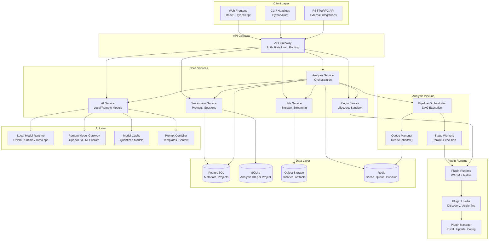
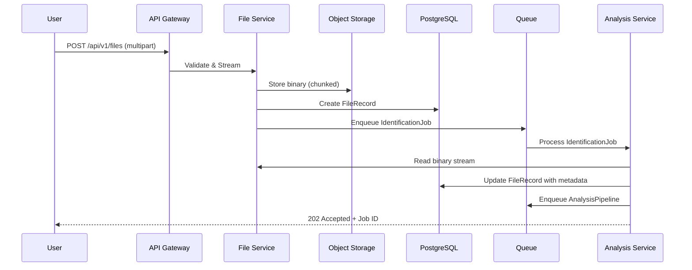
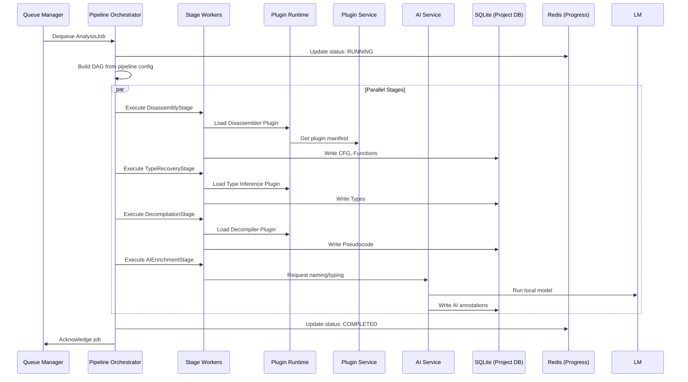
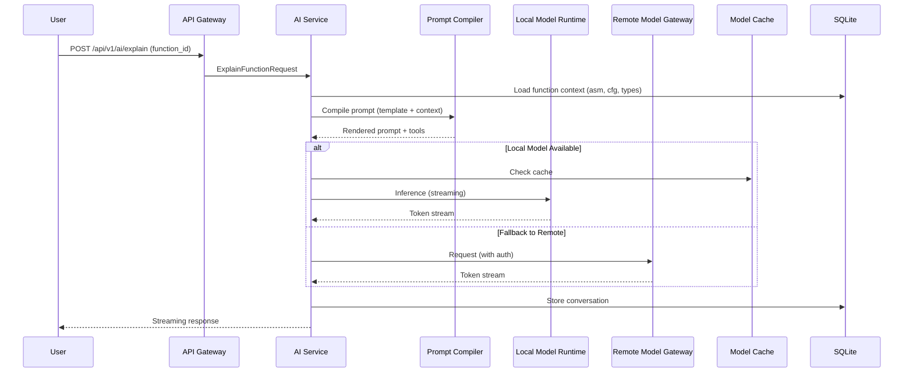
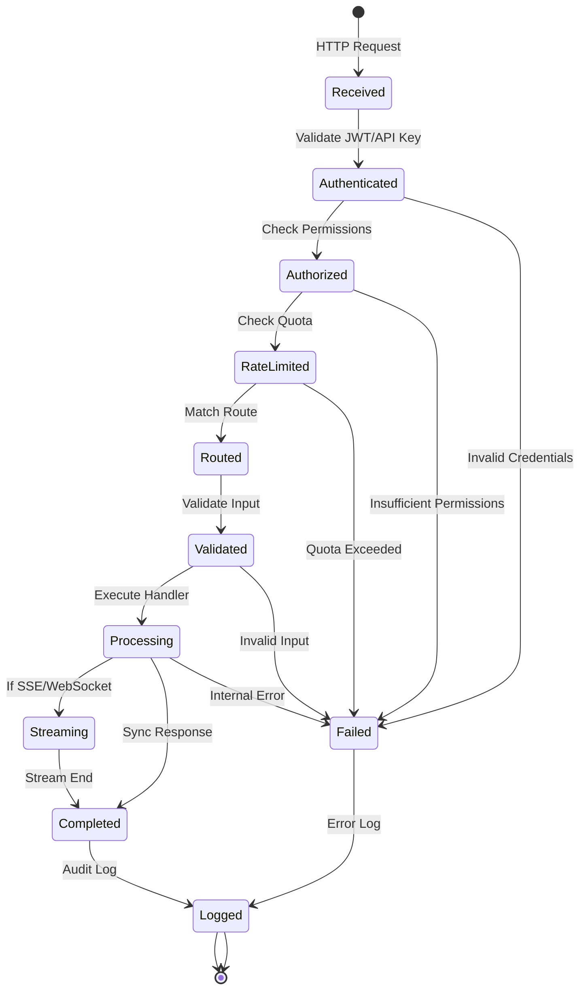
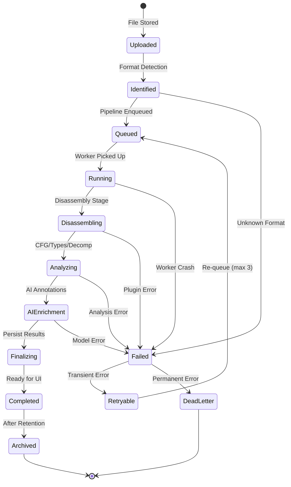
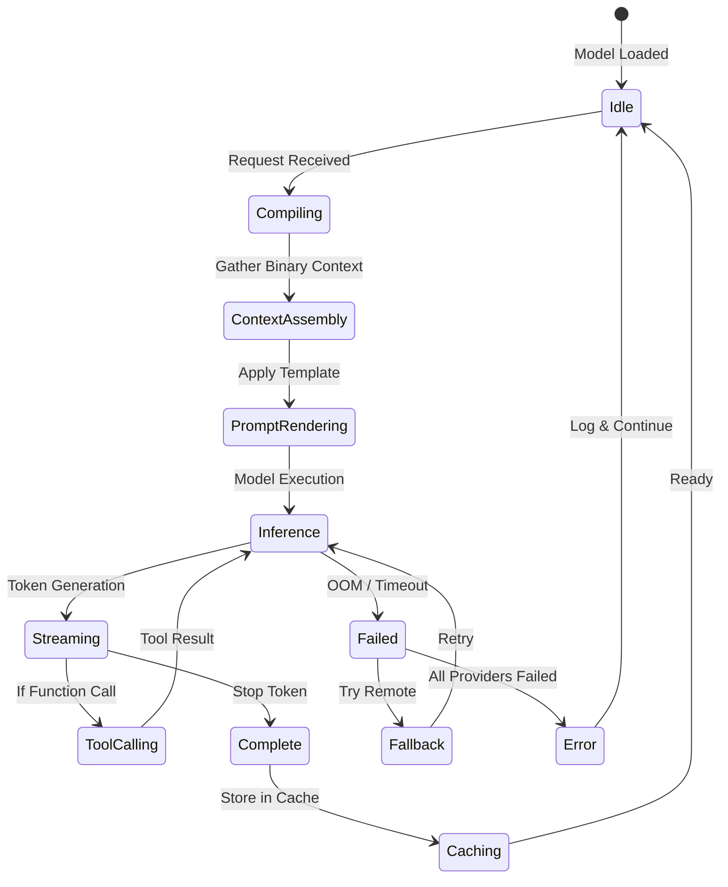
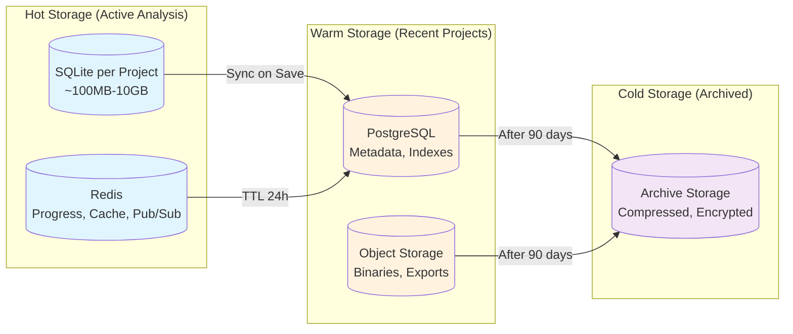
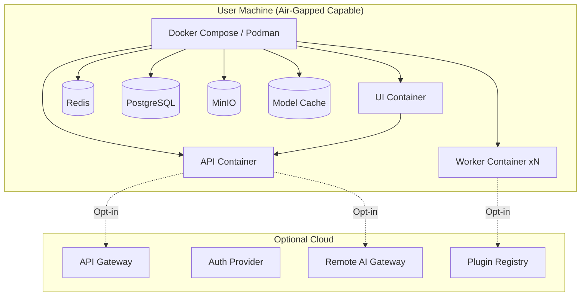

# System Architecture Overview

## Executive Summary

This document describes the high-level architecture of open-re, an AI-native reverse engineering platform. The architecture follows a **plugin-first, local-first, privacy-by-design** philosophy where every core capability is implemented as a replaceable plugin, AI runs locally by default, and user data never leaves the machine without explicit consent.

---

## High-Level Component Diagram

---

## Data Flow

### 1. Binary Upload Flow

### 2. Analysis Pipeline Flow

### 3. AI Interaction Flow

---

## Request Lifecycle

---

## Analysis Lifecycle

---

## AI Interaction Lifecycle

---

## Storage Lifecycle

---

## Key Architectural Principles

| Principle | Implementation |
|-----------|----------------|
| **Plugin-First** | Core analysis (disassembly, decompilation, CFG) are plugins loaded at runtime |
| **Local-First AI** | Models run locally via ONNX/llama.cpp; remote only as opt-in fallback |
| **Privacy by Design** | No telemetry, no auto-upload, air-gapped operation supported |
| **Deterministic Analysis** | Same binary + same config = identical results (reproducible builds) |
| **Incremental Everything** | Lazy loading, streaming, incremental re-analysis on changes |
| **Observability First** | Structured logging, distributed tracing, metrics at every layer |
| **Graceful Degradation** | Remote AI fails → local only; plugin crashes → isolated, analysis continues |
| **Unix Philosophy** | Small, sharp tools that compose via well-defined interfaces |

---

## Technology Stack Summary

| Layer | Technology | Rationale |
|-------|------------|-----------|
| **Core Language** | Rust | Memory safety, performance, WASM target, no GC pauses |
| **API Layer** | Axum (Rust) / FastAPI (Python) | High performance, async, type-safe |
| **Frontend** | React 18 + TypeScript + Vite | Modern, accessible, great DX |
| **State Management** | Zustand + TanStack Query | Simple, performant, server-state aware |
| **Database (Metadata)** | PostgreSQL 16 | ACID, JSONB, full-text search, mature |
| **Database (Analysis)** | SQLite (per project) | Portable, embeddable, no server needed |
| **Object Storage** | MinIO (S3-compatible) | Local-first, scalable, standard API |
| **Queue** | Redis + BullMQ | Reliable, priority queues, delayed jobs |
| **Cache** | Redis Cluster | Sub-ms latency, pub/sub for real-time |
| **AI Runtime** | ONNX Runtime + llama.cpp | Cross-platform, quantized, hardware accel |
| **Plugin Runtime** | Wasmtime (WASM) + dlopen (Native) | Sandboxed, polyglot, near-native speed |
| **Message Bus** | Redis Streams | Ordered, consumer groups, replay |
| **Observability** | OpenTelemetry + Prometheus + Grafana | Vendor-neutral, comprehensive |
| **Auth** | OIDC + JWT (RS256) | Standards-based, delegable |
| **Config** | Figment (Rust) / Pydantic Settings | Layered, validated, hot-reload |

---

## Deployment Topology

---

## Scalability Targets

| Metric | Target | Strategy |
|--------|--------|----------|
| **Concurrent Analyses** | 100+ | Horizontal worker scaling, priority queues |
| **Binary Size** | 10GB+ | Streaming, memory-mapped, chunked processing |
| **Project Size** | 100GB+ | SQLite per project, lazy loading, pagination |
| **Plugin Count** | 1000+ | Lazy plugin loading, capability-based sandboxing |
| **AI Requests/sec** | 100+ | Model caching, batching, quantization |
| **API Latency (p99)** | <200ms | Connection pooling, read replicas, caching |
| **Startup Time** | <3s | Pre-warmed workers, lazy initialization |

---

## Failure Modes & Mitigations

| Failure Mode | Detection | Mitigation |
|--------------|-----------|------------|
| **Worker OOM** | Memory metrics, health checks | Restart worker, re-queue job, reduce parallelism |
| **Plugin Crash** | Panic hook, watchdog | Isolate in WASM, mark plugin unhealthy, continue |
| **Model Load Fail** | Startup probe | Fallback to smaller model, disable AI features |
| **DB Connection Pool Exhausted** | Pool metrics | Queue requests, alert, auto-scale read replicas |
| **Object Storage Unavailable** | Health checks | Local cache, retry with backoff, degrade to read-only |
| **Remote AI Timeout** | Circuit breaker | Fail fast, use local model, cache previous results |
| **Queue Backlog** | Queue depth alerts | Auto-scale workers, priority inversion protection |

---

*This document is the architectural north star. All ADRs and detailed designs must align with these principles.*