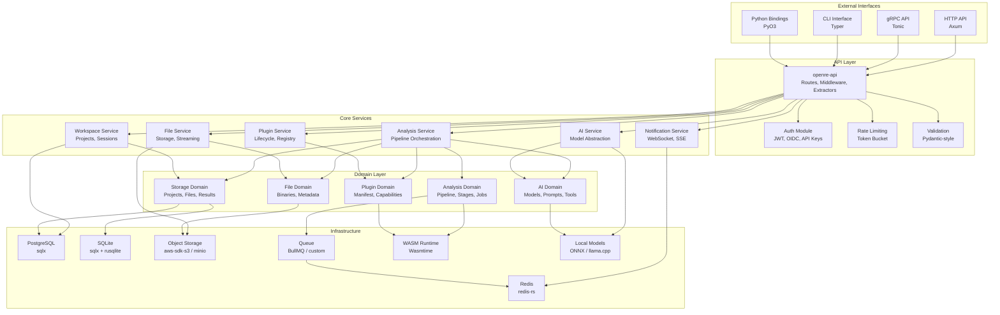
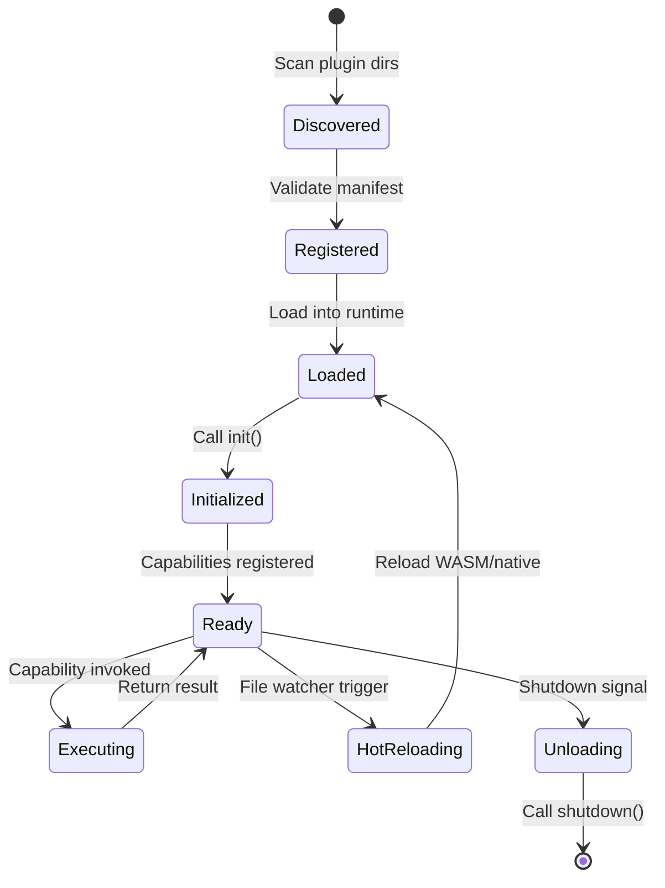
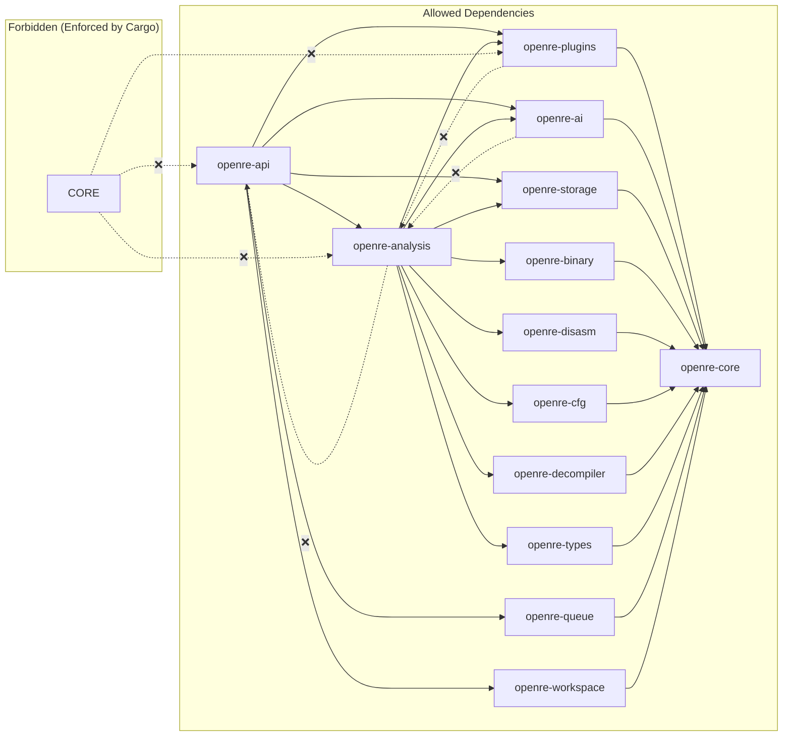

# Backend Architecture

## Overview

The backend is built in **Rust** using a **modular, async-first** architecture. It follows clean architecture principles with clear dependency boundaries, enabling independent development, testing, and deployment of each component.

---

## Module Architecture



---

## Service Definitions

### 1. Analysis Service (`openre-analysis`)

**Responsibility**: Orchestrates the complete analysis pipeline from binary upload to final results.

```rust
// crates/openre-analysis/src/service.rs
pub struct AnalysisService {
    pipeline_orchestrator: Arc<PipelineOrchestrator>,
    plugin_service: Arc<PluginService>,
    ai_service: Arc<AiService>,
    file_service: Arc<FileService>,
    workspace_service: Arc<WorkspaceService>,
    queue: Arc<QueueManager>,
    telemetry: Telemetry,
}

impl AnalysisService {
    /// Start a new analysis job for a file
    pub async fn start_analysis(
        &self,
        project_id: ProjectId,
        file_id: FileId,
        config: AnalysisConfig,
    ) -> Result<JobId, AnalysisError> { ... }

    /// Get real-time progress of an analysis job
    pub async fn get_progress(&self, job_id: JobId) -> Result<AnalysisProgress, AnalysisError> { ... }

    /// Cancel a running analysis
    pub async fn cancel_analysis(&self, job_id: JobId) -> Result<(), AnalysisError> { ... }

    /// Retry a failed analysis (with optional config changes)
    pub async fn retry_analysis(&self, job_id: JobId, config: Option<AnalysisConfig>) -> Result<JobId, AnalysisError> { ... }
}
```

**Key Components:**

| Component | Purpose |
|-----------|---------|
| `PipelineOrchestrator` | Builds DAG from config, manages stage execution order |
| `StageExecutor` | Runs individual stages with timeout, retry, cancellation |
| `ProgressTracker` | Emits progress events via Redis Pub/Sub |
| `ArtifactCollector` | Gathers results from each stage, stores in SQLite |

### 2. Plugin Service (`openre-plugins`)

**Responsibility**: Manages plugin lifecycle - discovery, loading, sandboxing, versioning, and communication.

```rust
// crates/openre-plugins/src/service.rs
pub struct PluginService {
    registry: Arc<PluginRegistry>,
    loader: Arc<PluginLoader>,
    sandbox: Arc<SandboxManager>,
    capability_checker: Arc<CapabilityChecker>,
    hot_reload: Arc<HotReloadManager>,
}

impl PluginService {
    /// Discover and register all available plugins
    pub async fn discover_plugins(&self) -> Result<Vec<PluginManifest>, PluginError> { ... }

    /// Load a plugin by ID with version resolution
    pub async fn load_plugin(&self, plugin_id: &str, version: Option<Version>) -> Result<PluginHandle, PluginError> { ... }

    /// Execute a plugin capability with sandboxing
    pub async fn execute_capability(
        &self,
        plugin_id: &str,
        capability: &str,
        input: PluginInput,
    ) -> Result<PluginOutput, PluginError> { ... }

    /// Hot-reload a plugin without restarting analysis
    pub async fn hot_reload(&self, plugin_id: &str) -> Result<(), PluginError> { ... }
}
```

**Plugin Lifecycle:**


### 3. AI Service (`openre-ai`)

**Responsibility**: Provides unified interface for AI operations regardless of provider (local/remote).

```rust
// crates/openre-ai/src/service.rs
pub struct AiService {
    model_registry: Arc<ModelRegistry>,
    local_runtime: Arc<LocalModelRuntime>,
    remote_gateway: Arc<RemoteModelGateway>,
    prompt_compiler: Arc<PromptCompiler>,
    context_assembler: Arc<ContextAssembler>,
    tool_executor: Arc<ToolExecutor>,
    cache: Arc<ModelCache>,
    telemetry: Telemetry,
}

impl AiService {
    /// Classify function purpose
    pub async fn classify_function(&self, ctx: FunctionContext) -> Result<Classification, AiError> { ... }

    /// Suggest variable/parameter names
    pub async fn suggest_names(&self, ctx: NamingContext) -> Result<Vec<NameSuggestion>, AiError> { ... }

    /// Explain function in natural language
    pub async fn explain_function(&self, ctx: ExplanationContext) -> Result<Explanation, AiError> { ... }

    /// Detect cryptographic constants
    pub async fn detect_crypto(&self, ctx: CryptoContext) -> Result<Vec<CryptoMatch>, AiError> { ... }

    /// Stream chat completion with tools
    pub async fn chat_stream(&self, req: ChatRequest) -> Result<StreamingResponse, AiError> { ... }
}
```

### 4. File Service (`openre-storage`)

**Responsibility**: Handles binary storage, streaming, and metadata extraction.

```rust
// crates/openre-storage/src/file_service.rs
pub struct FileService {
    object_store: Arc<dyn ObjectStore>,
    metadata_extractor: Arc<MetadataExtractor>,
    streaming_processor: Arc<StreamingProcessor>,
    integrity_checker: Arc<IntegrityChecker>,
}

impl FileService {
    /// Store binary with chunked upload support
    pub async fn store_binary(&self, upload: BinaryUpload) -> Result<FileRecord, StorageError> { ... }

    /// Stream binary for analysis (memory-efficient)
    pub async fn stream_binary(&self, file_id: FileId) -> Result<BinaryStream, StorageError> { ... }

    /// Extract metadata without full load
    pub async fn extract_metadata(&self, file_id: FileId) -> Result<BinaryMetadata, StorageError> { ... }

    /// Verify binary integrity
    pub async fn verify_integrity(&self, file_id: FileId) -> Result<IntegrityReport, StorageError> { ... }
}
```

### 5. Workspace Service (`openre-api`)

**Responsibility**: Manages projects, sessions, and collaboration state.

```rust
// crates/openre-api/src/workspace_service.rs
pub struct WorkspaceService {
    pg_pool: PgPool,
    sqlite_manager: Arc<SqliteManager>,
    collaboration: Arc<CollaborationManager>,
    export_service: Arc<ExportService>,
}

impl WorkspaceService {
    /// Create new project
    pub async fn create_project(&self, req: CreateProjectRequest) -> Result<Project, WorkspaceError> { ... }

    /// Open project (loads SQLite DB)
    pub async fn open_project(&self, project_id: ProjectId) -> Result<ProjectHandle, WorkspaceError> { ... }

    /// Save analysis state (annotations, types, names)
    pub async fn save_annotations(&self, project_id: ProjectId, annotations: Annotations) -> Result<(), WorkspaceError> { ... }

    /// Export project (portable bundle)
    pub async fn export_project(&self, project_id: ProjectId, format: ExportFormat) -> Result<ExportBundle, WorkspaceError> { ... }

    /// Real-time collaboration (CRDT-based)
    pub async fn join_session(&self, project_id: ProjectId, user: UserId) -> Result<SessionHandle, WorkspaceError> { ... }
}
```

---

## Dependency Boundaries



**Boundary Rules:**
1. **Core** (`openre-core`) has **zero dependencies** on other crates
2. **Domain crates** (binary, disasm, cfg, etc.) depend only on `core`
3. **Service crates** (analysis, plugins, ai, storage) depend on domain crates
4. **API crate** depends on service crates, **never** the reverse
5. **Plugins** depend only on `openre-plugins-sdk` (published separately)

---

## Internal Communication

### 1. Service-to-Service (Within Process)

```rust
// Trait-based dependency injection
#[async_trait]
pub trait AnalysisService: Send + Sync {
    async fn start_analysis(&self, ...) -> Result<JobId, AnalysisError>;
    async fn get_progress(&self, job_id: JobId) -> Result<AnalysisProgress, AnalysisError>;
}

// Concrete implementation injected at startup
pub struct AppState {
    pub analysis: Arc<dyn AnalysisService>,
    pub plugins: Arc<dyn PluginService>,
    pub ai: Arc<dyn AiService>,
    // ...
}

// Axum extractor for handlers
async fn start_analysis(
    State(state): State<AppState>,
    Json(req): Json<StartAnalysisRequest>,
) -> Result<Json<JobResponse>, ApiError> {
    let job_id = state.analysis.start_analysis(...).await?;
    Ok(Json(JobResponse { job_id }))
}
```

### 2. Async Message Passing (Cross-Process)

```rust
// Redis Streams for inter-service communication
#[derive(Serialize, Deserialize)]
pub enum AnalysisEvent {
    JobStarted { job_id: JobId, project_id: ProjectId },
    StageStarted { job_id: JobId, stage: StageName },
    StageProgress { job_id: JobId, stage: StageName, progress: f32 },
    StageCompleted { job_id: JobId, stage: StageName, artifacts: Vec<Artifact> },
    JobCompleted { job_id: JobId, result: AnalysisResult },
    JobFailed { job_id: JobId, error: String },
}

// Publisher (Analysis Service)
pub async fn emit_event(&self, event: AnalysisEvent) -> Result<(), RedisError> {
    let payload = serde_json::to_vec(&event)?;
    self.redis.xadd("analysis.events", "*", &[("data", payload)]).await?;
    Ok(())
}

// Consumer (Notification Service)
pub async fn consume_events(&self) -> Result<(), RedisError> {
    let mut stream = self.redis.xread_options(
        &["analysis.events"],
        &["$"], // Start from latest
        StreamReadOptions::default().block(5000).count(100),
    ).await?;
    
    for entry in stream {
        let event: AnalysisEvent = serde_json::from_slice(&entry.get("data").unwrap())?;
        self.broadcast_to_websockets(event).await?;
    }
    Ok(())
}
```

### 3. Plugin Communication (Host ↔ Plugin)

```rust
// Host exposes capabilities to plugins
#[async_trait]
pub trait HostCapabilities: Send + Sync {
    async fn read_binary(&self, offset: u64, len: usize) -> Result<Vec<u8>, HostError>;
    async fn write_annotation(&self, annotation: Annotation) -> Result<(), HostError>;
    async fn query_database(&self, query: SqlQuery) -> Result<QueryResult, HostError>;
    async fn request_ai(&self, request: AiRequest) -> Result<AiResponse, HostError>;
}

// Plugin implements this trait
#[async_trait]
pub trait Plugin: Send + Sync {
    fn manifest(&self) -> &PluginManifest;
    async fn initialize(&mut self, host: Arc<dyn HostCapabilities>) -> Result<(), PluginError>;
    async fn execute(&self, capability: &str, input: PluginInput) -> Result<PluginOutput, PluginError>;
    async fn shutdown(&mut self) -> Result<(), PluginError>;
}

// WASM guest exports (for Wasmtime)
#[wasmtime::component::export]
async fn plugin_execute(
    capability: String,
    input: Vec<u8>,
) -> Result<Vec<u8>, PluginError> { ... }
```

---

## Error Handling Strategy

### Error Hierarchy

```rust
// crates/openre-core/src/error.rs
#[derive(Debug, thiserror::Error)]
pub enum OpenReError {
    #[error("Configuration error: {0}")]
    Config(#[from] ConfigError),
    
    #[error("Storage error: {0}")]
    Storage(#[from] StorageError),
    
    #[error("Analysis error: {0}")]
    Analysis(#[from] AnalysisError),
    
    #[error("Plugin error: {0}")]
    Plugin(#[from] PluginError),
    
    #[error("AI error: {0}")]
    Ai(#[from] AiError),
    
    #[error("Validation error: {0}")]
    Validation(#[from] ValidationError),
    
    #[error("Authentication error: {0}")]
    Auth(#[from] AuthError),
    
    #[error("Internal error: {0}")]
    Internal(String),
}

// Each domain has its own error type
#[derive(Debug, thiserror::Error)]
pub enum AnalysisError {
    #[error("Job not found: {0}")]
    JobNotFound(JobId),
    
    #[error("Pipeline configuration invalid: {0}")]
    InvalidConfig(String),
    
    #[error("Stage {stage} failed: {source}")]
    StageFailed { stage: StageName, source: Box<dyn std::error::Error + Send + Sync> },
    
    #[error("Job cancelled")]
    Cancelled,
    
    #[error("Resource exhausted: {resource}")]
    ResourceExhausted { resource: String },
}
```

### Error Handling Patterns

```rust
// 1. Result<T, E> for all fallible operations
pub async fn analyze(&self, job: Job) -> Result<AnalysisResult, AnalysisError> { ... }

// 2. Error context with `anyhow` for internal errors
use anyhow::Context;
let result = self.stage.execute(input)
    .await
    .context("Failed to execute disassembly stage")?;

// 3. Structured error responses for API
#[derive(Serialize)]
pub struct ApiErrorResponse {
    pub error: String,
    pub code: ErrorCode,
    pub details: Option<serde_json::Value>,
    pub request_id: Uuid,
}

// 4. Error conversion at boundaries
impl From<AnalysisError> for ApiError {
    fn from(err: AnalysisError) -> Self {
        match err {
            AnalysisError::JobNotFound(id) => ApiError::not_found(format!("Job {id}")),
            AnalysisError::Cancelled => ApiError::conflict("Job was cancelled"),
            AnalysisError::ResourceExhausted { resource } => 
                ApiError::rate_limited(format!("Resource exhausted: {resource}")),
            _ => ApiError::internal(err.to_string()),
        }
    }
}
```

---

## Logging Strategy

### Structured Logging with `tracing`

```rust
// crates/openre-telemetry/src/lib.rs
pub fn init_telemetry(config: &TelemetryConfig) -> Result<WorkerGuard, TelemetryError> {
    let fmt_layer = tracing_subscriber::fmt::layer()
        .json()
        .with_current_span(true)
        .with_span_list(true)
        .with_timer(tracing_subscriber::fmt::time::UtcTime::rfc_3339());
    
    let filter = EnvFilter::try_from_default_env()
        .unwrap_or_else(|_| EnvFilter::new("info,openre=debug"));
    
    let (non_blocking, guard) = tracing_appender::non_blocking(
        tracing_appender::rolling::daily(&config.log_dir, "openre")
    );
    
    tracing_subscriber::registry()
        .with(filter)
        .with(fmt_layer.with_writer(non_blocking))
        .with(tracing_subscriber::fmt::layer().with_writer(std::io::stdout).with_ansi(false))
        .init();
    
    Ok(guard)
}
```

### Standard Fields (Every Log Entry)

```json
{
  "timestamp": "2026-07-14T10:30:45.123Z",
  "level": "INFO",
  "target": "openre_analysis::pipeline",
  "span": {
    "job_id": "550e8400-e29b-41d4-a716-446655440000",
    "project_id": "660e8400-e29b-41d4-a716-446655440001",
    "stage": "disassembly"
  },
  "fields": {
    "binary_size": 1048576,
    "architecture": "x86_64",
    "duration_ms": 1250
  },
  "message": "Disassembly stage completed"
}
```

### Log Levels

| Level | Use Case |
|-------|----------|
| `ERROR` | Failures requiring attention (job failed, plugin crash) |
| `WARN` | Degraded operation (fallback to remote AI, retry) |
| `INFO` | Major lifecycle events (job started, stage completed) |
| `DEBUG` | Detailed flow (stage input/output, cache hits) |
| `TRACE` | Very verbose (every instruction, token) |

---

## Configuration Management

### Layered Configuration (Figment)

```rust
// crates/openre-config/src/lib.rs
use figment::{Figment, providers::{Env, Format, Toml, Serialized}};
use serde::{Deserialize, Serialize};

#[derive(Debug, Deserialize, Serialize)]
pub struct Config {
    pub server: ServerConfig,
    pub database: DatabaseConfig,
    pub redis: RedisConfig,
    pub storage: StorageConfig,
    pub ai: AiConfig,
    pub plugins: PluginConfig,
    pub queue: QueueConfig,
    pub telemetry: TelemetryConfig,
    pub security: SecurityConfig,
}

impl Config {
    pub fn load() -> Result<Self, ConfigError> {
        Figment::new()
            .merge(Serialized::defaults(Config::default()))
            .merge(Toml::file("config.toml").nested())
            .merge(Env::prefixed("OPENRE_").split("__"))
            .extract()
    }
}

#[derive(Debug, Deserialize, Serialize)]
pub struct AiConfig {
    pub local_models_path: PathBuf,
    pub default_local_model: String,
    pub remote_providers: Vec<RemoteProviderConfig>,
    pub cache_size_gb: u64,
    pub max_context_tokens: usize,
    pub enable_fallback: bool,
    pub request_timeout_secs: u64,
}

#[derive(Debug, Deserialize, Serialize)]
pub struct PluginConfig {
    pub plugin_dirs: Vec<PathBuf>,
    pub allow_native: bool,
    pub wasm_fuel_limit: Option<u64>,
    pub capability_timeout_secs: u64,
    pub hot_reload: bool,
}
```

### Hot Reload

```rust
// Config watcher with notify
pub async fn watch_config<F>(config_path: PathBuf, mut on_change: F) -> Result<(), ConfigError>
where
    F: FnMut(Config) + Send + 'static,
{
    let (tx, mut rx) = tokio::sync::mpsc::channel(1);
    let mut watcher = notify::recommended_watcher(move |res| {
        if let Ok(event) = res {
            if event.kind.is_modify() {
                let _ = tx.try_send(());
            }
        }
    })?;
    
    watcher.watch(&config_path, RecursiveMode::NonRecursive)?;
    
    while rx.recv().await.is_some() {
        tokio::time::sleep(Duration::from_millis(100)).await; // Debounce
        if let Ok(new_config) = Config::load() {
            on_change(new_config);
        }
    }
    Ok(())
}
```

---

## Testing Strategy

### Unit Tests (Per Crate)

```rust
// crates/openre-analysis/src/pipeline_orchestrator_tests.rs
#[cfg(test)]
mod tests {
    use super::*;
    use openre_core::test_utils::*;
    
    #[tokio::test]
    async fn test_pipeline_dag_construction() {
        let config = AnalysisConfig::default();
        let dag = PipelineOrchestrator::build_dag(&config).unwrap();
        
        // Verify topological order
        let order = dag.topological_order().unwrap();
        assert!(order.iter().position(|s| *s == StageName::Disassembly) < 
                order.iter().position(|s| *s == StageName::Decompilation));
    }
    
    #[tokio::test]
    async fn test_stage_retry_logic() {
        let mut executor = StageExecutor::new(test_config());
        let result = executor.execute_with_retry(failing_stage, 3).await;
        assert!(result.is_err());
        assert_eq!(executor.attempt_count(), 3);
    }
}
```

### Integration Tests (Cross-Crate)

```rust
// tests/integration/full_pipeline_test.rs
#[tokio::test]
async fn test_full_analysis_pipeline() {
    let harness = TestHarness::new().await;
    
    // Upload test binary
    let file_id = harness.upload_binary("test_binaries/hello_x64").await;
    
    // Start analysis
    let job_id = harness.start_analysis(file_id, AnalysisConfig::default()).await;
    
    // Wait for completion
    let result = harness.wait_for_job(job_id, Duration::from_secs(60)).await;
    
    // Verify results
    assert!(result.functions.len() > 0);
    assert!(result.cfg.nodes.len() > 0);
    assert!(result.decompilation.is_some());
    
    // Verify AI annotations
    let annotations = harness.get_annotations(file_id).await;
    assert!(annotations.ai_suggestions.len() > 0);
}
```

### Property-Based Testing

```rust
// crates/openre-cfg/src/proptests.rs
use proptest::prelude::*;

proptest! {
    #[test]
    fn test_cfg_roundtrip(graph in arbitrary_cfg()) {
        let serialized = serde_json::to_string(&graph).unwrap();
        let deserialized: ControlFlowGraph = serde_json::from_str(&serialized).unwrap();
        prop_assert_eq!(graph, deserialized);
    }
    
    #[test]
    fn test_dominator_tree_properties(graph in arbitrary_cfg()) {
        let dom_tree = graph.compute_dominator_tree();
        // Every node (except entry) has exactly one immediate dominator
        for node in graph.nodes() {
            if node != graph.entry() {
                prop_assert_eq!(dom_tree.immediate_dominators(node).count(), 1);
            }
        }
    }
}
```

---

## Performance Considerations

| Concern | Solution |
|---------|----------|
| **Cold Start** | Pre-warm worker pool, lazy plugin loading, model pre-loading |
| **Memory Pressure** | Streaming processing, chunked binary access, explicit drop |
| **CPU Utilization** | Work-stealing scheduler, `rayon` for parallel stages |
| **Database Contention** | Connection pooling, read replicas, SQLite per-project |
| **AI Latency** | Model quantization (INT4/INT8), batching, KV-cache |
| **Plugin Overhead** | WASM AOT compilation, capability-based sandboxing |

---

*This backend architecture provides a solid foundation for Phase 1 implementation. Each service is independently deployable, testable, and replaceable.*