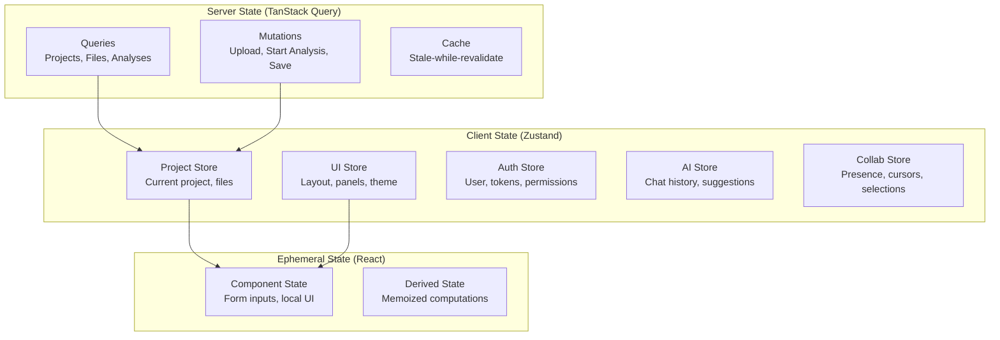

# Frontend Architecture

## Overview

The frontend is a **React 18 + TypeScript** single-page application built with **Vite**, designed for **accessibility-first**, **keyboard-driven** interaction, and **real-time collaboration**. It follows a **feature-based** architecture with clear separation between UI components, business logic, and API communication.

---

## Application Structure

```
frontend/
├── packages/
│   ├── app/                    # Main application shell
│   │   ├── src/
│   │   │   ├── main.tsx        # Entry point
│   │   │   ├── App.tsx         # Root component
│   │   │   ├── routes.tsx      # Router configuration
│   │   │   ├── providers.tsx   # Context providers
│   │   │   ├── styles/         # Global styles, theme
│   │   │   └── hooks/          # App-level hooks
│   │   └── package.json
│   │
│   ├── core/                   # Shared core functionality
│   │   ├── src/
│   │   │   ├── api/            # API client (TanStack Query)
│   │   │   │   ├── client.ts   # Axios/Fetch wrapper
│   │   │   │   ├── queries/    # Query hooks
│   │   │   │   ├── mutations/  # Mutation hooks
│   │   │   │   └── websocket/  # WebSocket client
│   │   │   ├── state/          # Global state (Zustand)
│   │   │   │   ├── project.ts  # Current project state
│   │   │   │   ├── ui.ts       # UI state (panels, layout)
│   │   │   │   ├── auth.ts     # Auth state
│   │   │   │   └── ai.ts       # AI chat state
│   │   │   ├── hooks/          # Shared hooks
│   │   │   ├── utils/          # Utilities
│   │   │   ├── types/          # Shared TypeScript types
│   │   │   └── constants/      # App constants
│   │   └── package.json
│   │
│   ├── components/             # Shared UI component library
│   │   ├── src/
│   │   │   ├── primitives/     # Base components (Button, Input, Panel)
│   │   │   ├── layout/         # Layout components (SplitPane, TabBar)
│   │   │   ├── data-display/   # Data components (Table, Tree, Graph)
│   │   │   ├── feedback/       # Toast, Modal, Tooltip, Progress
│   │   │   ├── navigation/     # CommandPalette, Breadcrumbs, Tabs
│   │   │   ├── forms/          # Form components
│   │   │   └── icons/          # Icon system
│   │   ├── stories/            # Storybook stories
│   │   └── package.json
│   │
│   ├── views/                  # Feature views (pages)
│   │   ├── src/
│   │   │   ├── project/        # Project dashboard, settings
│   │   │   ├── analysis/       # Main analysis workspace
│   │   │   │   ├── DisassemblyView.tsx
│   │   │   │   ├── DecompilerView.tsx
│   │   │   │   ├── GraphView.tsx
│   │   │   │   ├── HexView.tsx
│   │   │   │   ├── StringsView.tsx
│   │   │   │   ├── SymbolsView.tsx
│   │   │   │   ├── XrefsView.tsx
│   │   │   │   └── AnalysisLayout.tsx
│   │   │   ├── ai/             # AI chat, suggestions panel
│   │   │   │   ├── ChatPanel.tsx
│   │   │   │   ├── SuggestionsPanel.tsx
│   │   │   │   └── ExplainModal.tsx
│   │   │   ├── plugins/        # Plugin manager UI
│   │   │   ├── collaboration/  # Real-time collab UI
│   │   │   └── welcome/        # Welcome screen, onboarding
│   │   └── package.json
│   │
│   ├── plugins/                # Plugin UI extension system
│   │   ├── src/
│   │   │   ├── registry.ts     # Plugin UI registry
│   │   │   ├── extensions/     # Extension points
│   │   │   │   ├── ViewExtension.tsx
│   │   │   │   ├── PanelExtension.tsx
│   │   │   │   ├── CommandExtension.tsx
│   │   │   │   └── ContextMenuExtension.tsx
│   │   │   └── sandbox.tsx     # Iframe sandbox for untrusted plugins
│   │   └── package.json
│   │
│   └── ai/                     # AI-specific UI components
│       ├── src/
│       │   ├── chat/           # Chat interface components
│       │   ├── suggestions/    # Inline ghost suggestions
│       │   ├── streaming/      # Streaming response UI
│       │   └── tools/          # Tool call visualization
│       └── package.json
│
├── public/                     # Static assets
├── tests/                      # E2E tests (Playwright)
├── package.json                # Root workspace config
├── turbo.json                  # Turborepo config
├── tsconfig.json               # TypeScript config
├── vite.config.ts              # Vite config
└── tailwind.config.ts          # Tailwind config
```

---

## State Management

### Architecture: Zustand + TanStack Query



### Store Definitions

```typescript
// packages/core/src/state/project.ts
interface ProjectState {
  // Current project
  currentProject: Project | null;
  currentFile: FileRecord | null;
  
  // Analysis state
  analyses: Map<FileId, AnalysisResult>;
  activeAnalysis: JobId | null;
  analysisProgress: Map<JobId, AnalysisProgress>;
  
  // Annotations (user + AI)
  annotations: Map<FileId, AnnotationLayer>;
  
  // Actions
  setProject: (project: Project) => void;
  setFile: (file: FileRecord) => void;
  updateAnalysis: (fileId: FileId, result: AnalysisResult) => void;
  setAnalysisProgress: (jobId: JobId, progress: AnalysisProgress) => void;
  addAnnotation: (fileId: FileId, annotation: Annotation) => void;
  removeAnnotation: (fileId: FileId, id: string) => void;
}

export const useProjectStore = create<ProjectState>()(
  persist(
    (set, get) => ({
      currentProject: null,
      currentFile: null,
      analyses: new Map(),
      activeAnalysis: null,
      analysisProgress: new Map(),
      annotations: new Map(),
      
      setProject: (project) => set({ currentProject: project }),
      setFile: (file) => set({ currentFile: file }),
      updateAnalysis: (fileId, result) => set(state => ({
        analyses: new Map(state.analyses).set(fileId, result)
      })),
      // ... more actions
    }),
    { name: 'project-store', partialize: s => ({ currentProject: s.currentProject }) }
  )
);
```

```typescript
// packages/core/src/state/ui.ts
interface UIState {
  // Layout
  layout: 'analysis' | 'welcome' | 'settings';
  panels: PanelState[];
  activePanel: string | null;
  
  // Theme
  theme: 'light' | 'dark' | 'system';
  highContrast: boolean;
  reducedMotion: boolean;
  
  // Keyboard
  keybindings: KeybindingScheme; // 'vim' | 'emacs' | 'default'
  
  // Actions
  setLayout: (layout: UIState['layout']) => void;
  togglePanel: (panelId: string) => void;
  resizePanel: (panelId: string, size: number) => void;
  setTheme: (theme: UIState['theme']) => void;
  setKeybindings: (scheme: KeybindingScheme) => void;
}
```

---

## Routing Strategy

### Route Structure

```typescript
// packages/app/src/routes.tsx
const routes = [
  {
    path: '/',
    element: <AuthGuard><WelcomePage /></AuthGuard>,
  },
  {
    path: '/projects/:projectId',
    element: <AuthGuard><ProjectLayout /></AuthGuard>,
    children: [
      { index: true, element: <Navigate to="analysis" replace /> },
      {
        path: 'analysis',
        element: <AnalysisWorkspace />,
        children: [
          { path: ':fileId', element: <AnalysisView /> },
        ],
      },
      { path: 'settings', element: <ProjectSettings /> },
      { path: 'plugins', element: <PluginManager /> },
      { path: 'collaborate', element: <CollaborationView /> },
    ],
  },
  {
    path: '/settings',
    element: <AuthGuard><GlobalSettings /></AuthGuard>,
  },
  {
    path: '/ai',
    element: <AuthGuard><AIChatPage /></AuthGuard>,
  },
];
```

### Deep Linking Support

```typescript
// Shareable URLs for specific analysis contexts
// /projects/{projectId}/analysis/{fileId}?function=0x401000&view=decompiler&panel=graph
// /projects/{projectId}/analysis/{fileId}?address=0x401230&highlight=taint
```

---

## API Communication

### TanStack Query Setup

```typescript
// packages/core/src/api/client.ts
import { QueryClient, QueryClientProvider } from '@tanstack/react-query';
import { httpBatchLink, loggerLink } from '@trpc/client';
import { createTRPCReact } from '@trpc/react-query';

export const trpc = createTRPCReact<AppRouter>();

export const queryClient = new QueryClient({
  defaultOptions: {
    queries: {
      staleTime: 1000 * 30, // 30 seconds
      gcTime: 1000 * 60 * 10, // 10 minutes
      retry: (failureCount, error) => {
        if (error instanceof ApiError && error.code === 'UNAUTHORIZED') return false;
        return failureCount < 3;
      },
      refetchOnWindowFocus: false,
    },
    mutations: {
      retry: 0,
    },
  },
});

export const trpcClient = trpc.createClient({
  links: [
    loggerLink({ enabled: (opts) => process.env.NODE_ENV === 'development' }),
    httpBatchLink({
      url: `${import.meta.env.VITE_API_URL}/trpc`,
      headers: () => ({
        Authorization: `Bearer ${useAuthStore.getState().accessToken}`,
      }),
    }),
  ],
});
```

### Query Hooks

```typescript
// packages/core/src/api/queries/useProject.ts
export function useProject(projectId: ProjectId) {
  return trpc.project.get.useQuery(
    { projectId },
    { enabled: !!projectId }
  );
}

export function useAnalysisProgress(jobId: JobId) {
  return trpc.analysis.getProgress.useQuery(
    { jobId },
    { 
      enabled: !!jobId,
      refetchInterval: (data) => data?.status === 'RUNNING' ? 1000 : false,
    }
  );
}

export function useAnnotations(fileId: FileId) {
  return trpc.annotations.list.useQuery(
    { fileId },
    { staleTime: 1000 * 60 } // 1 minute
  );
}
```

### Mutation Hooks

```typescript
// packages/core/src/api/mutations/useAnalysis.ts
export function useStartAnalysis() {
  const queryClient = useQueryClient();
  
  return trpc.analysis.start.useMutation({
    onSuccess: (job) => {
      queryClient.invalidateQueries({ queryKey: ['analysis', 'list'] });
      queryClient.setQueryData(['analysis', 'progress', job.jobId], {
        status: 'QUEUED',
        progress: 0,
        stage: 'initializing',
      });
    },
  });
}

export function useSaveAnnotations() {
  const queryClient = useQueryClient();
  
  return trpc.annotations.save.useMutation({
    onMutate: async (variables) => {
      await queryClient.cancelQueries({ queryKey: ['annotations', variables.fileId] });
      const previous = queryClient.getQueryData(['annotations', variables.fileId]);
      queryClient.setQueryData(['annotations', variables.fileId], variables.annotations);
      return { previous };
    },
    onError: (err, variables, context) => {
      queryClient.setQueryData(['annotations', variables.fileId], context?.previous);
    },
    onSettled: (data, error, variables) => {
      queryClient.invalidateQueries({ queryKey: ['annotations', variables.fileId] });
    },
  });
}
```

---

## Real-Time Communication

### WebSocket Architecture

```typescript
// packages/core/src/api/websocket/client.ts
type WSMessage = 
  | { type: 'analysis.progress'; payload: AnalysisProgress }
  | { type: 'analysis.completed'; payload: AnalysisResult }
  | { type: 'analysis.failed'; payload: { jobId: JobId; error: string } }
  | { type: 'collab.presence'; payload: UserPresence[] }
  | { type: 'collab.cursor'; payload: CursorPosition }
  | { type: 'collab.annotation'; payload: AnnotationChange }
  | { type: 'ai.stream'; payload: AIStreamChunk }
  | { type: 'notification'; payload: Notification };

class WebSocketClient {
  private ws: WebSocket | null = null;
  private reconnectAttempts = 0;
  private maxReconnectAttempts = 10;
  private messageHandlers = new Map<string, Set<(payload: any) => void>>();
  
  connect(token: string) {
    this.ws = new WebSocket(`${import.meta.env.VITE_WS_URL}?token=${token}`);
    
    this.ws.onopen = () => {
      this.reconnectAttempts = 0;
      this.subscribe('analysis.*');
      this.subscribe('collab.*');
    };
    
    this.ws.onmessage = (event) => {
      const message: WSMessage = JSON.parse(event.data);
      this.dispatch(message);
    };
    
    this.ws.onclose = () => this.scheduleReconnect();
    this.ws.onerror = (err) => console.error('WS Error:', err);
  }
  
  subscribe(channel: string) {
    this.send({ type: 'subscribe', channel });
  }
  
  on<T>(type: string, handler: (payload: T) => void) {
    if (!this.messageHandlers.has(type)) {
      this.messageHandlers.set(type, new Set());
    }
    this.messageHandlers.get(type)!.add(handler);
    return () => this.messageHandlers.get(type)?.delete(handler);
  }
  
  private dispatch(message: WSMessage) {
    this.messageHandlers.get(message.type)?.forEach(h => h(message.payload));
    this.messageHandlers.get('*')?.forEach(h => h(message));
  }
}

export const wsClient = new WebSocketClient();
```

### React Hook for WebSocket

```typescript
// packages/core/src/hooks/useWebSocket.ts
export function useAnalysisProgress(jobId: JobId) {
  const [progress, setProgress] = useState<AnalysisProgress | null>(null);
  
  useEffect(() => {
    const unsubscribe = wsClient.on('analysis.progress', (payload: AnalysisProgress) => {
      if (payload.jobId === jobId) setProgress(payload);
    });
    
    const unsubscribeComplete = wsClient.on('analysis.completed', (payload: AnalysisResult) => {
      if (payload.jobId === jobId) setProgress({ ...payload, status: 'COMPLETED' });
    });
    
    return () => {
      unsubscribe();
      unsubscribeComplete();
    };
  }, [jobId]);
  
  return progress;
}
```

---

## Component Organization

### View Components (Analysis Workspace)

```typescript
// packages/views/src/analysis/AnalysisLayout.tsx
export function AnalysisLayout({ fileId }: { fileId: FileId }) {
  const { currentFile } = useProjectStore();
  const { panels, activePanel, togglePanel, resizePanel } = useUIStore();
  
  return (
    <SplitPane direction="horizontal" defaultSize={300} minSize={250} maxSize={600}>
      <SplitPane.Pane>
        <PanelGroup>
          <Panel id="disassembly" title="Disassembly" defaultOpen>
            <DisassemblyView fileId={fileId} />
          </Panel>
          <Panel id="decompiler" title="Decompiler" defaultOpen>
            <DecompilerView fileId={fileId} />
          </Panel>
          <Panel id="graph" title="Graph" defaultOpen>
            <GraphView fileId={fileId} />
          </Panel>
        </PanelGroup>
      </SplitPane.Pane>
      
      <SplitPane.Splitter />
      
      <SplitPane.Pane>
        <TabBar activeTab={activePanel} onChange={setActivePanel}>
          <Tab id="hex" label="Hex" />
          <Tab id="strings" label="Strings" />
          <Tab id="symbols" label="Symbols" />
          <Tab id="xrefs" label="Xrefs" />
          <Tab id="ai" label="AI" icon={<Sparkles />} />
        </TabBar>
        <TabPanels>
          <TabPanel id="hex"><HexView fileId={fileId} /></TabPanel>
          <TabPanel id="strings"><StringsView fileId={fileId} /></TabPanel>
          <TabPanel id="symbols"><SymbolsView fileId={fileId} /></TabPanel>
          <TabPanel id="xrefs"><XrefsView fileId={fileId} /></TabPanel>
          <TabPanel id="ai"><AISuggestionsPanel fileId={fileId} /></TabPanel>
        </TabPanels>
      </SplitPane.Pane>
    </SplitPane>
  );
}
```

### Disassembly View

```typescript
// packages/views/src/analysis/DisassemblyView.tsx
export function DisassemblyView({ fileId }: { fileId: FileId }) {
  const { analyses } = useProjectStore();
  const analysis = analyses.get(fileId);
  const [viewMode, setViewMode] = useState<'linear' | 'graph'>('linear');
  const [selectedAddress, setSelectedAddress] = useState<Address | null>(null);
  
  // Virtualized list for large functions
  const virtualizer = useVirtualizer({
    count: analysis?.disassembly?.instructions.length ?? 0,
    getScrollElement: () => parentRef.current,
    estimateSize: () => 24,
    overscan: 10,
  });
  
  return (
    <div ref={parentRef} className="disassembly-view h-full overflow-auto">
      <Toolbar>
        <ViewModeSelector value={viewMode} onChange={setViewMode} />
        <SearchBox placeholder="Search instructions..." />
        <AddressInput value={selectedAddress} onChange={setSelectedAddress} />
      </Toolbar>
      
      <VirtualList virtualizer={virtualizer}>
        {({ index, style }) => (
          <InstructionRow
            key={index}
            instruction={analysis.disassembly.instructions[index]}
            highlighted={selectedAddress === instruction.address}
            aiSuggestions={getAISuggestions(instruction.address)}
            onClick={() => setSelectedAddress(instruction.address)}
            style={style}
          />
        )}
      </VirtualList>
    </div>
  );
}
```

### Graph View (CFG/Call Graph)

```typescript
// packages/views/src/analysis/GraphView.tsx
export function GraphView({ fileId }: { fileId: FileId }) {
  const { analyses } = useProjectStore();
  const analysis = analyses.get(fileId);
  const [layout, setLayout] = useState<'dagre' | 'elk' | 'cose'>('dagre');
  const [selectedNode, setSelectedNode] = useState<NodeId | null>(null);
  
  const cyRef = useRef<Cytoscape.Core | null>(null);
  
  useEffect(() => {
    if (!analysis?.cfg) return;
    
    const cy = cytoscape({
      container: containerRef.current!,
      elements: convertCFGToCytoscape(analysis.cfg),
      layout: { name: layout, animate: true },
      style: graphStylesheet,
      wheelSensitivity: 0.1,
      minZoom: 0.1,
      maxZoom: 5,
    });
    
    cy.on('tap', 'node', (e) => setSelectedNode(e.target.id()));
    cy.on('tap', 'edge', (e) => setSelectedEdge(e.target.id()));
    
    cyRef.current = cy;
    return () => cy.destroy();
  }, [analysis?.cfg, layout]);
  
  return (
    <div className="graph-view h-full">
      <GraphToolbar>
        <LayoutSelector value={layout} onChange={setLayout} />
        <ZoomControls cy={cyRef.current} />
        <FilterPanel />
      </GraphToolbar>
      <div ref={containerRef} className="h-[calc(100%-48px)]" />
      {selectedNode && <NodeInspector node={selectedNode} />}
    </div>
  );
}
```

---

## AI Integration UI

### Chat Panel

```typescript
// packages/ai/src/chat/ChatPanel.tsx
export function ChatPanel({ fileId, functionId }: { fileId: FileId; functionId?: FunctionId }) {
  const [messages, setMessages] = useState<ChatMessage[]>([]);
  const [input, setInput] = useState('');
  const [isStreaming, setIsStreaming] = useState(false);
  
  const sendMessage = useCallback(async () => {
    if (!input.trim()) return;
    
    const userMessage: ChatMessage = { role: 'user', content: input, timestamp: Date.now() };
    setMessages(prev => [...prev, userMessage]);
    setInput('');
    setIsStreaming(true);
    
    try {
      for await (const chunk of aiService.chatStream({ 
        fileId, 
        functionId, 
        messages: [...messages, userMessage] 
      })) {
        setMessages(prev => {
          const last = prev[prev.length - 1];
          if (last.role === 'assistant') {
            return [...prev.slice(0, -1), { ...last, content: last.content + chunk }];
          }
          return [...prev, { role: 'assistant', content: chunk }];
        });
      }
    } finally {
      setIsStreaming(false);
    }
  }, [input, messages, fileId, functionId]);
  
  return (
    <div className="chat-panel h-full flex flex-col">
      <MessageList messages={messages} isStreaming={isStreaming} />
      <ChatInput 
        value={input} 
        onChange={setInput} 
        onSend={sendMessage} 
        disabled={isStreaming}
        placeholder="Ask about this function..."
      />
    </div>
  );
}
```

### Inline Ghost Suggestions

```typescript
// packages/ai/src/suggestions/GhostSuggestions.tsx
export function GhostSuggestions({ 
  fileId, 
  address, 
  type: 'name' | 'type' | 'comment'
}: { 
  fileId: FileId; 
  address: Address; 
  type: 'name' | 'type' | 'comment';
}) {
  const [suggestion, setSuggestion] = useState<string | null>(null);
  const [show, setShow] = useState(false);
  
  useEffect(() => {
    const unsubscribe = aiService.onSuggestion({ fileId, address, type }, (s) => {
      setSuggestion(s.text);
      setShow(true);
    });
    return unsubscribe;
  }, [fileId, address, type]);
  
  const accept = () => {
    if (suggestion) {
      aiService.acceptSuggestion({ fileId, address, type, value: suggestion });
      setShow(false);
    }
  };
  
  const dismiss = () => {
    aiService.dismissSuggestion({ fileId, address, type });
    setShow(false);
  };
  
  if (!show || !suggestion) return null;
  
  return (
    <GhostSuggestionOverlay
      suggestion={suggestion}
      onAccept={accept}
      onDismiss={dismiss}
      position={calculateOverlayPosition(address)}
    >
      <kbd>Tab</kbd> Accept &nbsp; <kbd>Esc</kbd> Dismiss
    </GhostSuggestionOverlay>
  );
}
```

---

## Accessibility (WCAG AA)

### Implementation Checklist

| Requirement | Implementation |
|-------------|----------------|
| **Keyboard Navigation** | All interactive elements reachable via Tab, Arrow keys for grids/graphs |
| **Focus Management** | Visible focus rings, focus trapping in modals, logical tab order |
| **Screen Readers** | Semantic HTML, ARIA labels, live regions for progress/alerts |
| **Color Contrast** | 4.5:1 minimum, high contrast theme option, colorblind-safe palettes |
| **Text Scaling** | Rem-based units, supports 200% zoom without horizontal scroll |
| **Reduced Motion** | `prefers-reduced-motion` respected, animations disabled |
| **Language** | `lang` attribute, RTL support via CSS logical properties |

### Accessibility Hooks

```typescript
// packages/core/src/hooks/useAccessibility.ts
export function useKeyboardNavigation() {
  const { keybindings } = useUIStore();
  
  useEffect(() => {
    const handler = (e: KeyboardEvent) => {
      // Global shortcuts
      if (e.metaKey || e.ctrlKey) {
        switch (e.key) {
          case 'p': e.preventDefault(); openCommandPalette(); break;
          case 'k': e.preventDefault(); toggleAIChat(); break;
          case '/': e.preventDefault(); focusSearch(); break;
        }
      }
      
      // Vim/Emacs mode
      if (keybindings === 'vim') {
        handleVimKeys(e);
      }
    };
    
    window.addEventListener('keydown', handler);
    return () => window.removeEventListener('keydown', handler);
  }, [keybindings]);
}

export function useAnnouncer() {
  const [announcements, setAnnouncements] = useState<string[]>([]);
  
  const announce = useCallback((message: string, priority: 'polite' | 'assertive' = 'polite') => {
    setAnnouncements(prev => [...prev, message]);
    setTimeout(() => setAnnouncements(prev => prev.slice(1)), 1000);
  }, []);
  
  return (
    <div aria-live="polite" aria-atomic="true" className="sr-only">
      {announcements.map((msg, i) => <div key={i}>{msg}</div>)}
    </div>
  );
}
```

---

## Theming & Styling

### Tailwind + CSS Variables

```css
/* packages/app/src/styles/globals.css */
@tailwind base;
@tailwind components;
@tailwind utilities;

:root {
  /* Light theme */
  --bg-primary: #ffffff;
  --bg-secondary: #f8fafc;
  --bg-tertiary: #f1f5f9;
  --text-primary: #0f172a;
  --text-secondary: #475569;
  --border-color: #e2e8f0;
  --accent: #3b82f6;
  --accent-hover: #2563eb;
  --success: #10b981;
  --warning: #f59e0b;
  --error: #ef4444;
  --focus-ring: #3b82f6;
}

[data-theme="dark"] {
  --bg-primary: #0f172a;
  --bg-secondary: #1e293b;
  --bg-tertiary: #334155;
  --text-primary: #f8fafc;
  --text-secondary: #94a3b8;
  --border-color: #475569;
  --accent: #60a5fa;
  --accent-hover: #93c5fd;
}

[data-high-contrast="true"] {
  --bg-primary: #000000;
  --bg-secondary: #1a1a1a;
  --text-primary: #ffffff;
  --text-secondary: #cccccc;
  --border-color: #ffffff;
  --focus-ring: #ffff00;
}

@media (prefers-reduced-motion: reduce) {
  *, *::before, *::after {
    animation-duration: 0.01ms !important;
    transition-duration: 0.01ms !important;
  }
}
```

---

## Performance Optimization

| Technique | Implementation |
|-----------|----------------|
| **Code Splitting** | Route-level `React.lazy()`, component-level `dynamic import()` |
| **Virtualization** | `@tanstack/react-virtual` for lists, graphs |
| **Memoization** | `React.memo`, `useMemo`, `useCallback` for expensive renders |
| **Bundle Analysis** | `vite-bundle-analyzer` in CI, budget enforcement |
| **Image Optimization** | WebP/AVIF, lazy loading, responsive images |
| **Font Loading** | `font-display: swap`, subset fonts, preload critical |
| **Service Worker** | Workbox for offline caching, background sync |

---

## Testing Strategy

```typescript
// Component tests (Vitest + React Testing Library)
describe('DisassemblyView', () => {
  it('renders instructions with virtualization', () => {
    render(<DisassemblyView fileId={mockFileId} />);
    expect(screen.getByTestId('virtual-list')).toBeInTheDocument();
  });
  
  it('highlights selected instruction', () => {
    render(<DisassemblyView fileId={mockFileId} />);
    fireEvent.click(screen.getByText('mov eax, 1'));
    expect(screen.getByText('mov eax, 1')).toHaveClass('highlighted');
  });
  
  it('shows AI ghost suggestion on hover', async () => {
    render(<DisassemblyView fileId={mockFileId} />);
    fireEvent.mouseOver(screen.getByText('call rax'));
    await waitFor(() => expect(screen.getByText('crypto_encrypt')).toBeInTheDocument());
  });
});

// E2E tests (Playwright)
test('full analysis workflow', async ({ page }) => {
  await page.goto('/projects/123/analysis/456');
  await expect(page.locator('.disassembly-view')).toBeVisible();
  await page.click('text=Graph');
  await expect(page.locator('.graph-view')).toBeVisible();
  await page.click('node[id="func_main"]');
  await expect(page.locator('.node-inspector')).toBeVisible();
});
```

---

## Plugin UI Extensions

```typescript
// packages/plugins/src/extensions/ViewExtension.tsx
interface ViewExtension {
  id: string;
  label: string;
  icon: React.ReactNode;
  component: React.ComponentType<ViewExtensionProps>;
  when?: (context: ExtensionContext) => boolean;
}

export function registerViewExtension(extension: ViewExtension) {
  viewExtensionRegistry.register(extension);
}

// Plugin contributes a custom view
registerViewExtension({
  id: 'yara-matches',
  label: 'YARA Matches',
  icon: <ShieldIcon />,
  component: YaraMatchesView,
  when: (ctx) => ctx.fileType === 'pe' || ctx.fileType === 'elf',
});
```

---

*This frontend architecture provides a scalable, accessible, and performant foundation for the open-re UI. The feature-based structure enables parallel development while maintaining consistency through shared core packages.*