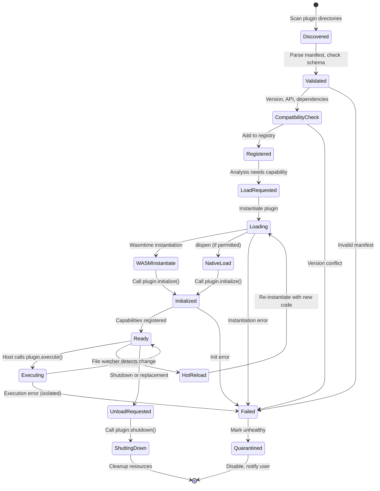

# Plugin Architecture

## Overview

The plugin system is the **core architectural pillar** of open-re. Every major capability—binary loading, disassembly, decompilation, AI analysis, export—is implemented as a plugin. This enables users to replace any component, vendors to ship proprietary extensions, and the community to innovate without core changes.

---

## Design Goals

| Goal | Implementation |
|------|----------------|
| **Replaceability** | Core plugins (disassembler, decompiler) use same interfaces as third-party |
| **Safety** | WASM sandbox by default; native plugins opt-in with capabilities |
| **Polyglot** | Plugins in Rust, C++, Go, Python, TypeScript via WASM |
| **Hot Reload** | Update plugins without restarting analysis sessions |
| **Versioning** | Semantic versioning with compatibility matrix |
| **Discovery** | Local filesystem + remote registry (opt-in) |
| **Isolation** | Plugin crash ≠ host crash; resource limits enforced |

---

## Plugin Types


```mermaid
graph TB
    subgraph "Plugin Categories"
        LOADER[Loader Plugins<br/>ELF, PE, Mach-O, Raw, Firmware]
        DISASM[Disassembler Plugins<br/>Capstone, LLVM, Custom]
        CFG[CFG Builder Plugins<br/>Standard, ML-enhanced]
        DEC[Decompiler Plugins<br/>Standard, ML-enhanced, Target-specific]
        TYPE[Type System Plugins<br/>C Header Import, PDB, DWARF]
        AI[AI Plugins<br/>Naming, Classification, Crypto, Vuln]
        EXPORT[Exporter Plugins<br/>C, Rust, Python, LLVM IR, GraphViz]
        VIEW[View Plugins<br/>Custom UI Panels, Visualizations]
        ANALYZER[Analyzer Plugins<br/>YARA, Capa, Taint, Custom]
    end
    
    subgraph "Extension Points"
        EP1[Binary Loading]
        EP2[Instruction Decoding]
        EP3[Function Detection]
        EP4[CFG Construction]
        EP5[Type Inference]
        EP6[Decompilation]
        EP7[AI Enrichment]
        EP8[Export]
        EP9[UI Views]
        EP10[Custom Analysis]
    end
    
    LOADER --> EP1
    DISASM --> EP2
    CFG --> EP3
    CFG --> EP4
    TYPE --> EP5
    DEC --> EP6
    AI --> EP7
    EXPORT --> EP8
    VIEW --> EP9
    ANALYZER --> EP10
```

---

## Plugin Manifest

```toml
# plugin.toml (required at plugin root)
[plugin]
id = "openre.disasm.capstone"
name = "Capstone Disassembler"
version = "1.2.0"
description = "Multi-architecture disassembler using Capstone Engine"
author = "open-re Team"
license = "MIT"
repository = "https://github.com/open-re/plugins"
homepage = "https://open-re.org/plugins/capstone-disasm"
categories = ["disassembler", "core"]
min_api_version = "1.0.0"
max_api_version = "2.0.0"

[plugin.capabilities]
# Capabilities this plugin provides
provides = [
  "disassemble",
  "instruction_semantics",
  "architecture:x86",
  "architecture:x86_64",
  "architecture:arm",
  "architecture:arm64",
  "architecture:mips",
  "architecture:riscv",
]

# Capabilities this plugin requires
requires = [
  "binary_read",
  "memory_map",
]

# Optional capabilities (graceful degradation)
optional = [
  "instruction_timing",
  "control_flow_hints",
]

[plugin.permissions]
# Sandbox permissions (deny by default)
filesystem = "none"           # none | read | write | sandbox
network = "none"              # none | localhost | egress
host_api = ["binary_read", "memory_map", "query_database"]
native_access = false         # Allow native code execution (requires signing)

[plugin.resources]
# Resource limits
max_memory_mb = 512
max_cpu_percent = 50
max_execution_time_secs = 300
max_open_files = 100

[plugin.configuration]
# User-configurable settings (JSON Schema)
config_schema = { type = "object", properties = { ... } }
default_config = { ... }

[plugin.dependencies]
# Other plugins this depends on
plugins = [
  { id = "openre.binary.base", version = "^1.0" },
]

[plugin.build]
# Build metadata (for registry)
targets = ["wasm32-wasip1", "x86_64-unknown-linux-gnu", "aarch64-apple-darwin"]
rust_version = "1.78"
```

---

## Plugin Interfaces

### Core Plugin Trait (Rust)

```rust
// crates/openre-plugins-sdk/src/lib.rs
use async_trait::async_trait;
use serde::{Deserialize, Serialize};

/// Unique plugin identifier
pub type PluginId = String;

/// Semantic version
pub type Version = semver::Version;

/// Plugin manifest (parsed from plugin.toml)
#[derive(Debug, Clone, Serialize, Deserialize)]
pub struct PluginManifest {
    pub id: PluginId,
    pub name: String,
    pub version: Version,
    pub description: String,
    pub author: String,
    pub license: String,
    pub capabilities: CapabilitySet,
    pub permissions: Permissions,
    pub resources: ResourceLimits,
    pub config_schema: serde_json::Value,
    pub default_config: serde_json::Value,
}

/// Capability identifier (namespaced)
pub type CapabilityId = String; // e.g., "disassemble", "architecture:x86_64"

/// Set of capabilities with version constraints
#[derive(Debug, Clone, Default, Serialize, Deserialize)]
pub struct CapabilitySet {
    pub provides: Vec<CapabilitySpec>,
    pub requires: Vec<CapabilitySpec>,
    pub optional: Vec<CapabilitySpec>,
}

#[derive(Debug, Clone, Serialize, Deserialize)]
pub struct CapabilitySpec {
    pub id: CapabilityId,
    pub version: Option<VersionRange>,
    pub params: Option<serde_json::Value>,
}

/// Plugin input/output for capability execution
#[derive(Debug, Clone, Serialize, Deserialize)]
pub struct PluginInput {
    pub capability: CapabilityId,
    pub params: serde_json::Value,
    pub context: PluginContext,
}

#[derive(Debug, Clone, Serialize, Deserialize)]
pub struct PluginOutput {
    pub success: bool,
    pub data: Option<serde_json::Value>,
    pub error: Option<String>,
    pub metrics: ExecutionMetrics,
}

#[derive(Debug, Clone, Serialize, Deserialize)]
pub struct PluginContext {
    pub project_id: ProjectId,
    pub file_id: Option<FileId>,
    pub function_id: Option<FunctionId>,
    pub address: Option<Address>,
    pub config: serde_json::Value,
    pub host_api: HostApiHandle,
}

/// Main plugin trait - implemented by all plugins
#[async_trait]
pub trait Plugin: Send + Sync {
    /// Returns the plugin manifest
    fn manifest(&self) -> &PluginManifest;
    
    /// Initialize plugin with host capabilities
    async fn initialize(&mut self, host: Arc<dyn HostCapabilities>) -> Result<(), PluginError>;
    
    /// Execute a capability
    async fn execute(&self, input: PluginInput) -> Result<PluginOutput, PluginError>;
    
    /// Hot-reload support (optional)
    async fn reload(&mut self, new_code: &[u8]) -> Result<(), PluginError> {
        Err(PluginError::NotSupported("hot_reload".into()))
    }
    
    /// Graceful shutdown
    async fn shutdown(&mut self) -> Result<(), PluginError> {
        Ok(())
    }
}

/// Host capabilities exposed to plugins
#[async_trait]
pub trait HostCapabilities: Send + Sync {
    /// Read binary data at offset
    async fn read_binary(&self, offset: u64, len: usize) -> Result<Vec<u8>, HostError>;
    
    /// Write annotation to database
    async fn write_annotation(&self, annotation: Annotation) -> Result<(), HostError>;
    
    /// Query analysis database
    async fn query_database(&self, query: SqlQuery) -> Result<QueryResult, HostError>;
    
    /// Request AI service
    async fn request_ai(&self, request: AiRequest) -> Result<AiResponse, HostError>;
    
    /// Emit progress event
    async fn emit_progress(&self, progress: f32, message: String) -> Result<(), HostError>;
    
    /// Get configuration value
    fn get_config(&self, key: &str) -> Option<serde_json::Value>;
}
```

### Capability Definitions

```rust
// Standard capability IDs (namespaced)
pub mod capabilities {
    // Loader capabilities
    pub const LOAD_BINARY: &str = "loader:load_binary";
    pub const DETECT_FORMAT: &str = "loader:detect_format";
    pub const EXTRACT_METADATA: &str = "loader:extract_metadata";
    pub const EXTRACT_RESOURCES: &str = "loader:extract_resources";
    
    // Disassembler capabilities
    pub const DISASSEMBLE: &str = "disassembler:disassemble";
    pub const INSTRUCTION_SEMANTICS: &str = "disassembler:instruction_semantics";
    pub const ARCH_X86: &str = "architecture:x86";
    pub const ARCH_X86_64: &str = "architecture:x86_64";
    pub const ARCH_ARM: &str = "architecture:arm";
    pub const ARCH_ARM64: &str = "architecture:arm64";
    pub const ARCH_MIPS: &str = "architecture:mips";
    pub const ARCH_RISCV: &str = "architecture:riscv";
    pub const ARCH_PPC: &str = "architecture:ppc";
    pub const ARCH_SPARC: &str = "architecture:sparc";
    
    // CFG capabilities
    pub const BUILD_CFG: &str = "cfg:build_cfg";
    pub const DETECT_FUNCTIONS: &str = "cfg:detect_functions";
    pub const RESOLVE_INDIRECT_CALLS: &str = "cfg:resolve_indirect_calls";
    pub const BUILD_CALL_GRAPH: &str = "cfg:build_call_graph";
    
    // Data flow capabilities
    pub const BUILD_SSA: &str = "dataflow:build_ssa";
    pub const VALUE_SET_ANALYSIS: &str = "dataflow:value_set_analysis";
    pub const TAINT_ANALYSIS: &str = "dataflow:taint_analysis";
    pub const REACHING_DEFINITIONS: &str = "dataflow:reaching_definitions";
    
    // Decompiler capabilities
    pub const DECOMPILE_FUNCTION: &str = "decompiler:decompile_function";
    pub const TYPE_INFERENCE: &str = "decompiler:type_inference";
    pub const STRUCT_RECONSTRUCTION: &str = "decompiler:struct_reconstruction";
    pub const CONTROL_STRUCTURE_RECOVERY: &str = "decompiler:control_structure_recovery";
    pub const EXPORT_C: &str = "decompiler:export_c";
    pub const EXPORT_RUST: &str = "decompiler:export_rust";
    pub const EXPORT_LLVM_IR: &str = "decompiler:export_llvm_ir";
    
    // Type system capabilities
    pub const PARSE_C_HEADERS: &str = "types:parse_c_headers";
    pub const IMPORT_PDB: &str = "types:import_pdb";
    pub const IMPORT_DWARF: &str = "types:import_dwarf";
    pub const TYPE_PROPAGATION: &str = "types:type_propagation";
    
    // AI capabilities
    pub const CLASSIFY_FUNCTION: &str = "ai:classify_function";
    pub const SUGGEST_NAMES: &str = "ai:suggest_names";
    pub const SUGGEST_TYPES: &str = "ai:suggest_types";
    pub const EXPLAIN_FUNCTION: &str = "ai:explain_function";
    pub const DETECT_CRYPTO: &str = "ai:detect_crypto";
    pub const DETECT_OBFUSCATION: &str = "ai:detect_obfuscation";
    pub const DETECT_VULNERABILITIES: &str = "ai:detect_vulnerabilities";
    
    // Analysis capabilities
    pub const SCAN_YARA: &str = "analysis:scan_yara";
    pub const RUN_CAPA: &str = "analysis:run_capa";
    pub const MATCH_SIGNATURES: &str = "analysis:match_signatures";
    
    // Export capabilities
    pub const EXPORT_GRAPHVIZ: &str = "export:graphviz";
    pub const EXPORT_JSON: &str = "export:json";
    pub const EXPORT_SARIF: &str = "export:sarif";
}
```

---

## Plugin Lifecycle


```mermaid
stateDiagram-v2
    [*] --> Discovered: Scan plugin directories
    Discovered --> Validated: Parse manifest, check schema
    Validated --> CompatibilityCheck: Version, API, dependencies
    CompatibilityCheck --> Registered: Add to registry
    Registered --> LoadRequested: Analysis needs capability
    LoadRequested --> Loading: Instantiate plugin
    Loading --> WASMInstantiate: Wasmtime instantiation
    Loading --> NativeLoad: dlopen (if permitted)
    WASMInstantiate --> Initialized: Call plugin.initialize()
    NativeLoad --> Initialized: Call plugin.initialize()
    Initialized --> Ready: Capabilities registered
    Ready --> Executing: Host calls plugin.execute()
    Executing --> Ready: Return result
    Ready --> HotReload: File watcher detects change
    HotReload --> Loading: Re-instantiate with new code
    Ready --> UnloadRequested: Shutdown or replacement
    UnloadRequested --> ShuttingDown: Call plugin.shutdown()
    ShuttingDown --> [*]: Cleanup resources
    
    Validated --> Failed: Invalid manifest
    CompatibilityCheck --> Failed: Version conflict
    Loading --> Failed: Instantiation error
    Initialized --> Failed: Init error
    Executing --> Failed: Execution error (isolated)
    Failed --> Quarantined: Mark unhealthy
    Quarantined --> [*]: Disable, notify user
```

---

## Plugin Loader

```rust
// crates/openre-plugins/src/loader.rs
pub struct PluginLoader {
    registry: Arc<PluginRegistry>,
    wasm_runtime: Arc<WasmtimeRuntime>,
    native_loader: Arc<NativeLoader>,
    sandbox: Arc<SandboxManager>,
    capability_resolver: Arc<CapabilityResolver>,
}

impl PluginLoader {
    /// Load plugin by ID with version resolution
    pub async fn load(&self, plugin_id: &str, version: Option<Version>) -> Result<PluginHandle, PluginError> {
        // 1. Resolve version
        let manifest = self.registry.resolve(plugin_id, version).await?;
        
        // 2. Check compatibility
        self.capability_resolver.check_compatibility(&manifest).await?;
        
        // 3. Load based on target
        let plugin = if manifest.build.targets.contains(&"wasm32-wasip1".to_string()) {
            self.load_wasm(&manifest).await?
        } else if manifest.permissions.native_access && self.native_loader.is_allowed(&manifest) {
            self.load_native(&manifest).await?
        } else {
            return Err(PluginError::UnsupportedTarget);
        };
        
        // 4. Initialize with host capabilities
        let host = self.create_host_handle(&manifest).await?;
        plugin.initialize(host).await?;
        
        // 5. Register capabilities
        self.registry.register_capabilities(&manifest, plugin.clone()).await?;
        
        Ok(PluginHandle { plugin, manifest })
    }
    
    /// Load WASM plugin with sandboxing
    async fn load_wasm(&self, manifest: &PluginManifest) -> Result<Box<dyn Plugin>, PluginError> {
        let wasm_bytes = self.fetch_wasm_binary(manifest).await?;
        
        // Configure Wasmtime with resource limits
        let mut config = wasmtime::Config::new();
        config.wasm_memory64(false);
        config.consume_fuel(true);
        config.max_wasm_stack(manifest.resources.max_stack_kb * 1024);
        
        let engine = self.wasm_runtime.engine(&config)?;
        let mut linker = wasmtime::Linker::new(&engine);
        
        // Add host functions
        self.add_host_functions(&mut linker, manifest)?;
        
        // Instantiate with fuel limit
        let mut store = wasmtime::Store::new(&engine, ());
        store.add_fuel(manifest.resources.max_fuel.unwrap_or(10_000_000))?;
        store.limiter(|store| store.fuel_consumed());
        
        let module = wasmtime::Module::new(&engine, &wasm_bytes)?;
        let instance = linker.instantiate(&mut store, &module)?;
        
        // Get plugin exports
        let plugin = WasmPlugin::new(store, instance, manifest.clone())?;
        
        Ok(Box::new(plugin))
    }
    
    /// Load native plugin (dlopen) - requires explicit permission
    async fn load_native(&self, manifest: &PluginManifest) -> Result<Box<dyn Plugin>, PluginError> {
        if !manifest.permissions.native_access {
            return Err(PluginError::NativeAccessDenied);
        }
        
        // Verify signature
        self.verify_signature(manifest).await?;
        
        let path = self.fetch_native_binary(manifest).await?;
        let library = unsafe { libloading::Library::new(&path)? };
        
        // Get plugin entry point
        let create_plugin: Symbol<unsafe extern "C" fn() -> *mut dyn Plugin> = 
            unsafe { library.get(b"create_plugin")? };
        
        let plugin = unsafe { Box::from_raw(create_plugin()) };
        
        Ok(plugin)
    }
}
```

---

## Sandboxing Model

### WASM Sandbox (Default)

```rust
// crates/openre-plugins/src/sandbox.rs
pub struct WasmSandbox {
    engine: wasmtime::Engine,
    fuel_limit: u64,
    memory_limit: usize,
    allowed_host_functions: HashSet<String>,
}

impl WasmSandbox {
    pub fn new(config: SandboxConfig) -> Result<Self, SandboxError> {
        let mut engine_config = wasmtime::Config::new();
        
        // Security: No SIMD, no threads, no memory64
        engine_config.wasm_simd(false);
        engine_config.wasm_threads(false);
        engine_config.wasm_memory64(false);
        engine_config.wasm_bulk_memory(false);
        engine_config.wasm_reference_types(false);
        
        // Resource limits
        engine_config.consume_fuel(true);
        engine_config.max_wasm_stack(config.max_stack_kb * 1024);
        
        let engine = wasmtime::Engine::new(&engine_config)?;
        
        Ok(Self {
            engine,
            fuel_limit: config.max_fuel,
            memory_limit: config.max_memory_mb * 1024 * 1024,
            allowed_host_functions: config.allowed_host_functions,
        })
    }
    
    pub fn create_store(&self) -> wasmtime::Store<PluginState> {
        let mut store = wasmtime::Store::new(&self.engine, PluginState::default());
        store.add_fuel(self.fuel_limit).unwrap();
        store.limiter(|store| store.data().fuel_consumed());
        store
    }
}
```

### Capability-Based Permissions

```rust
// Permission model (deny by default)
#[derive(Debug, Clone, Serialize, Deserialize)]
pub struct Permissions {
    pub filesystem: FilesystemPermission,  // none | read | write | sandbox
    pub network: NetworkPermission,        // none | localhost | egress
    pub host_api: Vec<String>,             // Explicit host API allowlist
    pub native_access: bool,               // Allow native code (requires signing)
}

#[derive(Debug, Clone, Serialize, Deserialize)]
pub enum FilesystemPermission {
    None,
    Read { paths: Vec<PathBuf> },
    Write { paths: Vec<PathBuf> },
    Sandbox { mount_points: Vec<MountPoint> },
}

#[derive(Debug, Clone, Serialize, Deserialize)]
pub enum NetworkPermission {
    None,
    Localhost { ports: Vec<u16> },
    Egress { domains: Vec<String> },
}
```

---

## Plugin Registry

```rust
// crates/openre-plugins/src/registry.rs
pub struct PluginRegistry {
    plugins: DashMap<PluginId, PluginEntry>,
    capabilities: DashMap<CapabilityId, Vec<PluginId>>,
    remote_client: Option<RemoteRegistryClient>,
}

#[derive(Debug, Clone)]
pub struct PluginEntry {
    pub manifest: PluginManifest,
    pub source: PluginSource,
    pub status: PluginStatus,
    pub loaded_at: Option<DateTime<Utc>>,
}

#[derive(Debug, Clone)]
pub enum PluginSource {
    Local { path: PathBuf },
    Remote { registry: String, digest: String },
}

#[derive(Debug, Clone, PartialEq)]
pub enum PluginStatus {
    Discovered,
    Registered,
    Loading,
    Ready,
    Error(String),
    Quarantined,
}

impl PluginRegistry {
    /// Discover plugins from local directories
    pub async fn discover(&self, dirs: &[PathBuf]) -> Result<Vec<PluginManifest>, RegistryError> {
        let mut manifests = Vec::new();
        
        for dir in dirs {
            for entry in walkdir::WalkDir::new(dir).max_depth(2) {
                let entry = entry?;
                if entry.file_name() == "plugin.toml" {
                    let manifest = self.parse_manifest(entry.path())?;
                    manifests.push(manifest);
                }
            }
        }
        
        Ok(manifests)
    }
    
    /// Register discovered plugins
    pub async fn register(&self, manifests: Vec<PluginManifest>) -> Result<(), RegistryError> {
        for manifest in manifests {
            // Validate
            self.validate_manifest(&manifest)?;
            
            // Check conflicts
            if let Some(existing) = self.plugins.get(&manifest.id) {
                if existing.manifest.version >= manifest.version {
                    continue; // Keep newer/equal version
                }
            }
            
            // Register
            self.plugins.insert(manifest.id.clone(), PluginEntry {
                manifest: manifest.clone(),
                source: PluginSource::Local { path: manifest.path.clone() },
                status: PluginStatus::Registered,
                loaded_at: None,
            });
            
            // Index capabilities
            for cap in &manifest.capabilities.provides {
                self.capabilities.entry(cap.id.clone())
                    .or_default()
                    .push(manifest.id.clone());
            }
        }
        
        Ok(())
    }
    
    /// Resolve best plugin for capability
    pub async fn resolve_capability(
        &self,
        capability: &CapabilityId,
        requirements: &CapabilityRequirements,
    ) -> Result<PluginId, RegistryError> {
        let candidates = self.capabilities.get(capability)
            .ok_or(RegistryError::CapabilityNotFound(capability.clone()))?;
        
        // Filter by version, compatibility, status
        let eligible: Vec<_> = candidates.iter()
            .filter_map(|id| self.plugins.get(id))
            .filter(|entry| entry.status == PluginStatus::Ready)
            .filter(|entry| self.check_compatibility(entry, requirements))
            .collect();
        
        // Select best (newest version, lowest resource usage)
        eligible.into_iter()
            .max_by_key(|e| (e.manifest.version.clone(), std::cmp::Reverse(e.manifest.resources.max_memory_mb)))
            .map(|e| e.manifest.id.clone())
            .ok_or(RegistryError::NoEligiblePlugin)
    }
}
```

---

## Remote Registry (Opt-In)

```rust
// crates/openre-plugins/src/remote_registry.rs
pub struct RemoteRegistryClient {
    base_url: Url,
    http_client: reqwest::Client,
    auth_token: Option<String>,
}

impl RemoteRegistryClient {
    /// Search plugins
    pub async fn search(&self, query: &str, filters: SearchFilters) -> Result<Vec<RemotePluginInfo>, RegistryError> { ... }
    
    /// Get plugin manifest
    pub async fn get_manifest(&self, plugin_id: &str, version: Option<Version>) -> Result<PluginManifest, RegistryError> { ... }
    
    /// Download plugin binary
    pub async fn download(&self, plugin_id: &str, version: Version, target: &str) -> Result<Vec<u8>, RegistryError> { ... }
    
    /// Publish plugin (for maintainers)
    pub async fn publish(&self, package: PluginPackage) -> Result<PublishResult, RegistryError> { ... }
}
```

---

## Plugin SDK (For Developers)

### Rust SDK

```rust
// openre-plugin-sdk crate (published separately)
use openre_plugin_sdk::{plugin, capability, Plugin, PluginInput, PluginOutput};

#[plugin(
    id = "myorg.custom-analyzer",
    name = "Custom Analyzer",
    version = "1.0.0",
    capabilities = ["analysis:custom_pattern"]
)]
struct CustomAnalyzer {
    config: CustomConfig,
}

#[capability(id = "analysis:custom_pattern")]
impl CustomAnalyzer {
    async fn analyze(&self, input: PluginInput) -> Result<PluginOutput, PluginError> {
        let binary = input.host.read_binary(0, 1024).await?;
        let matches = self.find_patterns(&binary);
        
        for m in matches {
            input.host.write_annotation(Annotation {
                type: "custom_pattern".into(),
                address: m.offset,
                data: serde_json::to_value(m)?,
            }).await?;
        }
        
        Ok(PluginOutput::success(serde_json::json!({ "matches": matches.len() })))
    }
}
```

### Python SDK

```python
# openre-plugin-python (pip installable)
from openre.plugin import Plugin, capability, PluginInput, PluginOutput

class YaraScanner(Plugin):
    manifest = {
        "id": "openre.yara",
        "name": "YARA Scanner",
        "version": "1.0.0",
        "capabilities": ["analysis:scan_yara"],
    }
    
    @capability("analysis:scan_yara")
    async def scan(self, input: PluginInput) -> PluginOutput:
        rules = input.config.get("rules", "")
        binary = await input.host.read_binary(0, -1)
        
        matches = yara.compile(source=rules).match(data=binary)
        
        for match in matches:
            await input.host.write_annotation({
                "type": "yara_match",
                "rule": match.rule,
                "tags": match.tags,
                "offset": match.offset,
            })
        
        return PluginOutput.success({"matches": len(matches)})
```

### TypeScript SDK (for UI plugins)

```typescript
// @openre/plugin-sdk (npm package)
import { Plugin, capability, ViewExtension, PanelExtension } from '@openre/plugin-sdk';

class CustomViewPlugin extends Plugin {
  manifest = {
    id: 'myorg.custom-view',
    name: 'Custom View',
    version: '1.0.0',
    capabilities: ['view:custom'],
  };
  
  @capability('view:custom')
  createView(): ViewExtension {
    return {
      id: 'custom-view',
      label: 'Custom Analysis',
      icon: <CustomIcon />,
      component: CustomViewComponent,
      when: (ctx) => ctx.fileType === 'elf',
    };
  }
}
```

---

## Versioning & Compatibility

### Semantic Versioning Rules

| Change | Version Bump | Compatibility |
|--------|--------------|---------------|
| Bug fix | PATCH (1.0.1) | Fully compatible |
| New capability (additive) | MINOR (1.1.0) | Backward compatible |
| New required host API | MINOR (1.1.0) | Backward compatible |
| Remove capability | MAJOR (2.0.0) | Breaking |
| Change capability signature | MAJOR (2.0.0) | Breaking |
| Change host API | MAJOR (2.0.0) | Breaking |

### Compatibility Matrix

```rust
// crates/openre-plugins/src/compatibility.rs
pub fn check_compatibility(
    plugin: &PluginManifest,
    host_api_version: &Version,
    loaded_plugins: &[PluginManifest],
) -> Result<(), CompatibilityError> {
    // 1. Check API version range
    if !plugin.min_api_version.satisfies(host_api_version) {
        return Err(CompatibilityError::ApiVersionTooOld);
    }
    if !plugin.max_api_version.satisfies(host_api_version) {
        return Err(CompatibilityError::ApiVersionTooNew);
    }
    
    // 2. Check dependency plugins
    for dep in &plugin.dependencies.plugins {
        let dep_plugin = loaded_plugins.iter().find(|p| p.id == dep.id);
        if dep_plugin.is_none() {
            return Err(CompatibilityError::MissingDependency(dep.id.clone()));
        }
        if !dep.version.matches(&dep_plugin.unwrap().version) {
            return Err(CompatibilityError::DependencyVersionMismatch);
        }
    }
    
    // 3. Check capability conflicts
    for cap in &plugin.capabilities.provides {
        for other in loaded_plugins {
            if other.id == plugin.id { continue; }
            if other.capabilities.provides.iter().any(|c| c.id == cap.id) {
                // Allow if versions compatible and not both required
                if cap.required && other.capabilities.provides.iter()
                    .find(|c| c.id == cap.id)
                    .map(|c| c.required)
                    .unwrap_or(false) {
                    return Err(CompatibilityError::CapabilityConflict(cap.id.clone()));
                }
            }
        }
    }
    
    Ok(())
}
```

---

## Hot Reload

```rust
// crates/openre-plugins/src/hot_reload.rs
pub struct HotReloadManager {
    watcher: notify::RecommendedWatcher,
    loader: Arc<PluginLoader>,
    registry: Arc<PluginRegistry>,
}

impl HotReloadManager {
    pub async fn start(&self) -> Result<(), HotReloadError> {
        let (tx, mut rx) = tokio::sync::mpsc::channel(100);
        
        let mut watcher = notify::recommended_watcher(move |res| {
            if let Ok(event) = res {
                if event.kind.is_modify() {
                    for path in event.paths {
                        if path.extension().map_or(false, |e| e == "wasm" || e == "so" || e == "dylib") {
                            let _ = tx.try_send(path);
                        }
                    }
                }
            }
        })?;
        
        // Watch plugin directories
        for dir in self.get_plugin_dirs() {
            watcher.watch(dir, RecursiveMode::NonRecursive)?;
        }
        
        // Process reload events
        tokio::spawn(async move {
            while let Some(path) = rx.recv().await {
                if let Err(e) = self.reload_plugin(&path).await {
                    tracing::error!("Hot reload failed for {:?}: {}", path, e);
                }
            }
        });
        
        Ok(())
    }
    
    async fn reload_plugin(&self, path: &Path) -> Result<(), HotReloadError> {
        // 1. Find plugin by binary path
        let plugin_id = self.find_plugin_by_binary(path)?;
        
        // 2. Get current plugin handle
        let old_handle = self.registry.get_handle(&plugin_id)?;
        
        // 3. Load new version
        let new_handle = self.loader.load(&plugin_id, None).await?;
        
        // 4. Migrate state (if plugin supports it)
        if let Some(migratable) = old_handle.as_migratable() {
            let state = migratable.export_state().await?;
            new_handle.as_migratable().unwrap().import_state(state).await?;
        }
        
        // 5. Atomic swap
        self.registry.swap_handle(&plugin_id, new_handle)?;
        
        // 6. Notify dependent systems
        self.emit_reload_event(&plugin_id).await?;
        
        Ok(())
    }
}
```

---

## Error Isolation

```rust
// Plugin execution with full isolation
pub async fn execute_plugin_capability(
    plugin: &dyn Plugin,
    input: PluginInput,
    timeout: Duration,
) -> Result<PluginOutput, PluginError> {
    let (tx, rx) = tokio::sync::oneshot::channel();
    
    // Spawn in separate task with timeout
    let handle = tokio::spawn(async move {
        let result = plugin.execute(input).await;
        let _ = tx.send(result);
    });
    
    // Wait with timeout
    let result = tokio::time::timeout(timeout, rx).await;
    
    match result {
        Ok(Ok(plugin_result)) => plugin_result,
        Ok(Err(e)) => Err(PluginError::ExecutionFailed(e.to_string())),
        Err(_) => {
            handle.abort();
            Err(PluginError::Timeout)
        }
    }
}
```

---

## Built-in Plugins (Shipped with Core)

| Plugin ID | Type | Description | Required |
|-----------|------|-------------|----------|
| `openre.loader.elf` | Loader | ELF binary loader | Yes |
| `openre.loader.pe` | Loader | PE/COFF binary loader | Yes |
| `openre.loader.macho` | Loader | Mach-O binary loader | Yes |
| `openre.disasm.capstone` | Disassembler | Capstone-based multi-arch | Yes |
| `openre.disasm.llvm` | Disassembler | LLVM-based (alternative) | No |
| `openre.cfg.standard` | CFG | Standard CFG builder | Yes |
| `openre.decompiler.standard` | Decompiler | LLIL/MLIL/HLIL pipeline | Yes |
| `openre.ai.naming` | AI | Function/variable naming | Yes |
| `openre.ai.classification` | AI | Function classification | Yes |
| `openre.ai.crypto` | AI | Crypto constant detection | Yes |
| `openre.analysis.yara` | Analyzer | YARA rule scanner | No |
| `openre.analysis.capa` | Analyzer | Capability detection | No |
| `openre.export.c` | Exporter | C pseudo-code export | Yes |
| `openre.export.graphviz` | Exporter | GraphViz DOT export | No |

---

## Security Plugins (Phase 5A)

The following security assessment plugins are included for authentication, session management, and common web security misconfigurations:

| Plugin ID | Type | Description | Category |
|-----------|------|-------------|----------|
| `openre.security.auth_discovery` | Security | Discovers authentication endpoints (login, register, password reset, MFA, SSO, OAuth/OIDC) | Authentication |
| `openre.security.session_management` | Security | Analyzes session cookie generation, expiration, invalidation, rotation, fixation | Session Management |
| `openre.security.cookie_security` | Security | Validates cookie security attributes (Secure, HttpOnly, SameSite, Domain, Path, Expiration, Weak values) | Cookie Security |
| `openre.security.security_headers` | Security | Checks security headers (CSP, HSTS, X-Frame-Options, Referrer-Policy, Permissions-Policy, X-Content-Type-Options, Cache-Control, Cross-Origin headers) | Security Headers |
| `openre.security.cors_analysis` | Security | Evaluates CORS configuration (wildcard origins, credentials, origin reflection, unsafe methods) | CORS |
| `openre.security.rate_limiting` | Security | Tests rate limiting on endpoints (general, auth, API) | Rate Limiting |
| `openre.security.information_disclosure` | Security | Detects information exposure (server headers, framework versions, debug pages, stack traces, sensitive data) | Information Disclosure |

### Security Plugin Capabilities

All security plugins require these capabilities:
- `NetworkAccess` - Make HTTP requests to target
- `ReadConfig` - Read plugin configuration
- `ReadBinary` - Read binary data (for consistency with plugin interface)
- `WriteAnnotations` - Write findings to database
- `QueryDatabase` - Query scan database

### Security Plugin Manifest Example

```toml
# plugin.toml for security plugins
[plugin]
type = "security"
capabilities = ["ReadBinary", "WriteAnnotations", "QueryDatabase", "NetworkAccess", "ReadConfig"]
min_core_version = "0.1.0"
max_core_version = "1.0.0"

[plugin.entry]
wasm = "security_plugin.wasm"
native = { linux = "libsecurity_plugin.so", macos = "libsecurity_plugin.dylib", windows = "security_plugin.dll" }

[build]
target = "wasm"
rust_version = "1.75"
features = []

[resources]
max_memory_mb = 256
max_fuel = 10000000
max_execution_time_secs = 300

[config]
schema = "config_schema.json"
defaults = {}
```

### Security Plugin Configuration Schema

```json
{
  "$schema": "http://json-schema.org/draft-07/schema#",
  "title": "Security Plugin Configuration",
  "type": "object",
  "properties": {
    "settings": {
      "type": "object",
      "properties": {
        "aggressive_mode": { "type": "boolean", "default": false },
        "verify_ssl": { "type": "boolean", "default": true }
      }
    },
    "enabled_checks": {
      "type": "array",
      "items": { "type": "string" },
      "description": "Which security checks to enable"
    },
    "request_timeout": { "type": "integer", "default": 30, "minimum": 5, "maximum": 300 },
    "max_concurrent_requests": { "type": "integer", "default": 10, "minimum": 1, "maximum": 100 },
    "user_agent": { "type": "string", "default": "open-re-security-scanner/1.0" },
    "follow_redirects": { "type": "boolean", "default": true },
    "max_redirects": { "type": "integer", "default": 10, "minimum": 0, "maximum": 50 }
  },
  "required": ["request_timeout", "max_concurrent_requests", "user_agent"]
}
```

### Security Finding Schema

Security plugins return findings using the standardized schema with these categories:
- `BrokenAuthentication` - Authentication and session issues
- `SecurityMisconfiguration` - Header, cookie, CORS, rate limiting issues
- `InformationDisclosure` - Information exposure issues

Each finding includes:
- Severity (Info, Low, Medium, High, Critical)
- Confidence (VeryLow, Low, Medium, High, VeryHigh)
- Evidence (HTTP request/response data)
- References (CWE, OWASP, CVE)
- Tags for categorization
- Risk score (0-100)
- Optional CVSS vector/score

---

## Injection Testing Framework Plugins (Phase 5B)

The injection testing framework provides a modular, shared infrastructure for detecting injection vulnerabilities. Each vulnerability type is implemented as a plugin using the common framework components.

### Injection Plugin Architecture

```
┌─────────────────────────────────────────────────────────────────┐
                    BaseInjectionPlugin
├─────────────────────────────────────────────────────────────────┤
  ┌──────────────┐ ┌──────────────┐ ┌──────────────┐ ┌──────────┐
  │  Payload     │ │  Request     │ │  Response    │ │Confidence│
  │  Engine      │ │  Engine      │ │  Analyzer    │ │ Scorer   │
  └──────────────┘ └──────────────┘ └──────────────┘ └──────────┘
         │               │               │              │
         └───────────────┼───────────────┼──────────────┘
                         ▼
              ┌─────────────────────┐
              │  Safety Controller  │
              └─────────────────────┘
```

### Shared Framework Components

| Component | Purpose | Location |
|-----------|---------|----------|
| **PayloadEngine** | Payload generation, context-aware selection, encoding | `crates/openre-plugins/src/injection/payload_engine.rs` |
| **RequestEngine** | Tests query params, POST bodies, JSON, XML, multipart, headers, cookies | `crates/openre-plugins/src/injection/request_engine.rs` |
| **ResponseAnalyzer** | Error-based, boolean-based, time-based, reflection, pattern matching, differential | `crates/openre-plugins/src/injection/response_analyzer.rs` |
| **ConfidenceScorer** | Multi-factor confidence scoring | `crates/openre-plugins/src/injection/confidence_scoring.rs` |
| **SafetyController** | Rate limiting, scope enforcement, payload blocking, authorization | `crates/openre-plugins/src/injection/safety_controls.rs` |

### Injection Plugins (Security Type)

| Plugin ID | Category | Detection Methods | Severity |
|-----------|----------|-------------------|----------|
| `openre.injection.sql_injection` | SQL Injection | Error-based, Boolean-based, Time-based, Union-based, Pattern Match | High |
| `openre.injection.nosql_injection` | NoSQL Injection | Error-based, Pattern Match | High |
| `openre.injection.xss` | Cross-Site Scripting | Reflection, Pattern Match, Differential | High |
| `openre.injection.ssti` | Server-Side Template Injection | Pattern Match, Error-based, Reflection | Critical |
| `openre.injection.command_injection` | Command Injection | Pattern Match, Error-based, Time-based | Critical |
| `openre.injection.xxe` | XML External Entity | Pattern Match, Error-based, Out-of-Band | Critical |
| `openre.injection.ldap_injection` | LDAP Injection | Error-based, Pattern Match, Boolean-based | High |
| `openre.injection.xpath_injection` | XPath Injection | Error-based, Pattern Match, Boolean-based | High |
| `openre.injection.header_injection` | HTTP Header Injection | Reflection, Pattern Match, Differential | High |

### Injection Plugin Capabilities

All injection plugins require:
- `NetworkAccess` - Make HTTP requests to target
- `ReadConfig` - Read plugin configuration

### Injection Plugin Manifest Example

```toml
# plugin.toml for injection plugins
[plugin]
type = "security"
capabilities = ["NetworkAccess", "ReadConfig"]
min_core_version = "0.1.0"
max_core_version = "1.0.0"

[plugin.entry]
wasm = "injection_plugin.wasm"
native = { linux = "libinjection_plugin.so", macos = "libinjection_plugin.dylib", windows = "injection_plugin.dll" }

[build]
target = "wasm"
rust_version = "1.75"
features = []

[resources]
max_memory_mb = 256
max_fuel = 10000000
max_execution_time_secs = 300

[config]
schema = "config_schema.json"
defaults = {}
```

### Injection Plugin Configuration Schema

```json
{
  "$schema": "http://json-schema.org/draft-07/schema#",
  "title": "Injection Plugin Configuration",
  "type": "object",
  "properties": {
    "enabled_tests": {
      "type": "array",
      "items": { "type": "string" },
      "description": "Enabled test categories"
    },
    "request_timeout": { "type": "integer", "minimum": 1, "maximum": 300, "default": 30 },
    "max_concurrent_requests": { "type": "integer", "minimum": 1, "maximum": 50, "default": 10 },
    "user_agent": { "type": "string", "default": "open-re-injection-tester/1.0" },
    "follow_redirects": { "type": "boolean", "default": true },
    "max_redirects": { "type": "integer", "minimum": 0, "maximum": 20, "default": 10 },
    "safety": {
      "type": "object",
      "properties": {
        "max_requests_per_test": { "type": "integer", "minimum": 1, "maximum": 1000, "default": 100 },
        "max_total_requests": { "type": "integer", "minimum": 1, "maximum": 100000, "default": 10000 },
        "rate_limit_rps": { "type": "number", "minimum": 0, "maximum": 1000, "default": 10.0 },
        "max_payloads_per_param": { "type": "integer", "minimum": 1, "maximum": 500, "default": 50 },
        "max_concurrency": { "type": "integer", "minimum": 1, "maximum": 50, "default": 5 },
        "request_timeout_secs": { "type": "integer", "minimum": 1, "maximum": 300, "default": 30 },
        "allowed_scopes": { "type": "array", "items": { "type": "string" }, "default": [] },
        "blocked_patterns": { "type": "array", "items": { "type": "string" }, "default": ["DROP TABLE", "DELETE FROM", "rm -rf"] },
        "require_authorization": { "type": "boolean", "default": true }
      },
      "required": ["max_requests_per_test", "max_total_requests", "rate_limit_rps", "max_payloads_per_param", "max_concurrency", "request_timeout_secs", "allowed_scopes", "blocked_patterns", "require_authorization"]
    }
  },
  "required": ["enabled_tests", "request_timeout", "max_concurrent_requests", "user_agent", "follow_redirects", "max_redirects", "safety"]
}
```

### Injection Plugin Implementation Pattern

```rust
// crates/openre-plugins/src/injection/sql_injection.rs
use crate::injection::{
    InjectionCategory, InjectionPluginConfig, InjectionTestResult,
    ParameterLocation, PayloadContext, PayloadEngine, RequestEngine,
    ResponseAnalyzer, SafetyConfig, create_payload_engine,
    create_request_engine, create_response_analyzer,
};
use crate::sdk::{Plugin, CapabilityRequest, CapabilityResponse, AnalysisContext, Result, Capability};

pub struct SqlInjectionPlugin {
    base: BaseInjectionPlugin,
}

impl SqlInjectionPlugin {
    pub fn new(config: InjectionPluginConfig) -> Result<Self, String> {
        let base = BaseInjectionPlugin::new(config, InjectionCategory::SqlInjection)?;
        Ok(Self { base })
    }
}

#[async_trait]
impl Plugin for SqlInjectionPlugin {
    type Config = InjectionPluginConfig;
    
    fn new(config: Self::Config) -> Self {
        Self::new(config).expect("Failed to create SQL injection plugin")
    }
    
    fn capabilities(&self) -> Vec<Capability> {
        vec![Capability::NetworkAccess, Capability::ReadConfig]
    }
    
    async fn execute(&self, request: CapabilityRequest) -> Result<CapabilityResponse> {
        let target_url = request.input.get("target_url").and_then(|v| v.as_str()).unwrap_or("http://localhost");
        
        let parameters = request.input.get("parameters")
            .and_then(|v| serde_json::from_value(v.clone()).ok())
            .unwrap_or_else(|| vec![
                ParameterTestConfig { name: "id".to_string(), location: ParameterLocation::Query, required: false },
                ParameterTestConfig { name: "search".to_string(), location: ParameterLocation::Query, required: false },
            ]);
        
        let payload_context = PayloadContext {
            parameter_name: "".to_string(),
            location: ParameterLocation::Query,
            technology_hints: vec![],
            database_type: None,
            // ... other fields
        };
        
        let results = self.base.execute_injection_tests(target_url, parameters, &payload_context).await;
        let findings = self.base.results_to_findings(results, scan_id, target_url);
        
        Ok(CapabilityResponse::success(json!({ "findings": findings })))
    }
}

impl InjectionPlugin for SqlInjectionPlugin {
    fn injection_category(&self) -> InjectionCategory { InjectionCategory::SqlInjection }
    fn version(&self) -> &'static str { "1.0.0" }
    fn payload_engine(&self) -> Box<dyn PayloadEngine> { create_payload_engine(self.base.config.safety.clone()) }
    fn response_analyzer(&self) -> Box<dyn ResponseAnalyzer> { create_response_analyzer(InjectionCategory::SqlInjection) }
}
```

### Adding New Injection Types

1. **Add to `InjectionCategory` enum** in `mod.rs`
2. **Add payloads** in `payload_engine.rs` → `load_builtin_payloads()`
3. **Add error patterns** in `response_analyzer.rs` → `load_error_patterns()`
4. **Add pattern matching** in `response_analyzer.rs` → `check_patterns()`
5. **Create plugin** following existing pattern
6. **Add plugin manifest** in `plugins/security/<name>/`
7. **Register in plugin registry** (auto-discovered from `local_plugin_dir`)

### Injection Testing API Endpoints

| Endpoint | Description |
|----------|-------------|
| `GET /api/security/injection/findings` | List injection findings with filters |
| `GET /api/security/injection/findings/stats` | Injection statistics by category/method |
| `GET /api/security/injection/categories` | List all injection categories |
| `GET /api/security/injection/detection-methods` | List all detection methods |

### CLI Commands

```bash
# List injection findings
sentinel finding security injection --scan-id <scan_id>

# Injection statistics
sentinel finding security injection-stats --scan-id <scan_id>

# List categories
sentinel finding security injection-categories

# List detection methods
sentinel finding security detection-methods
```

### Safety Controls

All injection plugins inherit comprehensive safety controls:

- **Authorization Required**: Explicit token required by default
- **Scope Enforcement**: Allowed/blocked host patterns with wildcards
- **Payload Blocking**: Blocks destructive patterns (DROP TABLE, rm -rf, etc.)
- **Rate Limiting**: Token bucket algorithm (configurable RPS)
- **Request Limits**: Per-test and per-scan limits
- **Concurrency Control**: Semaphore-based limiting
- **Timeouts**: Per-request and per-plugin timeouts

### Testing Methodology

Each injection plugin follows evidence-based detection:

1. **Baseline Capture**: Clean request/response for each parameter
2. **Payload Generation**: Context-aware, encoded variants
3. **Request Execution**: Rate-limited, safety-checked
4. **Multi-Method Analysis**: Error-based, boolean-based, time-based, reflection, pattern match, differential
5. **Confidence Scoring**: Multi-factor algorithm with evidence quality
6. **Finding Generation**: Reproducible request, verification steps, references

### Documentation

- [Framework Architecture](../injection/framework_architecture.md)
- [Plugin Development Guide](../injection/plugin_development_guide.md)
- [Testing Methodology](../injection/testing_methodology.md)
- [Safety Controls](../injection/safety_controls.md)
- [API Documentation](../injection/api_documentation.md)

---

## API Security Plugins (Phase 5C)

The API Security plugins provide comprehensive security assessment for modern API architectures including REST APIs, GraphQL services, and rate limiting implementations.

### API Security Plugin Architecture

```
┌─────────────────────────────────────────────────────────────────┐
                    BaseSecurityPlugin
├─────────────────────────────────────────────────────────────────┤
  ┌──────────────┐ ┌──────────────┐ ┌──────────────┐ ┌──────────┐
  │  Discovery   │ │  Analysis    │ │  Validation  │ │ Reporting│
  │  Engine      │ │  Engine      │ │  Engine      │ │  Engine  │
  └──────────────┘ └──────────────┘ └──────────────┘ └──────────┘
```

### API Security Plugins (Security Type)

| Plugin ID | Category | Description | Severity |
|-----------|----------|-------------|----------|
| `openre.security.rest_api` | REST API Security | Discovers and analyzes REST API endpoints for security issues | High |
| `openre.security.graphql` | GraphQL Security | Detects GraphQL endpoints and analyzes for security issues | High |
| `openre.security.api_rate_limiting` | API Rate Limiting | Evaluates API rate limiting implementation | High |

### API Security Plugin Capabilities

All API security plugins require:
- `NetworkAccess` - Make HTTP requests to target
- `ReadConfig` - Read plugin configuration

### API Security Plugin Manifest Example

```toml
# plugin.toml for API security plugins
[plugin]
type = "security"
capabilities = ["NetworkAccess", "ReadConfig"]
min_core_version = "0.1.0"
max_core_version = "1.0.0"

[plugin.entry]
wasm = "api_security_plugin.wasm"
native = { linux = "libapi_security_plugin.so", macos = "libapi_security_plugin.dylib", windows = "api_security_plugin.dll" }

[build]
target = "wasm"
rust_version = "1.75"
features = []

[resources]
max_memory_mb = 256
max_fuel = 10000000
max_execution_time_secs = 300

[config]
schema = "config_schema.json"
defaults = {}
```

### API Security Plugin Configuration Schema

```json
{
  "$schema": "http://json-schema.org/draft-07/schema#",
  "title": "API Security Plugin Configuration",
  "type": "object",
  "properties": {
    "request_timeout": { "type": "integer", "minimum": 1, "maximum": 300, "default": 30 },
    "max_concurrent_requests": { "type": "integer", "minimum": 1, "maximum": 50, "default": 10 },
    "user_agent": { "type": "string", "default": "open-re-api-scanner/1.0" },
    "follow_redirects": { "type": "boolean", "default": true },
    "max_redirects": { "type": "integer", "minimum": 0, "maximum": 20, "default": 10 },
    "verify_ssl": { "type": "boolean", "default": true }
  },
  "required": ["request_timeout", "max_concurrent_requests", "user_agent", "follow_redirects", "max_redirects", "verify_ssl"]
}
```

### API Security Testing API Endpoints

| Endpoint | Description |
|----------|-------------|
| `GET /api/security/api/findings` | List REST API findings with filters |
| `GET /api/security/api/findings/stats` | REST API statistics |
| `GET /api/security/api/endpoints` | List discovered API endpoints |
| `GET /api/security/graphql/findings` | List GraphQL findings with filters |
| `GET /api/security/graphql/findings/stats` | GraphQL statistics |
| `GET /api/security/rate-limiting/findings` | List rate limiting findings |
| `GET /api/security/rate-limiting/findings/stats` | Rate limiting statistics |

### CLI Commands

```bash
# REST API findings
sentinel finding security api --scan-id <scan_id>
sentinel finding security api-stats --scan-id <scan_id>

# GraphQL findings
sentinel finding security graphql --scan-id <scan_id>
sentinel finding security graphql-stats --scan-id <scan_id>

# Rate limiting findings
sentinel finding security rate-limiting --scan-id <scan_id>
sentinel finding security rate-limiting-stats --scan-id <scan_id>
```

### Documentation

- [API Security Plugin Guide](../security/api_security_plugin_guide.md)

---

## File Handling Security Plugins (Phase 5C)

The File Handling plugins provide comprehensive security assessment for file upload mechanisms, path traversal vulnerabilities, and sensitive information exposure.

### File Handling Plugin Architecture

```
┌─────────────────────────────────────────────────────────────────┐
                    BaseSecurityPlugin
├─────────────────────────────────────────────────────────────────┤
  ┌──────────────┐ ┌──────────────┐ ┌──────────────┐ ┌──────────┐
  │  Discovery   │ │  Payload     │ │  Validation  │ │ Reporting│
  │  Engine      │ │  Generator   │ │  Engine      │ │  Engine  │
  └──────────────┘ └──────────────┘ └──────────────┘ └──────────┘
```

### File Handling Plugins (Security Type)

| Plugin ID | Category | Description | Severity |
|-----------|----------|-------------|----------|
| `openre.security.file_upload` | File Upload Security | Evaluates file upload mechanisms for security issues | High |
| `openre.security.path_traversal` | Path Traversal / LFI | Safely detects Path Traversal and LFI vulnerabilities | Critical |
| `openre.security.sensitive_info` | Sensitive Information | Detects exposure of sensitive files and endpoints | Critical |

### File Handling Plugin Capabilities

All file handling plugins require:
- `NetworkAccess` - Make HTTP requests to target
- `ReadConfig` - Read plugin configuration

### File Handling Plugin Manifest Example

```toml
# plugin.toml for file handling plugins
[plugin]
type = "security"
capabilities = ["NetworkAccess", "ReadConfig"]
min_core_version = "0.1.0"
max_core_version = "1.0.0"

[plugin.entry]
wasm = "file_handling_plugin.wasm"
native = { linux = "libfile_handling_plugin.so", macos = "libfile_handling_plugin.dylib", windows = "file_handling_plugin.dll" }

[build]
target = "wasm"
rust_version = "1.75"
features = []

[resources]
max_memory_mb = 256
max_fuel = 10000000
max_execution_time_secs = 300

[config]
schema = "config_schema.json"
defaults = {}
```

### File Handling Testing API Endpoints

| Endpoint | Description |
|----------|-------------|
| `GET /api/security/file-upload/findings` | List file upload findings |
| `GET /api/security/file-upload/findings/stats` | File upload statistics |
| `GET /api/security/path-traversal/findings` | List path traversal findings |
| `GET /api/security/path-traversal/findings/stats` | Path traversal statistics |
| `GET /api/security/sensitive-info/findings` | List sensitive info findings |
| `GET /api/security/sensitive-info/findings/stats` | Sensitive info statistics |

### CLI Commands

```bash
# File upload findings
sentinel finding security file-upload --scan-id <scan_id>
sentinel finding security file-upload-stats --scan-id <scan_id>

# Path traversal findings
sentinel finding security path-traversal --scan-id <scan_id>
sentinel finding security path-traversal-stats --scan-id <scan_id>

# Sensitive info findings
sentinel finding security sensitive-info --scan-id <scan_id>
sentinel finding security sensitive-info-stats --scan-id <scan_id>
```

### Documentation

- [File Handling Plugin Guide](../security/file_handling_plugin_guide.md)

---

## Access Control Testing Plugin (Phase 5C)

The Access Control plugin provides comprehensive assessment of authorization mechanisms.

### Access Control Plugin (Security Type)

| Plugin ID | Category | Description | Severity |
|-----------|----------|-------------|----------|
| `openre.security.access_control` | Access Control | Detects IDOR, missing authorization, privilege boundaries, info disclosure | Critical |

### Access Control Plugin Capabilities

- `NetworkAccess` - Make HTTP requests to target
- `ReadConfig` - Read plugin configuration

### Access Control Plugin Manifest Example

```toml
# plugin.toml for access control plugin
[plugin]
type = "security"
capabilities = ["NetworkAccess", "ReadConfig"]
min_core_version = "0.1.0"
max_core_version = "1.0.0"

[plugin.entry]
wasm = "access_control.wasm"
native = { linux = "libaccess_control.so", macos = "libaccess_control.dylib", windows = "access_control.dll" }

[build]
target = "wasm"
rust_version = "1.75"
features = []

[resources]
max_memory_mb = 256
max_fuel = 10000000
max_execution_time_secs = 300

[config]
schema = "config_schema.json"
defaults = {}
```

### Access Control Testing API Endpoints

| Endpoint | Description |
|----------|-------------|
| `GET /api/security/access-control/findings` | List access control findings |
| `GET /api/security/access-control/findings/stats` | Access control statistics |

### CLI Commands

```bash
# Access control findings
sentinel finding security access-control --scan-id <scan_id>
sentinel finding security access-control-stats --scan-id <scan_id>
```

### Documentation

- [Access Control Testing Documentation](../security/access_control_testing.md)

---

## Testing Methodology (Phase 5C)

Each Phase 5C plugin follows evidence-based detection:

1. **Discovery Phase**: Identify relevant endpoints/parameters
2. **Payload Generation**: Context-aware, safe test payloads
3. **Request Execution**: Rate-limited, safety-checked
4. **Response Analysis**: Pattern matching, behavioral analysis
5. **Evidence Collection**: HTTP request/response capture
6. **Finding Generation**: Reproducible request, verification steps, references

### Safety Controls

All Phase 5C plugins inherit comprehensive safety controls:

- **Authorization Required**: Explicit token required by default
- **Scope Enforcement**: Allowed/blocked host patterns with wildcards
- **Payload Safety**: Non-destructive test payloads only
- **Rate Limiting**: Token bucket algorithm (configurable RPS)
- **Request Limits**: Per-test and per-scan limits
- **Concurrency Control**: Semaphore-based limiting
- **Timeouts**: Per-request and per-plugin timeouts

### Documentation

- [API Security Plugin Guide](../security/api_security_plugin_guide.md)
- [File Handling Plugin Guide](../security/file_handling_plugin_guide.md)
- [Access Control Testing Documentation](../security/access_control_testing.md)

---

*This plugin architecture enables open-re to be a true platform where every component is replaceable, extensible, and safe by default.*