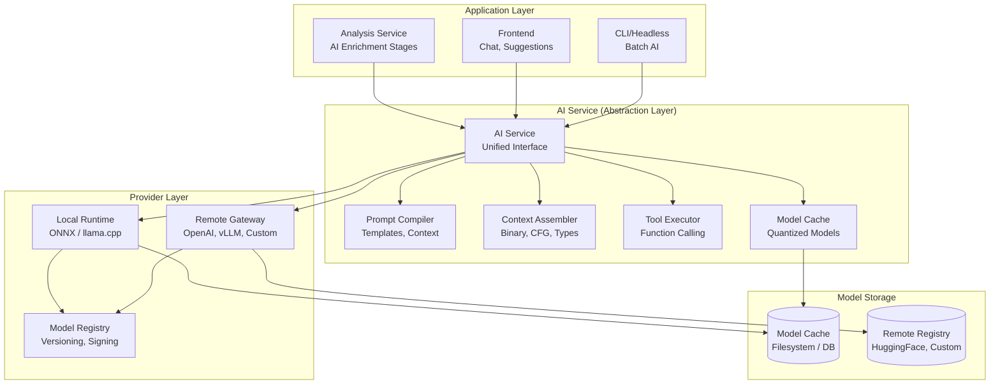
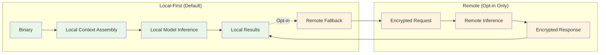

# AI Architecture

## Overview

The AI system is designed as a **provider-agnostic abstraction layer** that supports local-first inference with optional remote fallback. The architecture ensures the rest of the application never depends directly on a specific model or provider, enabling seamless switching between local models (ONNX, llama.cpp), remote APIs (OpenAI, vLLM, custom), and future providers.

---

## High-Level Architecture



---

## AI Service Interface

```rust
// crates/openre-ai/src/service.rs
#[async_trait]
pub trait AiService: Send + Sync {
    /// Classify function purpose (e.g., "crypto_routine", "c2_handler", "parser")
    async fn classify_function(&self, ctx: FunctionContext) -> Result<Classification, AiError>;
    
    /// Suggest semantic variable/parameter names
    async fn suggest_names(&self, ctx: NamingContext) -> Result<Vec<NameSuggestion>, AiError>;
    
    /// Suggest types for variables/parameters/returns
    async fn suggest_types(&self, ctx: TypeContext) -> Result<Vec<TypeSuggestion>, AiError>;
    
    /// Explain function in natural language
    async fn explain_function(&self, ctx: ExplanationContext) -> Result<Explanation, AiError>;
    
    /// Detect cryptographic constants and algorithms
    async fn detect_crypto(&self, ctx: CryptoContext) -> Result<Vec<CryptoMatch>, AiError>;
    
    /// Detect obfuscation techniques
    async fn detect_obfuscation(&self, ctx: ObfuscationContext) -> Result<ObfuscationReport, AiError>;
    
    /// Detect vulnerability patterns
    async fn detect_vulnerabilities(&self, ctx: VulnContext) -> Result<Vec<VulnMatch>, AiError>;
    
    /// Stream chat completion with tool calling
    async fn chat_stream(&self, req: ChatRequest) -> Result<StreamingResponse, AiError>;
    
    /// Generate inline ghost suggestions
    async fn suggest_inline(&self, ctx: InlineContext) -> Result<InlineSuggestion, AiError>;
}

#[derive(Debug, Clone, Serialize, Deserialize)]
pub struct FunctionContext {
    pub function_id: FunctionId,
    pub assembly: String,           // Disassembly (linear or graph)
    pub pseudocode: Option<String>, // Decompiler output if available
    pub cfg: ControlFlowGraph,      // CFG structure
    pub calls: Vec<CallInfo>,       // Called functions
    pub strings: Vec<StringRef>,    // Referenced strings
    pub constants: Vec<Constant>,   // Numeric constants
    pub metadata: FunctionMetadata, // Size, complexity, entropy
}

#[derive(Debug, Clone, Serialize, Deserialize)]
pub struct Classification {
    pub primary: FunctionCategory,  // e.g., "crypto", "network", "parser", "anti_analysis"
    pub confidence: f32,            // 0.0 - 1.0
    pub alternatives: Vec<(FunctionCategory, f32)>,
    pub reasoning: String,          // Human-readable explanation
    pub model_version: String,      // For reproducibility
}
```

---

## Provider Abstraction

### Provider Trait

```rust
// crates/openre-ai/src/providers/mod.rs
#[async_trait]
pub trait ModelProvider: Send + Sync {
    /// Provider identifier
    fn id(&self) -> ProviderId;
    
    /// Provider display name
    fn name(&self) -> &str;
    
    /// Check if provider is available
    async fn is_available(&self) -> bool;
    
    /// List available models
    async fn list_models(&self) -> Result<Vec<ModelInfo>, AiError>;
    
    /// Load a specific model
    async fn load_model(&self, model_id: &ModelId) -> Result<ModelHandle, AiError>;
    
    /// Unload model
    async fn unload_model(&self, model_id: &ModelId) -> Result<(), AiError>;
    
    /// Get provider capabilities
    fn capabilities(&self) -> ProviderCapabilities;
}

#[derive(Debug, Clone, Serialize, Deserialize)]
pub struct ProviderCapabilities {
    pub supports_streaming: bool,
    pub supports_tools: bool,
    pub supports_vision: bool,
    pub supports_embeddings: bool,
    pub max_context_tokens: usize,
    pub max_output_tokens: usize,
    pub supports_logprobs: bool,
    pub supports_structured_output: bool,
}

#[derive(Debug, Clone, Serialize, Deserialize)]
pub struct ModelInfo {
    pub id: ModelId,
    pub name: String,
    pub description: String,
    pub size_bytes: u64,
    pub parameter_count: Option<u64>,
    pub quantization: Option<String>, // "int4", "int8", "fp16", "fp32"
    pub context_window: usize,
    pub capabilities: ModelCapabilities,
    pub license: String,
    pub source: ModelSource,
}

#[derive(Debug, Clone, Serialize, Deserialize)]
pub enum ModelSource {
    Local { path: PathBuf },
    Remote { registry: String, digest: String },
    BuiltIn,
}
```

### Local Provider (ONNX Runtime)

```rust
// crates/openre-ai/src/providers/local/onnx.rs
pub struct OnnxProvider {
    session_cache: Arc<DashMap<ModelId, OnnxSession>>,
    model_dir: PathBuf,
    execution_providers: Vec<ExecutionProvider>,
}

#[async_trait]
impl ModelProvider for OnnxProvider {
    fn id(&self) -> ProviderId { "onnx".into() }
    fn name(&self) -> &str { "ONNX Runtime" }
    
    async fn is_available(&self) -> bool {
        // Check if ONNX Runtime is functional
        true
    }
    
    async fn list_models(&self) -> Result<Vec<ModelInfo>, AiError> {
        let mut models = Vec::new();
        for entry in std::fs::read_dir(&self.model_dir)? {
            let entry = entry?;
            if entry.path().extension().map_or(false, |e| e == "onnx") {
                models.push(self.parse_model_info(&entry.path()).await?);
            }
        }
        Ok(models)
    }
    
    async fn load_model(&self, model_id: &ModelId) -> Result<ModelHandle, AiError> {
        let path = self.model_dir.join(format!("{}.onnx", model_id));
        
        let session = OnnxSession::new(&path, &self.execution_providers)?;
        self.session_cache.insert(model_id.clone(), session);
        
        Ok(ModelHandle::Local { model_id: model_id.clone(), provider: self.id() })
    }
}

pub struct OnnxSession {
    session: ort::Session,
    input_names: Vec<String>,
    output_names: Vec<String>,
    tokenizer: Option<Tokenizer>,
}

impl OnnxSession {
    pub async fn run(&self, inputs: HashMap<String, Tensor>) -> Result<HashMap<String, Tensor>, AiError> {
        let outputs = self.session.run(inputs)?;
        Ok(outputs.into_iter().zip(self.output_names.clone()).collect())
    }
}
```

### Local Provider (llama.cpp)

```rust
// crates/openre-ai/src/providers/local/llama.cpp.rs
pub struct LlamaCppProvider {
    model_cache: Arc<DashMap<ModelId, LlamaModel>>,
    model_dir: PathBuf,
    default_params: LlamaParams,
}

#[async_trait]
impl ModelProvider for LlamaCppProvider {
    fn id(&self) -> ProviderId { "llama.cpp".into() }
    fn name(&self) -> &str { "llama.cpp" }
    
    async fn load_model(&self, model_id: &ModelId) -> Result<ModelHandle, AiError> {
        let path = self.model_dir.join(format!("{}.gguf", model_id));
        
        let model = LlamaModel::load(&path, self.default_params.clone())?;
        self.model_cache.insert(model_id.clone(), model);
        
        Ok(ModelHandle::Local { model_id: model_id.clone(), provider: self.id() })
    }
}

pub struct LlamaModel {
    ctx: llama_cpp::LlamaContext,
    params: LlamaParams,
}

impl LlamaModel {
    pub async fn complete(&self, prompt: &str, params: CompletionParams) -> Result<CompletionResult, AiError> {
        let mut completion = self.ctx.completion(prompt, params)?;
        let mut result = String::new();
        
        while let Some(token) = completion.next_token()? {
            result.push_str(&token);
            if params.stream {
                params.on_token(&token)?;
            }
        }
        
        Ok(CompletionResult { text: result, tokens: completion.tokens() })
    }
    
    pub async fn chat(&self, messages: Vec<ChatMessage>, params: ChatParams) -> Result<ChatResult, AiError> {
        // Apply chat template
        let prompt = self.apply_chat_template(messages)?;
        self.complete(&prompt, params.into()).await
    }
}
```

### Remote Provider (OpenAI-Compatible)

```rust
// crates/openre-ai/src/providers/remote/openai.rs
pub struct OpenAiProvider {
    client: reqwest::Client,
    base_url: Url,
    api_key: Option<String>,
    organization: Option<String>,
}

#[async_trait]
impl ModelProvider for OpenAiProvider {
    fn id(&self) -> ProviderId { "openai".into() }
    fn name(&self) -> &str { "OpenAI" }
    
    async fn is_available(&self) -> bool {
        self.client.get(self.base_url.join("/models").unwrap())
            .send().await
            .map(|r| r.status().is_success())
            .unwrap_or(false)
    }
    
    async fn list_models(&self) -> Result<Vec<ModelInfo>, AiError> {
        let response = self.client.get(self.base_url.join("/models").unwrap())
            .bearer_auth(self.api_key.as_ref().unwrap())
            .send().await?
            .json::<ModelsResponse>().await?;
        
        Ok(response.data.into_iter().map(Into::into).collect())
    }
    
    async fn load_model(&self, model_id: &ModelId) -> Result<ModelHandle, AiError> {
        // Remote models don't need local loading
        Ok(ModelHandle::Remote { 
            model_id: model_id.clone(), 
            provider: self.id(),
            base_url: self.base_url.clone(),
        })
    }
}

pub struct OpenAiModelHandle {
    client: reqwest::Client,
    base_url: Url,
    model_id: ModelId,
    api_key: String,
}

impl OpenAiModelHandle {
    pub async fn chat_completion(&self, req: ChatCompletionRequest) -> Result<ChatCompletionResponse, AiError> {
        let mut req = req;
        req.model = self.model_id.clone();
        
        let response = self.client.post(self.base_url.join("/chat/completions").unwrap())
            .bearer_auth(&self.api_key)
            .json(&req)
            .send().await?
            .json().await?;
        
        Ok(response)
    }
    
    pub async fn chat_completion_stream(&self, req: ChatCompletionRequest) -> Result<EventStream, AiError> {
        let mut req = req;
        req.model = self.model_id.clone();
        req.stream = Some(true);
        
        let response = self.client.post(self.base_url.join("/chat/completions").unwrap())
            .bearer_auth(&self.api_key)
            .json(&req)
            .send().await?;
        
        Ok(response.bytes_stream().map(|chunk| parse_sse_chunk(chunk)))
    }
}
```

---

## Prompt Management

### Prompt Compiler

```rust
// crates/openre-ai/src/prompt_compiler.rs
pub struct PromptCompiler {
    template_engine: Arc<TemplateEngine>,
    template_registry: Arc<TemplateRegistry>,
    few_shot_store: Arc<FewShotStore>,
}

impl PromptCompiler {
    /// Compile a prompt for a specific task
    pub async fn compile(&self, task: PromptTask, context: PromptContext) -> Result<CompiledPrompt, AiError> {
        // 1. Get base template
        let template = self.template_registry.get(&task.template_id)?;
        
        // 2. Assemble context
        let assembled_context = self.assemble_context(&context).await?;
        
        // 3. Select few-shot examples
        let few_shots = self.few_shot_store.select(&task, &context).await?;
        
        // 4. Render template
        let rendered = self.template_engine.render(template, TemplateData {
            system_prompt: task.system_prompt,
            context: assembled_context,
            few_shots,
            tools: context.available_tools,
            constraints: task.constraints,
        })?;
        
        // 5. Apply token budget
        let final_prompt = self.apply_token_budget(rendered, context.token_budget)?;
        
        Ok(CompiledPrompt {
            messages: final_prompt,
            tools: context.available_tools,
            token_count: self.count_tokens(&final_prompt),
            model_hints: task.model_hints,
        })
    }
    
    async fn assemble_context(&self, context: &PromptContext) -> Result<AssembledContext, AiError> {
        let mut parts = Vec::new();
        
        // Binary context
        if let Some(binary_ctx) = &context.binary {
            parts.push(ContextPart {
                role: "system",
                content: format!("Binary: {} ({})", binary_ctx.name, binary_ctx.architecture),
                priority: 100,
            });
        }
        
        // Function context
        if let Some(func_ctx) = &context.function {
            parts.push(ContextPart {
                role: "user",
                content: self.format_function_context(func_ctx)?,
                priority: 90,
            });
        }
        
        // CFG context
        if let Some(cfg) = &context.cfg {
            parts.push(ContextPart {
                role: "user",
                content: self.format_cfg_context(cfg)?,
                priority: 80,
            });
        }
        
        // Type context
        if let Some(types) = &context.types {
            parts.push(ContextPart {
                role: "user",
                content: self.format_types_context(types)?,
                priority: 70,
            });
        }
        
        // Previous conversation
        if let Some(history) = &context.history {
            for msg in history.iter().rev().take(10) {
                parts.push(ContextPart {
                    role: msg.role,
                    content: msg.content.clone(),
                    priority: 50,
                });
            }
        }
        
        // Sort by priority and apply token budget
        parts.sort_by_key(|p| std::cmp::Reverse(p.priority));
        Ok(AssembledContext { parts })
    }
}
```

### Template System

```rust
// Template example (stored as .tera files)
/*
{{#if system_prompt}}
<|system|>
{{system_prompt}}
{{/if}}

{{#each few_shots}}
<|user|>
{{this.input}}
<|assistant|>
{{this.output}}
{{/each}}

<|user|>
Binary: {{context.binary.name}} ({{context.binary.architecture}})
Function: {{context.function.name}} at {{context.function.address}}

Assembly:
{{context.function.assembly}}

{{#if context.function.pseudocode}}
Decompilation:
{{context.function.pseudocode}}
{{/if}}

{{#if context.cfg}}
Control Flow:
{{context.cfg.summary}}
{{/if}}

Task: {{task_description}}
{{/each}}

<|assistant|>
*/

// Template registry
pub struct TemplateRegistry {
    templates: DashMap<String, Template>,
}

impl TemplateRegistry {
    pub fn get(&self, id: &str) -> Result<Template, TemplateError> {
        self.templates.get(id)
            .ok_or(TemplateError::NotFound(id.into()))
    }
    
    pub fn register(&self, id: String, template: Template) {
        self.templates.insert(id, template);
    }
}
```

---

## Context Assembly

```rust
// crates/openre-ai/src/context_assembler.rs
pub struct ContextAssembler {
    binary_service: Arc<BinaryService>,
    analysis_service: Arc<AnalysisService>,
    type_service: Arc<TypeService>,
    cfg_service: Arc<CfgService>,
}

impl ContextAssembler {
    /// Assemble context for function analysis
    pub async fn assemble_function_context(
        &self,
        function_id: FunctionId,
        options: ContextOptions,
    ) -> Result<FunctionContext, AiError> {
        let function = self.analysis_service.get_function(function_id).await?;
        let binary = self.binary_service.get_binary(function.binary_id).await?;
        
        let mut ctx = FunctionContext {
            function_id,
            assembly: String::new(),
            pseudocode: None,
            cfg: ControlFlowGraph::default(),
            calls: Vec::new(),
            strings: Vec::new(),
            constants: Vec::new(),
            metadata: FunctionMetadata::default(),
        };
        
        // Assembly (always included)
        if options.include_assembly {
            ctx.assembly = self.format_assembly(&function).await?;
        }
        
        // Pseudocode (if available)
        if options.include_pseudocode {
            ctx.pseudocode = self.analysis_service.get_pseudocode(function_id).await.ok();
        }
        
        // CFG
        if options.include_cfg {
            ctx.cfg = self.cfg_service.get_function_cfg(function_id).await?;
        }
        
        // Calls
        if options.include_calls {
            ctx.calls = self.analysis_service.get_calls(function_id).await?;
        }
        
        // Strings
        if options.include_strings {
            ctx.strings = self.binary_service.get_referenced_strings(function_id).await?;
        }
        
        // Constants
        if options.include_constants {
            ctx.constants = self.extract_constants(&function).await?;
        }
        
        // Metadata
        ctx.metadata = self.compute_metadata(&function).await?;
        
        Ok(ctx)
    }
    
    /// Assemble context for chat
    pub async fn assemble_chat_context(
        &self,
        request: ChatRequest,
    ) -> Result<ChatContext, AiError> {
        let mut context = ChatContext {
            binary: None,
            function: None,
            cfg: None,
            types: None,
            history: request.history,
            available_tools: self.get_available_tools(&request).await?,
        };
        
        // Attach binary context if file specified
        if let Some(file_id) = request.file_id {
            context.binary = Some(self.binary_service.get_summary(file_id).await?);
        }
        
        // Attach function context if function specified
        if let Some(func_id) = request.function_id {
            context.function = Some(self.assemble_function_context(func_id, ContextOptions::default()).await?);
        }
        
        Ok(context)
    }
}
```

---

## Tool Calling

```rust
// crates/openre-ai/src/tool_executor.rs
pub struct ToolExecutor {
    tools: DashMap<String, Box<dyn Tool>>,
    analysis_service: Arc<AnalysisService>,
    binary_service: Arc<BinaryService>,
    workspace_service: Arc<WorkspaceService>,
}

#[async_trait]
pub trait Tool: Send + Sync {
    fn definition(&self) -> ToolDefinition;
    async fn execute(&self, args: serde_json::Value) -> Result<ToolResult, ToolError>;
}

pub struct ToolDefinition {
    pub name: String,
    pub description: String,
    pub parameters: serde_json::Value, // JSON Schema
    pub returns: serde_json::Value,    // JSON Schema
}

pub struct ToolResult {
    pub success: bool,
    pub data: Option<serde_json::Value>,
    pub error: Option<String>,
    pub artifacts: Vec<Artifact>,
}

// Built-in tools
pub struct ReadBinaryTool;
pub struct WriteAnnotationTool;
pub struct QueryDatabaseTool;
pub struct GetFunctionTool;
pub struct SearchTool;
pub struct RunYaraTool;
pub struct RunCapaTool;

impl Tool for ReadBinaryTool {
    fn definition(&self) -> ToolDefinition {
        ToolDefinition {
            name: "read_binary".into(),
            description: "Read binary data at a specific offset".into(),
            parameters: json!({
                "type": "object",
                "properties": {
                    "offset": { "type": "integer", "minimum": 0 },
                    "length": { "type": "integer", "minimum": 1, "maximum": 1048576 }
                },
                "required": ["offset", "length"]
            }),
            returns: json!({
                "type": "object",
                "properties": {
                    "data": { "type": "string", "format": "base64" },
                    "offset": { "type": "integer" }
                }
            }),
        }
    }
    
    async fn execute(&self, args: serde_json::Value) -> Result<ToolResult, ToolError> {
        let offset = args["offset"].as_u64().unwrap();
        let length = args["length"].as_u64().unwrap().min(1048576) as usize;
        
        let data = self.binary_service.read_binary(offset, length).await?;
        
        Ok(ToolResult {
            success: true,
            data: Some(json!({
                "data": base64::encode(data),
                "offset": offset
            })),
            error: None,
            artifacts: vec![],
        })
    }
}
```

---

## Model Selection & Routing

```rust
// crates/openre-ai/src/model_router.rs
pub struct ModelRouter {
    providers: Vec<Arc<dyn ModelProvider>>,
    local_provider: Arc<dyn ModelProvider>,
    remote_provider: Option<Arc<dyn ModelProvider>>,
    selection_policy: SelectionPolicy,
    cache: Arc<ModelCache>,
}

#[derive(Debug, Clone, Serialize, Deserialize)]
pub struct SelectionPolicy {
    pub prefer_local: bool,
    pub fallback_to_remote: bool,
    pub max_local_model_size_gb: f32,
    pub task_preferences: HashMap<TaskType, ModelPreference>,
}

#[derive(Debug, Clone, Serialize, Deserialize)]
pub struct ModelPreference {
    pub preferred_models: Vec<ModelId>,
    pub min_context_window: usize,
    pub require_tools: bool,
    pub require_structured_output: bool,
    pub max_latency_ms: Option<u64>,
}

impl ModelRouter {
    pub async fn select_model(&self, task: TaskType, context: &RoutingContext) -> Result<ModelHandle, AiError> {
        let preference = self.selection_policy.task_preferences
            .get(&task)
            .cloned()
            .unwrap_or_default();
        
        // 1. Try preferred models
        for model_id in &preference.preferred_models {
            if let Ok(handle) = self.try_load_model(model_id).await {
                return Ok(handle);
            }
        }
        
        // 2. Find compatible local model
        if self.selection_policy.prefer_local {
            if let Ok(handle) = self.find_local_model(&preference).await {
                return Ok(handle);
            }
        }
        
        // 3. Fallback to remote
        if self.selection_policy.fallback_to_remote {
            if let Some(remote) = &self.remote_provider {
                if let Ok(handle) = self.find_remote_model(remote, &preference).await {
                    return Ok(handle);
                }
            }
        }
        
        Err(AiError::NoSuitableModel)
    }
    
    async fn find_local_model(&self, preference: &ModelPreference) -> Result<ModelHandle, AiError> {
        let models = self.local_provider.list_models().await?;
        
        let candidates: Vec<_> = models.into_iter()
            .filter(|m| m.context_window >= preference.min_context_window)
            .filter(|m| !preference.require_tools || m.capabilities.supports_tools)
            .filter(|m| !preference.require_structured_output || m.capabilities.supports_structured_output)
            .filter(|m| m.size_bytes as f32 / 1e9 <= self.selection_policy.max_local_model_size_gb)
            .collect();
        
        // Score and select best
        let best = candidates.into_iter()
            .max_by_key(|m| self.score_model(m, &preference))
            .ok_or(AiError::NoSuitableModel)?;
        
        self.local_provider.load_model(&best.id).await
    }
}
```

---

## Caching Strategy

```rust
// crates/openre-ai/src/cache.rs
pub struct ModelCache {
    // In-memory cache for hot models
    memory: Arc<DashMap<ModelId, CachedModel>>,
    
    // Persistent cache on disk
    disk: Arc<DiskCache>,
    
    // Prompt/response cache
    response_cache: Arc<DashMap<CacheKey, CachedResponse>>,
    
    config: CacheConfig,
}

#[derive(Debug, Clone)]
pub struct CachedModel {
    pub handle: ModelHandle,
    pub last_used: Instant,
    pub load_time: Duration,
    pub memory_usage: usize,
}

#[derive(Debug, Clone, Hash, Eq, PartialEq)]
pub struct CacheKey {
    pub model_id: ModelId,
    pub prompt_hash: u64,
    pub params_hash: u64,
}

impl ModelCache {
    pub async fn get_or_load(&self, model_id: &ModelId, loader: impl FnOnce() -> Future<Output = Result<ModelHandle, AiError>>) -> Result<ModelHandle, AiError> {
        // Check memory cache
        if let Some(cached) = self.memory.get(model_id) {
            cached.last_used = Instant::now();
            return Ok(cached.handle.clone());
        }
        
        // Check disk cache
        if let Some(handle) = self.disk.load(model_id).await? {
            self.memory.insert(model_id.clone(), CachedModel {
                handle: handle.clone(),
                last_used: Instant::now(),
                load_time: Duration::ZERO,
                memory_usage: 0,
            });
            return Ok(handle);
        }
        
        // Load fresh
        let start = Instant::now();
        let handle = loader().await?;
        let load_time = start.elapsed();
        
        // Cache in memory
        self.memory.insert(model_id.clone(), CachedModel {
            handle: handle.clone(),
            last_used: Instant::now(),
            load_time,
            memory_usage: self.estimate_memory(&handle),
        });
        
        // Persist to disk (async)
        let model_id = model_id.clone();
        let handle_clone = handle.clone();
        tokio::spawn(async move {
            let _ = self.disk.store(&model_id, &handle_clone).await;
        });
        
        Ok(handle)
    }
    
    pub async fn get_response(&self, key: &CacheKey) -> Option<CachedResponse> {
        self.response_cache.get(key).map(|r| r.clone())
    }
    
    pub async fn set_response(&self, key: CacheKey, response: CachedResponse) {
        if self.response_cache.len() >= self.config.max_entries {
            self.evict_lru();
        }
        self.response_cache.insert(key, response);
    }
}
```

---

## Streaming & Real-Time

```rust
// crates/openre-ai/src/streaming.rs
pub struct StreamingResponse {
    pub stream: Pin<Box<dyn Stream<Item = Result<StreamChunk, AiError>> + Send>>,
    pub model_id: ModelId,
    pub usage: Option<TokenUsage>,
}

#[derive(Debug, Clone, Serialize, Deserialize)]
pub enum StreamChunk {
    Token { text: String, logprob: Option<f32> },
    ToolCall { name: String, arguments: serde_json::Value },
    ToolResult { name: String, result: ToolResult },
    Usage { prompt_tokens: u32, completion_tokens: u32, total_tokens: u32 },
    Done { finish_reason: FinishReason },
    Error { message: String },
}

impl AiService {
    pub async fn chat_stream(&self, req: ChatRequest) -> Result<StreamingResponse, AiError> {
        let model = self.router.select_model(TaskType::Chat, &req.into()).await?;
        let compiled = self.prompt_compiler.compile(PromptTask::Chat, req.into()).await?;
        
        let stream = match model {
            ModelHandle::Local { provider, .. } => {
                provider.stream_chat(compiled).await?
            }
            ModelHandle::Remote { provider, .. } => {
                provider.stream_chat(compiled).await?
            }
        };
        
        // Wrap with tool execution
        let stream = self.wrap_with_tools(stream, req.tools).await?;
        
        Ok(StreamingResponse {
            stream: Box::pin(stream),
            model_id: model.id(),
            usage: None,
        })
    }
    
    async fn wrap_with_tools(
        &self,
        stream: Pin<Box<dyn Stream<Item = Result<StreamChunk, AiError>> + Send>>,
        tools: Vec<ToolDefinition>,
    ) -> Result<Pin<Box<dyn Stream<Item = Result<StreamChunk, AiError>> + Send>>, AiError> {
        // Buffer tool calls, execute them, inject results back into stream
        // Implementation uses a state machine to parse tool calls from token stream
        Ok(Box::pin(ToolCallingStream::new(stream, self.tool_executor.clone(), tools)))
    }
}
```

---

## Cost & Performance Optimization

### Quantization Strategy

| Quantization | Size Reduction | Quality Loss | Use Case |
|--------------|----------------|--------------|----------|
| FP16 | 2x | Minimal | Default local |
| INT8 | 4x | Low | Memory constrained |
| INT4 | 8x | Moderate | Edge/low RAM |
| GPTQ/AWQ | 4-8x | Low-Moderate | Best quality/size |

### Model Selection by Task

| Task | Preferred Model | Context | Quantization |
|------|-----------------|---------|--------------|
| Function Classification | Small BERT/Classifier | 512 tokens | INT8 |
| Naming/Typing | CodeBERT/StarCoder | 2048 tokens | INT4 |
| Explanation | Llama-3-8B/Phi-3 | 4096 tokens | INT4 |
| Chat/Reasoning | Llama-3-8B/Phi-3 | 8192 tokens | INT4 |
| Vulnerability Detection | Specialized/CodeLlama | 4096 tokens | INT8 |

### Performance Targets

| Metric | Target | Strategy |
|--------|--------|----------|
| **Local Model Load** | <5s | Background pre-load, quantization |
| **First Token Latency** | <500ms | KV-cache, speculative decoding |
| **Token Throughput** | >20 tok/s | Quantization, batching, GPU offload |
| **Memory Usage** | <4GB (8B model) | INT4 quantization, offloading |
| **Cache Hit Rate** | >80% | Semantic caching, prompt normalization |

---

## Privacy & Security

### Data Flow Guarantees



### Privacy Controls

```rust
// crates/openre-ai/src/privacy.rs
pub struct PrivacyConfig {
    pub allow_remote: bool,
    pub allowed_remote_providers: Vec<ProviderId>,
    pub redact_sensitive_data: bool,
    pub sensitive_patterns: Vec<Regex>,
    pub audit_log: bool,
}

impl AiService {
    fn sanitize_context(&self, context: &mut PromptContext, config: &PrivacyConfig) {
        if config.redact_sensitive_data {
            for pattern in &config.sensitive_patterns {
                context.binary.name = pattern.replace_all(&context.binary.name, "[REDACTED]").to_string();
                if let Some(func) = &mut context.function {
                    func.assembly = pattern.replace_all(&func.assembly, "[REDACTED]").to_string();
                    if let Some(pseudo) = &mut func.pseudocode {
                        *pseudo = pattern.replace_all(pseudo, "[REDACTED]").to_string();
                    }
                }
            }
        }
    }
    
    async fn audit_request(&self, request: &AiRequest, config: &PrivacyConfig) {
        if config.audit_log {
            let entry = AuditEntry {
                timestamp: Utc::now(),
                task: request.task_type,
                model: request.model_id.clone(),
                remote: request.remote_fallback,
                tokens_estimated: request.estimated_tokens,
                user_id: request.user_id,
            };
            self.audit_log.write(entry).await;
        }
    }
}
```

---

## Evaluation & Testing

### Benchmark Suite

```rust
// crates/openre-ai/src/benchmarks.rs
pub struct AiBenchmarks {
    pub classification_accuracy: f32,
    pub naming_acceptance_rate: f32,
    pub typing_accuracy: f32,
    pub explanation_quality: f32, // Human eval score
    pub latency_p50_ms: u64,
    pub latency_p99_ms: u64,
    pub memory_usage_mb: u64,
}

pub async fn run_benchmarks(service: &AiService, dataset: &BenchmarkDataset) -> AiBenchmarks {
    let mut results = Vec::new();
    
    for sample in dataset.samples {
        let start = Instant::now();
        let result = match sample.task {
            TaskType::Classification => service.classify_function(sample.context).await,
            TaskType::Naming => service.suggest_names(sample.context).await,
            TaskType::Typing => service.suggest_types(sample.context).await,
            TaskType::Explanation => service.explain_function(sample.context).await,
        };
        let latency = start.elapsed();
        
        results.push(BenchmarkResult {
            task: sample.task,
            expected: sample.expected,
            actual: result,
            latency,
        });
    }
    
    AiBenchmarks::from_results(results)
}
```

---

*This AI architecture provides a flexible, privacy-first foundation that can evolve with the rapidly changing LLM landscape while maintaining strict isolation between the application and specific model providers.*