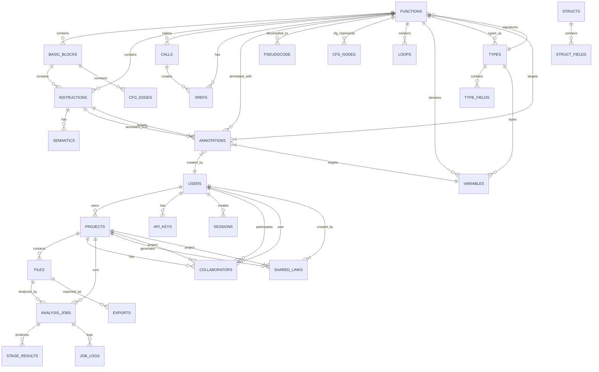

# Database Design

## Overview

The database architecture uses a **dual-database strategy**: **PostgreSQL** for global metadata, projects, users, and collaboration state; **SQLite** (per-project) for analysis results, annotations, and binary-specific data. This provides ACID guarantees for global state while keeping analysis data portable, embeddable, and performant.

---

## Entity Relationship Diagram



---

## PostgreSQL Schema (Global Metadata)

```sql
-- users.sql
CREATE TABLE users (
    id UUID PRIMARY KEY DEFAULT gen_random_uuid(),
    email VARCHAR(255) UNIQUE NOT NULL,
    username VARCHAR(100) UNIQUE NOT NULL,
    password_hash VARCHAR(255) NOT NULL, -- Argon2id
    full_name VARCHAR(255),
    avatar_url TEXT,
    role VARCHAR(50) DEFAULT 'user', -- user, admin, maintainer
    is_active BOOLEAN DEFAULT true,
    email_verified BOOLEAN DEFAULT false,
    created_at TIMESTAMPTZ DEFAULT NOW(),
    updated_at TIMESTAMPTZ DEFAULT NOW(),
    last_login_at TIMESTAMPTZ
);

CREATE INDEX idx_users_email ON users(email);
CREATE INDEX idx_users_username ON users(username);

-- api_keys.sql
CREATE TABLE api_keys (
    id UUID PRIMARY KEY DEFAULT gen_random_uuid(),
    user_id UUID NOT NULL REFERENCES users(id) ON DELETE CASCADE,
    name VARCHAR(100) NOT NULL,
    key_hash VARCHAR(255) NOT NULL, -- SHA-256
    prefix VARCHAR(20) NOT NULL, -- First 8 chars for identification
    scopes TEXT[] DEFAULT '{}', -- read, write, admin
    expires_at TIMESTAMPTZ,
    last_used_at TIMESTAMPTZ,
    created_at TIMESTAMPTZ DEFAULT NOW(),
    revoked_at TIMESTAMPTZ
);

CREATE INDEX idx_api_keys_user ON api_keys(user_id);
CREATE INDEX idx_api_keys_prefix ON api_keys(prefix);

-- projects.sql
CREATE TABLE projects (
    id UUID PRIMARY KEY DEFAULT gen_random_uuid(),
    owner_id UUID NOT NULL REFERENCES users(id) ON DELETE CASCADE,
    name VARCHAR(255) NOT NULL,
    description TEXT,
    visibility VARCHAR(20) DEFAULT 'private', -- private, team, public
    settings JSONB DEFAULT '{}', -- UI preferences, analysis defaults
    created_at TIMESTAMPTZ DEFAULT NOW(),
    updated_at TIMESTAMPTZ DEFAULT NOW(),
    archived_at TIMESTAMPTZ
);

CREATE INDEX idx_projects_owner ON projects(owner_id);
CREATE INDEX idx_projects_visibility ON projects(visibility);

-- project_collaborators.sql
CREATE TABLE project_collaborators (
    id UUID PRIMARY KEY DEFAULT gen_random_uuid(),
    project_id UUID NOT NULL REFERENCES projects(id) ON DELETE CASCADE,
    user_id UUID NOT NULL REFERENCES users(id) ON DELETE CASCADE,
    role VARCHAR(50) DEFAULT 'viewer', -- viewer, analyst, admin
    invited_by UUID NOT NULL REFERENCES users(id),
    invited_at TIMESTAMPTZ DEFAULT NOW(),
    accepted_at TIMESTAMPTZ,
    UNIQUE(project_id, user_id)
);

CREATE INDEX idx_collaborators_project ON project_collaborators(project_id);
CREATE INDEX idx_collaborators_user ON project_collaborators(user_id);

-- files.sql
CREATE TABLE files (
    id UUID PRIMARY KEY DEFAULT gen_random_uuid(),
    project_id UUID NOT NULL REFERENCES projects(id) ON DELETE CASCADE,
    original_name VARCHAR(512) NOT NULL,
    stored_name VARCHAR(255) NOT NULL, -- UUID in object storage
    size_bytes BIGINT NOT NULL,
    sha256 CHAR(64) NOT NULL,
    format VARCHAR(50), -- elf, pe, macho, raw
    architecture VARCHAR(50), -- x86, x86_64, arm, arm64, mips, riscv
    metadata JSONB DEFAULT '{}', -- compiler, packer, entry_points, etc.
    uploaded_by UUID NOT NULL REFERENCES users(id),
    uploaded_at TIMESTAMPTZ DEFAULT NOW(),
    analysis_status VARCHAR(20) DEFAULT 'pending', -- pending, running, completed, failed
    last_analyzed_at TIMESTAMPTZ
);

CREATE INDEX idx_files_project ON files(project_id);
CREATE INDEX idx_files_sha256 ON files(sha256);
CREATE INDEX idx_files_status ON files(analysis_status);

-- analysis_jobs.sql
CREATE TABLE analysis_jobs (
    id UUID PRIMARY KEY DEFAULT gen_random_uuid(),
    project_id UUID NOT NULL REFERENCES projects(id) ON DELETE CASCADE,
    file_id UUID NOT NULL REFERENCES files(id) ON DELETE CASCADE,
    config JSONB NOT NULL, -- AnalysisConfig snapshot
    status VARCHAR(20) DEFAULT 'queued', -- queued, running, completed, failed, cancelled
    priority INTEGER DEFAULT 0,
    started_at TIMESTAMPTZ,
    completed_at TIMESTAMPTZ,
    error TEXT,
    metrics JSONB DEFAULT '{}', -- PipelineMetrics
    created_by UUID NOT NULL REFERENCES users(id),
    created_at TIMESTAMPTZ DEFAULT NOW()
);

CREATE INDEX idx_jobs_project ON analysis_jobs(project_id);
CREATE INDEX idx_jobs_file ON analysis_jobs(file_id);
CREATE INDEX idx_jobs_status ON analysis_jobs(status);
CREATE INDEX idx_jobs_priority ON analysis_jobs(priority DESC, created_at);

-- stage_results.sql
CREATE TABLE stage_results (
    id UUID PRIMARY KEY DEFAULT gen_random_uuid(),
    job_id UUID NOT NULL REFERENCES analysis_jobs(id) ON DELETE CASCADE,
    stage_name VARCHAR(100) NOT NULL,
    status VARCHAR(20) NOT NULL, -- running, completed, failed, skipped
    started_at TIMESTAMPTZ,
    completed_at TIMESTAMPTZ,
    duration_ms BIGINT,
    attempts INTEGER DEFAULT 1,
    error TEXT,
    artifacts JSONB DEFAULT '[]', -- Artifact references
    created_at TIMESTAMPTZ DEFAULT NOW()
);

CREATE INDEX idx_stage_results_job ON stage_results(job_id);

-- job_logs.sql
CREATE TABLE job_logs (
    id BIGSERIAL PRIMARY KEY,
    job_id UUID NOT NULL REFERENCES analysis_jobs(id) ON DELETE CASCADE,
    level VARCHAR(10) NOT NULL, -- DEBUG, INFO, WARN, ERROR
    message TEXT NOT NULL,
    context JSONB DEFAULT '{}',
    created_at TIMESTAMPTZ DEFAULT NOW()
);

CREATE INDEX idx_job_logs_job ON job_logs(job_id);
CREATE INDEX idx_job_logs_created ON job_logs(created_at);

-- shared_links.sql
CREATE TABLE shared_links (
    id UUID PRIMARY KEY DEFAULT gen_random_uuid(),
    project_id UUID NOT NULL REFERENCES projects(id) ON DELETE CASCADE,
    created_by UUID NOT NULL REFERENCES users(id),
    token VARCHAR(64) UNIQUE NOT NULL, -- URL-safe base64
    permissions JSONB DEFAULT '{"view": true}', -- view, annotate, export
    expires_at TIMESTAMPTZ,
    access_count INTEGER DEFAULT 0,
    last_accessed_at TIMESTAMPTZ,
    created_at TIMESTAMPTZ DEFAULT NOW()
);

CREATE INDEX idx_shared_links_token ON shared_links(token);
CREATE INDEX idx_shared_links_project ON shared_links(project_id);

-- exports.sql
CREATE TABLE exports (
    id UUID PRIMARY KEY DEFAULT gen_random_uuid(),
    project_id UUID NOT NULL REFERENCES projects(id) ON DELETE CASCADE,
    file_id UUID REFERENCES files(id) ON DELETE SET NULL,
    format VARCHAR(50) NOT NULL, -- c, rust, json, graphviz, sarif
    status VARCHAR(20) DEFAULT 'pending',
    size_bytes BIGINT,
    download_url TEXT,
    expires_at TIMESTAMPTZ,
    created_by UUID NOT NULL REFERENCES users(id),
    created_at TIMESTAMPTZ DEFAULT NOW()
);

CREATE INDEX idx_exports_project ON exports(project_id);
```

---

## SQLite Schema (Per-Project Analysis Data)

Each project gets its own SQLite database: `projects/{project_id}/analysis.db`

```sql
-- functions.sql
CREATE TABLE functions (
    id INTEGER PRIMARY KEY, -- FunctionId (address-based)
    address INTEGER NOT NULL UNIQUE, -- Entry address
    name TEXT, -- Current name (user + AI)
    original_name TEXT, -- Original symbol name
    demangled_name TEXT,
    size INTEGER NOT NULL,
    start_address INTEGER NOT NULL,
    end_address INTEGER NOT NULL,
    calling_convention TEXT,
    return_type_id INTEGER REFERENCES types(id),
    is_entry BOOLEAN DEFAULT FALSE,
    is_thunk BOOLEAN DEFAULT FALSE,
    is_library BOOLEAN DEFAULT FALSE,
    complexity_score REAL,
    entropy REAL,
    stack_frame_size INTEGER,
    metadata JSON DEFAULT '{}', -- AI classification, tags, etc.
    created_at TIMESTAMP DEFAULT CURRENT_TIMESTAMP,
    updated_at TIMESTAMP DEFAULT CURRENT_TIMESTAMP
);

CREATE INDEX idx_functions_address ON functions(address);
CREATE INDEX idx_functions_name ON functions(name);

-- basic_blocks.sql
CREATE TABLE basic_blocks (
    id INTEGER PRIMARY KEY, -- BlockId
    function_id INTEGER NOT NULL REFERENCES functions(id) ON DELETE CASCADE,
    start_address INTEGER NOT NULL,
    end_address INTEGER NOT NULL,
    size INTEGER NOT NULL,
    instruction_count INTEGER NOT NULL,
    is_entry BOOLEAN DEFAULT FALSE,
    is_exit BOOLEAN DEFAULT FALSE,
    loop_depth INTEGER DEFAULT 0,
    dominator_id INTEGER REFERENCES basic_blocks(id),
    post_dominator_id INTEGER REFERENCES basic_blocks(id),
    metadata JSON DEFAULT '{}'
);

CREATE INDEX idx_basic_blocks_function ON basic_blocks(function_id);
CREATE INDEX idx_basic_blocks_address ON basic_blocks(start_address);

-- instructions.sql
CREATE TABLE instructions (
    id INTEGER PRIMARY KEY, -- InstructionId
    block_id INTEGER NOT NULL REFERENCES basic_blocks(id) ON DELETE CASCADE,
    address INTEGER NOT NULL,
    offset INTEGER NOT NULL, -- Offset within block
    bytes BLOB NOT NULL, -- Raw instruction bytes
    mnemonic TEXT NOT NULL,
    operands TEXT, -- JSON array of operands
    size INTEGER NOT NULL,
    groups TEXT, -- JSON array of instruction groups (call, jump, etc.)
    semantics_id INTEGER REFERENCES instruction_semantics(id),
    metadata JSON DEFAULT '{}' -- AI suggestions, annotations
);

CREATE INDEX idx_instructions_block ON instructions(block_id);
CREATE INDEX idx_instructions_address ON instructions(address);

-- instruction_semantics.sql
CREATE TABLE instruction_semantics (
    id INTEGER PRIMARY KEY,
    instruction_id INTEGER NOT NULL REFERENCES instructions(id) ON DELETE CASCADE,
    reads_registers TEXT, -- JSON array
    writes_registers TEXT, -- JSON array
    reads_memory TEXT, -- JSON array of {base, index, scale, disp, size}
    writes_memory TEXT, -- JSON array
    reads_flags TEXT, -- JSON array
    writes_flags TEXT, -- JSON array
    branch_target INTEGER, -- For conditional/unconditional branches
    is_call BOOLEAN DEFAULT FALSE,
    is_return BOOLEAN DEFAULT FALSE,
    is_syscall BOOLEAN DEFAULT FALSE
);

CREATE INDEX idx_semantics_instruction ON instruction_semantics(instruction_id);

-- cfg_nodes.sql (Control Flow Graph nodes)
CREATE TABLE cfg_nodes (
    id INTEGER PRIMARY KEY,
    function_id INTEGER NOT NULL REFERENCES functions(id) ON DELETE CASCADE,
    block_id INTEGER NOT NULL REFERENCES basic_blocks(id) ON DELETE CASCADE,
    node_type TEXT NOT NULL, -- 'entry', 'exit', 'basic_block', 'call', 'return'
    metadata JSON DEFAULT '{}'
);

CREATE INDEX idx_cfg_nodes_function ON cfg_nodes(function_id);

-- cfg_edges.sql
CREATE TABLE cfg_edges (
    id INTEGER PRIMARY KEY,
    function_id INTEGER NOT NULL REFERENCES functions(id) ON DELETE CASCADE,
    source_id INTEGER NOT NULL REFERENCES cfg_nodes(id) ON DELETE CASCADE,
    target_id INTEGER NOT NULL REFERENCES cfg_nodes(id) ON DELETE CASCADE,
    edge_type TEXT NOT NULL, -- 'fallthrough', 'branch', 'call', 'return', 'exception'
    condition TEXT, -- For conditional branches
    metadata JSON DEFAULT '{}'
);

CREATE INDEX idx_cfg_edges_function ON cfg_edges(function_id);
CREATE INDEX idx_cfg_edges_source ON cfg_edges(source_id);
CREATE INDEX idx_cfg_edges_target ON cfg_edges(target_id);

-- calls.sql
CREATE TABLE calls (
    id INTEGER PRIMARY KEY,
    caller_id INTEGER NOT NULL REFERENCES functions(id) ON DELETE CASCADE,
    callee_id INTEGER REFERENCES functions(id) ON DELETE SET NULL, -- NULL for indirect
    call_site_address INTEGER NOT NULL,
    call_type TEXT NOT NULL, -- 'direct', 'indirect', 'vtable', 'tail'
    is_tail_call BOOLEAN DEFAULT FALSE,
    metadata JSON DEFAULT '{}'
);

CREATE INDEX idx_calls_caller ON calls(caller_id);
CREATE INDEX idx_calls_callee ON calls(callee_id);
CREATE INDEX idx_calls_address ON calls(call_site_address);

-- xrefs.sql (Cross-references)
CREATE TABLE xrefs (
    id INTEGER PRIMARY KEY,
    from_type TEXT NOT NULL, -- 'function', 'instruction', 'data', 'string'
    from_id INTEGER NOT NULL, -- FunctionId, InstructionId, etc.
    from_address INTEGER NOT NULL,
    to_type TEXT NOT NULL,
    to_id INTEGER NOT NULL,
    to_address INTEGER NOT NULL,
    xref_type TEXT NOT NULL, -- 'read', 'write', 'call', 'jump', 'reference'
    metadata JSON DEFAULT '{}'
);

CREATE INDEX idx_xrefs_from ON xrefs(from_type, from_id);
CREATE INDEX idx_xrefs_to ON xrefs(to_type, to_id);
CREATE INDEX idx_xrefs_address ON xrefs(from_address, to_address);

-- loops.sql
CREATE TABLE loops (
    id INTEGER PRIMARY KEY,
    function_id INTEGER NOT NULL REFERENCES functions(id) ON DELETE CASCADE,
    header_block_id INTEGER NOT NULL REFERENCES basic_blocks(id) ON DELETE CASCADE,
    loop_type TEXT NOT NULL, -- 'natural', 'irreducible', 'while', 'for', 'do_while'
    nesting_level INTEGER DEFAULT 0,
    induction_variable_id INTEGER REFERENCES variables(id),
    bounds JSON, -- {min, max, step}
    blocks TEXT NOT NULL, -- JSON array of block IDs
    metadata JSON DEFAULT '{}'
);

CREATE INDEX idx_loops_function ON loops(function_id);

-- variables.sql
CREATE TABLE variables (
    id INTEGER PRIMARY KEY,
    function_id INTEGER NOT NULL REFERENCES functions(id) ON DELETE CASCADE,
    name TEXT, -- Current name (user + AI)
    original_name TEXT, -- Original from debug info
    type_id INTEGER REFERENCES types(id),
    storage_class TEXT NOT NULL, -- 'register', 'stack', 'global', 'parameter', 'return'
    stack_offset INTEGER, -- For stack variables
    register_name TEXT, -- For register variables
    size INTEGER NOT NULL,
    is_parameter BOOLEAN DEFAULT FALSE,
    is_return BOOLEAN DEFAULT FALSE,
    parameter_index INTEGER, -- For parameters
    metadata JSON DEFAULT '{}' -- AI suggestions, confidence
);

CREATE INDEX idx_variables_function ON variables(function_id);
CREATE INDEX idx_variables_name ON variables(name);

-- types.sql
CREATE TABLE types (
    id INTEGER PRIMARY KEY,
    name TEXT NOT NULL,
    kind TEXT NOT NULL, -- 'primitive', 'pointer', 'array', 'struct', 'union', 'enum', 'function', 'typedef'
    size INTEGER NOT NULL,
    alignment INTEGER,
    primitive_kind TEXT, -- 'int', 'float', 'bool', 'void', 'char'
    pointer_to INTEGER REFERENCES types(id), -- For pointers
    array_element_type INTEGER REFERENCES types(id), -- For arrays
    array_length INTEGER, -- For arrays
    is_const BOOLEAN DEFAULT FALSE,
    is_volatile BOOLEAN DEFAULT FALSE,
    metadata JSON DEFAULT '{}'
);

CREATE INDEX idx_types_name ON types(name);
CREATE INDEX idx_types_kind ON types(kind);

-- type_fields.sql (Struct/Union fields)
CREATE TABLE type_fields (
    id INTEGER PRIMARY KEY,
    parent_type_id INTEGER NOT NULL REFERENCES types(id) ON DELETE CASCADE,
    name TEXT,
    type_id INTEGER NOT NULL REFERENCES types(id),
    offset INTEGER NOT NULL,
    size INTEGER NOT NULL,
    bit_offset INTEGER, -- For bitfields
    bit_size INTEGER, -- For bitfields
    is_bitfield BOOLEAN DEFAULT FALSE,
    metadata JSON DEFAULT '{}'
);

CREATE INDEX idx_type_fields_parent ON type_fields(parent_type_id);

-- structs.sql (Named structs for display)
CREATE TABLE structs (
    id INTEGER PRIMARY KEY,
    type_id INTEGER NOT NULL UNIQUE REFERENCES types(id) ON DELETE CASCADE,
    name TEXT NOT NULL UNIQUE,
    is_union BOOLEAN DEFAULT FALSE,
    is_forward_decl BOOLEAN DEFAULT FALSE,
    metadata JSON DEFAULT '{}'
);

-- pseudocode.sql
CREATE TABLE pseudocode (
    id INTEGER PRIMARY KEY,
    function_id INTEGER NOT NULL UNIQUE REFERENCES functions(id) ON DELETE CASCADE,
    hlil TEXT NOT NULL, -- High-level IL (JSON)
    c_code TEXT, -- Generated C-like pseudocode
    rust_code TEXT, -- Generated Rust
    llvm_ir TEXT, -- LLVM IR
    confidence REAL, -- Overall confidence 0-1
    generation_time_ms INTEGER,
    metadata JSON DEFAULT '{}'
);

CREATE INDEX idx_pseudocode_function ON pseudocode(function_id);

-- annotations.sql
CREATE TABLE annotations (
    id INTEGER PRIMARY KEY,
    target_type TEXT NOT NULL, -- 'function', 'instruction', 'variable', 'type', 'block'
    target_id INTEGER NOT NULL,
    annotation_type TEXT NOT NULL, -- 'name', 'type', 'comment', 'classification', 'bookmark', 'ai_suggestion'
    data JSON NOT NULL, -- Type-specific data
    source TEXT NOT NULL, -- 'user', 'ai', 'plugin', 'import'
    created_by UUID, -- User ID (for user annotations)
    confidence REAL, -- 0-1 for AI annotations
    status TEXT DEFAULT 'active', -- 'active', 'accepted', 'rejected', 'superseded'
    created_at TIMESTAMP DEFAULT CURRENT_TIMESTAMP,
    updated_at TIMESTAMP DEFAULT CURRENT_TIMESTAMP
);

CREATE INDEX idx_annotations_target ON annotations(target_type, target_id);
CREATE INDEX idx_annotations_type ON annotations(annotation_type);
CREATE INDEX idx_annotations_source ON annotations(source);
CREATE INDEX idx_annotations_status ON annotations(status);

-- strings.sql
CREATE TABLE strings (
    id INTEGER PRIMARY KEY,
    address INTEGER NOT NULL UNIQUE,
    length INTEGER NOT NULL,
    encoding TEXT NOT NULL, -- 'ascii', 'utf8', 'utf16le', 'utf16be'
    value TEXT NOT NULL,
    is_stack BOOLEAN DEFAULT FALSE,
    referenced_by TEXT, -- JSON array of instruction addresses
    metadata JSON DEFAULT '{}'
);

CREATE INDEX idx_strings_address ON strings(address);
CREATE INDEX idx_strings_value ON strings(value);

-- constants.sql
CREATE TABLE constants (
    id INTEGER PRIMARY KEY,
    address INTEGER NOT NULL,
    value TEXT NOT NULL, -- Hex string
    size INTEGER NOT NULL, -- 1, 2, 4, 8 bytes
    type TEXT, -- 'immediate', 'offset', 'magic', 'crypto'
    referenced_by TEXT, -- JSON array of instruction addresses
    metadata JSON DEFAULT '{}'
);

CREATE INDEX idx_constants_address ON constants(address);
CREATE INDEX idx_constants_type ON constants(type);

-- indexes.sql (Search indexes)
CREATE TABLE indexes (
    id INTEGER PRIMARY KEY,
    index_name TEXT NOT NULL UNIQUE,
    index_type TEXT NOT NULL, -- 'function_names', 'strings', 'constants', 'instructions'
    data JSON NOT NULL, -- Serialized index (trie, inverted index, etc.)
    version INTEGER DEFAULT 1,
    updated_at TIMESTAMP DEFAULT CURRENT_TIMESTAMP
);

-- statistics.sql
CREATE TABLE statistics (
    id INTEGER PRIMARY KEY,
    stat_key TEXT NOT NULL UNIQUE,
    stat_value JSON NOT NULL,
    updated_at TIMESTAMP DEFAULT CURRENT_TIMESTAMP
);

-- analysis_metadata.sql
CREATE TABLE analysis_metadata (
    id INTEGER PRIMARY KEY,
    key TEXT NOT NULL UNIQUE,
    value JSON NOT NULL,
    updated_at TIMESTAMP DEFAULT CURRENT_TIMESTAMP
);

-- Insert default metadata
INSERT INTO analysis_metadata (key, value) VALUES 
('schema_version', '1'),
('created_at', datetime('now')),
('last_analysis_job_id', ''),
('total_functions', 0),
('total_instructions', 0),
('total_basic_blocks', 0);
```

---

## Data Access Patterns

### PostgreSQL (Global) - Typical Queries

```rust
// Get user's projects with file counts
SELECT p.*, COUNT(f.id) as file_count
FROM projects p
LEFT JOIN files f ON f.project_id = p.id
WHERE p.owner_id = $1 OR p.id IN (
    SELECT project_id FROM project_collaborators WHERE user_id = $1
)
GROUP BY p.id
ORDER BY p.updated_at DESC;

// Get analysis job with stage results
SELECT j.*, 
    json_agg(sr.*) as stages
FROM analysis_jobs j
LEFT JOIN stage_results sr ON sr.job_id = j.id
WHERE j.id = $1
GROUP BY j.id;

// Find duplicate binaries across projects
SELECT sha256, COUNT(*) as count, json_agg(json_build_object('project', p.name, 'file', f.original_name)) as locations
FROM files f
JOIN projects p ON p.id = f.project_id
GROUP BY sha256
HAVING COUNT(*) > 1;
```

### SQLite (Per-Project) - Typical Queries

```rust
// Get function with all related data
SELECT f.*, p.c_code, p.confidence
FROM functions f
LEFT JOIN pseudocode p ON p.function_id = f.id
WHERE f.id = ?;

// Get CFG for function
SELECT n.*, e.source_id, e.target_id, e.edge_type
FROM cfg_nodes n
LEFT JOIN cfg_edges e ON e.source_id = n.id OR e.target_id = n.id
WHERE n.function_id = ?;

// Get all annotations for a function
SELECT a.*, u.username as created_by_name
FROM annotations a
LEFT JOIN users u ON u.id = a.created_by
WHERE a.target_type = 'function' AND a.target_id = ?
ORDER BY a.created_at DESC;

// Search functions by name (using index)
SELECT f.id, f.address, f.name
FROM functions f
JOIN indexes i ON i.index_name = 'function_names'
WHERE i.data LIKE ? || '%'
LIMIT 50;

// Get call graph for function
WITH RECURSIVE call_tree AS (
    SELECT c.caller_id, c.callee_id, c.call_site_address, 1 as depth
    FROM calls c
    WHERE c.caller_id = ?
    
    UNION ALL
    
    SELECT c.caller_id, c.callee_id, c.call_site_address, ct.depth + 1
    FROM calls c
    JOIN call_tree ct ON ct.callee_id = c.caller_id
    WHERE ct.depth < 10
)
SELECT * FROM call_tree;
```

---

## Migration Strategy

### PostgreSQL Migrations (sqlx)

```rust
// migrations/20260714000001_initial_schema.sql
-- (See schema above)

// migrations/20260715000001_add_collaboration.sql
ALTER TABLE projects ADD COLUMN collaboration_enabled BOOLEAN DEFAULT FALSE;
ALTER TABLE projects ADD COLUMN crdt_document_id UUID;

CREATE TABLE crdt_documents (
    id UUID PRIMARY KEY DEFAULT gen_random_uuid(),
    project_id UUID NOT NULL REFERENCES projects(id) ON DELETE CASCADE,
    document_type TEXT NOT NULL, -- 'annotations', 'names', 'types'
    state BYTEA NOT NULL, -- Serialized Yjs/Automerge document
    updated_at TIMESTAMPTZ DEFAULT NOW()
);

// migrations/20260716000001_add_plugin_registry.sql
CREATE TABLE plugin_registry (
    id UUID PRIMARY KEY DEFAULT gen_random_uuid(),
    plugin_id TEXT NOT NULL,
    version TEXT NOT NULL,
    manifest JSONB NOT NULL,
    wasm_binary BYTEA, -- For small plugins
    storage_url TEXT, -- For large plugins
    publisher_id UUID REFERENCES users(id),
    status TEXT DEFAULT 'pending', -- pending, approved, rejected
    downloads INTEGER DEFAULT 0,
    rating REAL DEFAULT 0,
    created_at TIMESTAMPTZ DEFAULT NOW(),
    updated_at TIMESTAMPTZ DEFAULT NOW(),
    UNIQUE(plugin_id, version)
);
```

### SQLite Migrations (Per-Project)

```rust
// crates/openre-storage/src/sqlite_migrations.rs
pub const SQLITE_MIGRATIONS: &[&str] = &[
    // v1: Initial schema (see above)
    include_str!("migrations/v1_initial.sql"),
    
    // v2: Add AI annotations table
    r#"
    ALTER TABLE annotations ADD COLUMN model_version TEXT;
    ALTER TABLE annotations ADD COLUMN prompt_hash TEXT;
    CREATE INDEX idx_annotations_model ON annotations(model_version);
    "#,
    
    // v3: Add taint analysis tables
    r#"
    CREATE TABLE taint_sources (
        id INTEGER PRIMARY KEY,
        function_id INTEGER NOT NULL REFERENCES functions(id) ON DELETE CASCADE,
        instruction_id INTEGER NOT NULL REFERENCES instructions(id) ON DELETE CASCADE,
        source_type TEXT NOT NULL, -- 'input', 'network', 'file', 'env'
        taint_label TEXT NOT NULL,
        metadata JSON DEFAULT '{}'
    );
    
    CREATE TABLE taint_sinks (
        id INTEGER PRIMARY KEY,
        function_id INTEGER NOT NULL REFERENCES functions(id) ON DELETE CASCADE,
        instruction_id INTEGER NOT NULL REFERENCES instructions(id) ON DELETE CASCADE,
        sink_type TEXT NOT NULL, -- 'output', 'exec', 'write', 'network'
        taint_label TEXT NOT NULL,
        metadata JSON DEFAULT '{}'
    );
    
    CREATE TABLE taint_paths (
        id INTEGER PRIMARY KEY,
        source_id INTEGER NOT NULL REFERENCES taint_sources(id) ON DELETE CASCADE,
        sink_id INTEGER NOT NULL REFERENCES taint_sinks(id) ON DELETE CASCADE,
        path JSON NOT NULL, -- Array of instruction IDs
        sanitized BOOLEAN DEFAULT FALSE,
        sanitizer_id INTEGER REFERENCES instructions(id)
    );
    "#,
    
    // v4: Add decompilation confidence per-statement
    r#"
    ALTER TABLE pseudocode ADD COLUMN statement_confidence JSON; -- Array of {offset, confidence}
    ALTER TABLE pseudocode ADD COLUMN variable_mapping JSON; -- HLIL var -> C var
    "#,
];

pub async fn run_migrations(db: &SqlitePool) -> Result<(), MigrationError> {
    let current_version = get_schema_version(db).await?;
    
    for (i, migration) in SQLITE_MIGRATIONS.iter().enumerate().skip(current_version) {
        let version = i + 1;
        tracing::info!("Running SQLite migration v{}", version);
        
        db.execute(migration).await?;
        set_schema_version(db, version).await?;
    }
    
    Ok(())
}
```

---

## Backup & Recovery

### PostgreSQL Backup

```bash
# Daily automated backup
pg_dump -h localhost -U openre -d openre \
  --format=custom \
  --compress=9 \
  --no-owner \
  --no-privileges \
  --file=/backups/openre_$(date +%Y%m%d).dump

# Point-in-time recovery (WAL archiving)
archive_command = 'cp %p /wal_archive/%f'
```

### SQLite Backup (Per-Project)

```rust
// crates/openre-storage/src/backup.rs
pub async fn backup_project_db(project_id: &ProjectId) -> Result<BackupInfo, BackupError> {
    let src_path = get_project_db_path(project_id);
    let backup_dir = get_backup_dir(project_id);
    let timestamp = Utc::now().format("%Y%m%d_%H%M%S");
    let dst_path = backup_dir.join(format!("analysis_{}.db", timestamp));
    
    // Use SQLite backup API (online, consistent)
    let src = SqliteConnection::open(&src_path).await?;
    let dst = SqliteConnection::open(&dst_path).await?;
    
    src.backup(&dst, None, None, None).await?;
    
    // Compress
    let compressed = dst_path.with_extension("db.gz");
    compress_file(&dst_path, &compressed).await?;
    std::fs::remove_file(&dst_path)?;
    
    // Verify
    verify_backup(&compressed).await?;
    
    // Cleanup old backups (keep last 30 days)
    cleanup_old_backups(&backup_dir, 30).await?;
    
    Ok(BackupInfo { path: compressed, size: file_size(&compressed)?, timestamp })
}
```

---

## Performance Optimization

### PostgreSQL Indexes

```sql
-- Composite indexes for common query patterns
CREATE INDEX idx_files_project_status ON files(project_id, analysis_status);
CREATE INDEX idx_jobs_project_status_priority ON analysis_jobs(project_id, status, priority DESC);
CREATE INDEX idx_stage_results_job_status ON stage_results(job_id, status);

-- Partial indexes for active data
CREATE INDEX idx_projects_active ON projects(id) WHERE archived_at IS NULL;
CREATE INDEX idx_files_unanalyzed ON files(project_id) WHERE analysis_status IN ('pending', 'running');
```

### SQLite Optimization

```sql
-- PRAGMA settings (set on connection)
PRAGMA journal_mode = WAL;
PRAGMA synchronous = NORMAL;
PRAGMA cache_size = -32768; -- 32MB cache
PRAGMA temp_store = MEMORY;
PRAGMA mmap_size = 268435456; -- 256MB mmap
PRAGMA page_size = 4096;
PRAGMA auto_vacuum = INCREMENTAL;

-- Indexes for analysis queries
CREATE INDEX idx_functions_address ON functions(address);
CREATE INDEX idx_instructions_address ON instructions(address);
CREATE INDEX idx_xrefs_to ON xrefs(to_type, to_id);
CREATE INDEX idx_annotations_target ON annotations(target_type, target_id);
```

---

## Data Retention Policy

| Data Type | Retention | Cleanup |
|-----------|-----------|---------|
| **Projects** | Indefinite | Manual only |
| **Files** | Indefinite | Manual only |
| **Analysis Jobs** | 90 days completed | Daily cron |
| **Job Logs** | 30 days | Daily cron |
| **Stage Results** | 90 days | With job cleanup |
| **Exports** | 7 days | Daily cron |
| **Shared Links** | Per link expiry | On access check |
| **SQLite DBs** | Indefinite | Manual only |

---

*This database design provides a solid foundation for both global coordination and per-project analysis, with clear separation of concerns and optimized access patterns for each use case.*