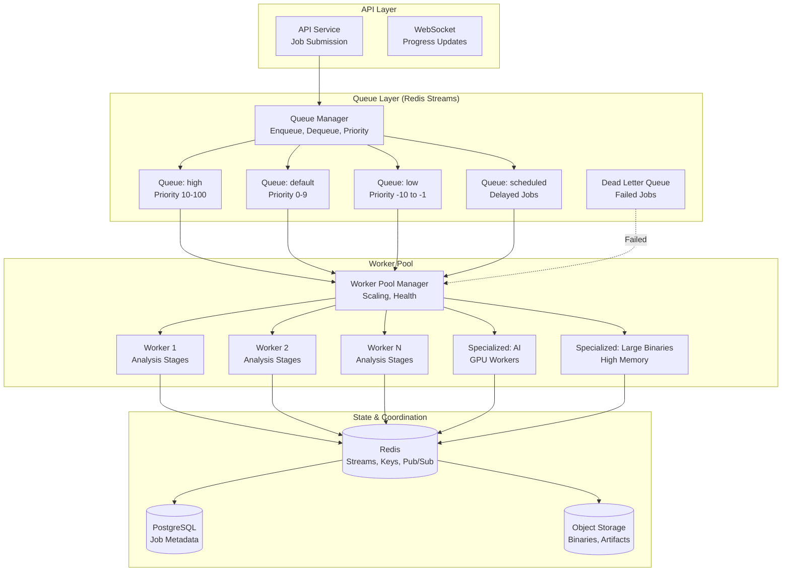

# Queue & Worker System

## Overview

The queue and worker system handles **asynchronous, long-running analysis jobs** with support for prioritization, retries, progress tracking, cancellation, and horizontal scaling. Built on **Redis Streams** with **BullMQ-compatible** semantics for reliability and operational simplicity.

---

## Architecture



---

## Queue Design

### Redis Streams Structure

```redis
# Stream: queue:analysis:high (Priority 10-100)
# Stream: queue:analysis:default (Priority 0-9)
# Stream: queue:analysis:low (Priority -10 to -1)
# Stream: queue:analysis:scheduled (Delayed jobs)
# Stream: queue:analysis:dlq (Dead letter)

# Job entry format:
XADD queue:analysis:default * \
  job_id "550e8400-e29b-41d4-a716-446655440000" \
  project_id "660e8400-e29b-41d4-a716-446655440001" \
  file_id "770e8400-e29b-41d4-a716-446655440002" \
  priority "5" \
  config '{"stages":[...],"timeouts":{...}}' \
  created_at "2026-07-14T10:30:00Z" \
  retry_count "0" \
  idempotency_key "abc123"
```

### Job Payload

```rust
// crates/openre-queue/src/job.rs
#[derive(Debug, Clone, Serialize, Deserialize)]
pub struct AnalysisJob {
    pub id: JobId,
    pub project_id: ProjectId,
    pub file_id: FileId,
    pub priority: i32, // -10 to 100
    pub config: AnalysisConfig,
    pub created_at: DateTime<Utc>,
    pub scheduled_at: Option<DateTime<Utc>>, // For delayed jobs
    pub retry_count: u32,
    pub max_retries: u32,
    pub idempotency_key: Option<String>,
    pub tags: Vec<String>, // For routing to specialized workers
    pub timeout_secs: u64,
    pub created_by: UserId,
}

#[derive(Debug, Clone, Serialize, Deserialize)]
pub enum JobStatus {
    Queued { queued_at: DateTime<Utc> },
    Running { worker_id: WorkerId, started_at: DateTime<Utc>, stage: StageName },
    Completed { completed_at: DateTime<Utc>, result: AnalysisResult },
    Failed { error: String, failed_at: DateTime<Utc>, retryable: bool },
    Cancelled { cancelled_at: DateTime<Utc>, reason: String },
    Scheduled { run_at: DateTime<Utc> },
}
```

---

## Queue Manager

```rust
// crates/openre-queue/src/manager.rs
pub struct QueueManager {
    redis: Arc<RedisClient>,
    streams: QueueStreams,
    idempotency: Arc<IdempotencyChecker>,
}

#[derive(Debug, Clone)]
pub struct QueueStreams {
    pub high: String,      // "queue:analysis:high"
    pub default: String,   // "queue:analysis:default"
    pub low: String,       // "queue:analysis:low"
    pub scheduled: String, // "queue:analysis:scheduled"
    pub dlq: String,       // "queue:analysis:dlq"
    pub events: String,    // "queue:analysis:events"
}

impl QueueManager {
    /// Enqueue a new analysis job
    pub async fn enqueue(&self, job: AnalysisJob) -> Result<JobId, QueueError> {
        // 1. Check idempotency
        if let Some(key) = &job.idempotency_key {
            if self.idempotency.check(key).await? {
                return Err(QueueError::DuplicateJob);
            }
        }
        
        // 2. Select stream based on priority
        let stream = self.select_stream(job.priority);
        
        // 3. Serialize job
        let payload = self.serialize_job(&job)?;
        
        // 4. Add to stream with maxlen for memory management
        let entry_id = self.redis.xadd_maxlen(
            &stream,
            10000, // Max 10k entries per stream
            true,  // Approximate trimming
            &payload,
        ).await?;
        
        // 5. Store job metadata in PostgreSQL
        self.persist_job_metadata(&job).await?;
        
        // 6. Record idempotency key
        if let Some(key) = job.idempotency_key {
            self.idempotency.record(key, job.id).await?;
        }
        
        // 7. Emit event
        self.emit_event(QueueEvent::JobQueued { job_id: job.id, stream }).await?;
        
        Ok(job.id)
    }
    
    /// Dequeue job for worker (blocking with priority)
    pub async fn dequeue(&self, worker_id: &WorkerId, count: usize) -> Result<Vec<DequeuedJob>, QueueError> {
        // Priority order: high > default > low
        let streams = vec![
            (self.streams.high.clone(), 10),
            (self.streams.default.clone(), 5),
            (self.streams.low.clone(), 1),
        ];
        
        // Use XREADGROUP for consumer groups (exactly-once)
        let group = format!("workers:{}", worker_id.0);
        let consumer = worker_id.0.clone();
        
        let results = self.redis.xreadgroup_group_consumer(
            &group,
            &consumer,
            &streams.iter().map(|(s, _)| s.clone()).collect::<Vec<_>>(),
            &vec![">"; streams.len()], // Only new messages
            count,
            Some(Duration::from_secs(30)), // Block up to 30s
        ).await?;
        
        let mut jobs = Vec::new();
        for stream_result in results {
            for entry in stream_result.entries {
                let job = self.deserialize_job(&entry)?;
                jobs.push(DequeuedJob {
                    entry_id: entry.id,
                    stream: stream_result.stream,
                    job,
                });
            }
        }
        
        Ok(jobs)
    }
    
    /// Acknowledge job completion
    pub async fn ack(&self, worker_id: &WorkerId, stream: &str, entry_id: &str) -> Result<(), QueueError> {
        self.redis.xack(stream, &format!("workers:{}", worker_id.0), entry_id).await?;
        Ok(())
    }
    
    /// Requeue job (for retry)
    pub async fn requeue(&self, job: AnalysisJob, delay: Option<Duration>) -> Result<(), QueueError> {
        let mut job = job;
        job.retry_count += 1;
        
        if let Some(delay) = delay {
            job.scheduled_at = Some(Utc::now() + delay);
            self.schedule_job(job).await
        } else {
            self.enqueue(job).await.map(|_| ())
        }
    }
    
    /// Move job to DLQ
    pub async fn move_to_dlq(&self, job: AnalysisJob, error: String) -> Result<(), QueueError> {
        let mut job = job;
        job.config = job.config; // Keep config for debugging
        
        let payload = self.serialize_job(&job)?;
        self.redis.xadd(&self.streams.dlq, &payload).await?;
        
        // Update PostgreSQL status
        self.update_job_status(job.id, JobStatus::Failed { 
            error, 
            failed_at: Utc::now(), 
            retryable: false 
        }).await?;
        
        self.emit_event(QueueEvent::JobMovedToDlq { job_id: job.id, error }).await?;
        Ok(())
    }
    
    fn select_stream(&self, priority: i32) -> &str {
        match priority {
            10..=100 => &self.streams.high,
            0..=9 => &self.streams.default,
            -10..=-1 => &self.streams.low,
            _ => &self.streams.default,
        }
    }
}
```

---

## Worker Pool

### Worker Types

```rust
// crates/openre-queue/src/worker.rs
#[derive(Debug, Clone, Serialize, Deserialize)]
pub struct WorkerConfig {
    pub id: WorkerId,
    pub tags: Vec<String>,           // Capabilities: "ai", "large_binary", "gpu"
    pub max_concurrent_jobs: usize,
    pub max_memory_mb: u64,
    pub max_cpu_percent: u8,
    pub heartbeat_interval_secs: u64,
    pub graceful_shutdown_timeout_secs: u64,
}

#[derive(Debug, Clone)]
pub enum WorkerType {
    General,      // Standard analysis stages
    Ai,           // AI inference (GPU preferred)
    LargeBinary,  // High memory, streaming
    Scheduled,    // Delayed/recurring jobs
}

pub struct Worker {
    config: WorkerConfig,
    worker_type: WorkerType,
    queue_manager: Arc<QueueManager>,
    analysis_service: Arc<AnalysisService>,
    state: Arc<RwLock<WorkerState>>,
    cancellation: CancellationToken,
}

#[derive(Debug, Default)]
pub struct WorkerState {
    pub status: WorkerStatus,
    pub current_job: Option<JobId>,
    pub jobs_completed: u64,
    pub jobs_failed: u64,
    pub started_at: DateTime<Utc>,
    pub last_heartbeat: DateTime<Utc>,
    pub memory_usage_mb: u64,
    pub cpu_percent: f32,
}

#[derive(Debug, Clone, PartialEq)]
pub enum WorkerStatus {
    Starting,
    Idle,
    Running,
    Draining, // Not accepting new jobs, finishing current
    Stopping,
    Stopped,
    Unhealthy,
}

impl Worker {
    pub async fn run(&self) -> Result<(), WorkerError> {
        // 1. Register worker
        self.register().await?;
        
        // 2. Start heartbeat
        let heartbeat = self.start_heartbeat();
        
        // 3. Start metrics collection
        let metrics = self.start_metrics_collection();
        
        // 4. Main work loop
        let work_loop = self.work_loop();
        
        // 5. Wait for shutdown signal
        tokio::select! {
            _ = self.cancellation.cancelled() => {
                self.initiate_graceful_shutdown().await?;
            }
            result = work_loop => {
                result?;
            }
            _ = heartbeat => {}
            _ = metrics => {}
        }
        
        // 6. Graceful shutdown
        self.shutdown().await?;
        Ok(())
    }
    
    async fn work_loop(&self) -> Result<(), WorkerError> {
        while !self.cancellation.is_cancelled() {
            // Check if we can accept more jobs
            if !self.can_accept_job().await {
                tokio::time::sleep(Duration::from_secs(5)).await;
                continue;
            }
            
            // Dequeue job
            let jobs = match self.queue_manager.dequeue(&self.config.id, self.config.max_concurrent_jobs).await {
                Ok(jobs) if !jobs.is_empty() => jobs,
                Ok(_) => {
                    tokio::time::sleep(Duration::from_secs(1)).await;
                    continue;
                }
                Err(e) => {
                    tracing::warn!("Dequeue error: {}", e);
                    tokio::time::sleep(Duration::from_secs(5)).await;
                    continue;
                }
            };
            
            // Process jobs concurrently (up to max_concurrent_jobs)
            let futures = jobs.into_iter().map(|dequeued| self.process_job(dequeued));
            let results = futures::future::join_all(futures).await;
            
            // Handle results
            for (dequeued, result) in results {
                match result {
                    Ok(_) => {
                        self.queue_manager.ack(&self.config.id, &dequeued.stream, &dequeued.entry_id).await?;
                        self.increment_completed().await;
                    }
                    Err(e) => self.handle_job_failure(dequeued, e).await?,
                }
            }
        }
        Ok(())
    }
    
    async fn process_job(&self, dequeued: DequeuedJob) -> Result<(), WorkerError> {
        let job = dequeued.job;
        
        // Update state
        self.set_status(WorkerStatus::Running).await;
        self.set_current_job(Some(job.id)).await;
        
        // Create timeout
        let timeout = Duration::from_secs(job.timeout_secs);
        
        // Execute with timeout
        let result = tokio::time::timeout(timeout, async {
            self.analysis_service.execute_analysis(job).await
        }).await;
        
        match result {
            Ok(Ok(result)) => {
                // Success - result already persisted by analysis service
                Ok(())
            }
            Ok(Err(e)) => {
                // Analysis failed - will be retried or moved to DLQ
                Err(WorkerError::AnalysisFailed(e))
            }
            Err(_) => {
                // Timeout
                Err(WorkerError::Timeout)
            }
        }
    }
    
    async fn handle_job_failure(&self, dequeued: DequeuedJob, error: WorkerError) -> Result<(), WorkerError> {
        let job = dequeued.job;
        
        // Check if retryable
        let retryable = matches!(error, 
            WorkerError::Timeout | 
            WorkerError::ResourceExhausted(_) | 
            WorkerError::Transient(_)
        );
        
        if retryable && job.retry_count < job.max_retries {
            // Calculate exponential backoff
            let delay = Duration::from_secs(
                (job.config.retries.base_delay_secs as f64 * 
                 job.config.retries.exponential_base.powi(job.retry_count as i32)) as u64
            ).min(Duration::from_secs(job.config.retries.max_delay_secs));
            
            // Requeue with delay
            self.queue_manager.requeue(job, Some(delay)).await?;
        } else {
            // Move to DLQ
            self.queue_manager.move_to_dlq(job, error.to_string()).await?;
        }
        
        self.increment_failed().await;
        Ok(())
    }
}
```

---

## Worker Pool Manager

```rust
// crates/openre-queue/src/pool_manager.rs
pub struct WorkerPoolManager {
    config: PoolConfig,
    workers: Arc<DashMap<WorkerId, WorkerHandle>>,
    queue_manager: Arc<QueueManager>,
    analysis_service: Arc<AnalysisService>,
    scaler: Arc<AutoScaler>,
    shutdown: CancellationToken,
}

#[derive(Debug, Clone)]
pub struct PoolConfig {
    pub min_workers: usize,
    pub max_workers: usize,
    pub target_queue_depth_per_worker: usize,
    pub scale_up_threshold: f64,    // Queue depth / worker > threshold
    pub scale_down_threshold: f64,  // Queue depth / worker < threshold
    pub scale_up_cooldown_secs: u64,
    pub scale_down_cooldown_secs: u64,
    pub worker_defaults: WorkerConfig,
}

impl WorkerPoolManager {
    pub async fn start(&self) -> Result<(), PoolError> {
        // 1. Start minimum workers
        for _ in 0..self.config.min_workers {
            self.spawn_worker(WorkerType::General).await?;
        }
        
        // 2. Start autoscaler
        self.scaler.start().await?;
        
        // 3. Start health monitor
        self.start_health_monitor().await?;
        
        Ok(())
    }
    
    async fn spawn_worker(&self, worker_type: WorkerType) -> Result<WorkerId, PoolError> {
        let worker_id = WorkerId(Uuid::new_v4().to_string());
        let mut config = self.config.worker_defaults.clone();
        config.id = worker_id.clone();
        
        // Customize for worker type
        match worker_type {
            WorkerType::Ai => {
                config.tags.push("ai".to_string());
                config.tags.push("gpu".to_string());
                config.max_memory_mb = 8192;
            }
            WorkerType::LargeBinary => {
                config.tags.push("large_binary".to_string());
                config.max_memory_mb = 16384;
                config.max_concurrent_jobs = 1;
            }
            WorkerType::Scheduled => {
                config.tags.push("scheduled".to_string());
            }
            _ => {}
        }
        
        let worker = Worker::new(config, worker_type, self.queue_manager.clone(), self.analysis_service.clone());
        let handle = worker.start().await?;
        
        self.workers.insert(worker_id.clone(), handle);
        Ok(worker_id)
    }
    
    pub async fn scale_to(&self, target: usize) -> Result<(), PoolError> {
        let current = self.workers.len();
        
        if target > current {
            // Scale up
            for _ in 0..(target - current) {
                self.spawn_worker(WorkerType::General).await?;
            }
        } else if target < current {
            // Scale down - drain workers gracefully
            let to_remove = current - target;
            let workers_to_drain: Vec<_> = self.workers.iter()
                .filter(|w| w.value().state.read().await.status == WorkerStatus::Idle)
                .take(to_remove)
                .map(|w| w.key().clone())
                .collect();
            
            for worker_id in workers_to_drain {
                self.drain_worker(&worker_id).await?;
            }
        }
        
        Ok(())
    }
    
    async fn drain_worker(&self, worker_id: &WorkerId) -> Result<(), PoolError> {
        if let Some(handle) = self.workers.get(worker_id) {
            handle.value().drain().await?; // Set to Draining, wait for completion
            handle.value().shutdown().await?;
            self.workers.remove(worker_id);
        }
        Ok(())
    }
}
```

---

## Auto Scaler

```rust
// crates/openre-queue/src/autoscaler.rs
pub struct AutoScaler {
    pool_manager: Arc<WorkerPoolManager>,
    queue_manager: Arc<QueueManager>,
    config: PoolConfig,
    last_scale_up: Arc<RwLock<Option<DateTime<Utc>>>>,
    last_scale_down: Arc<RwLock<Option<DateTime<Utc>>>>,
}

impl AutoScaler {
    pub async fn run(&self) -> Result<(), ScalerError> {
        let mut interval = tokio::time::interval(Duration::from_secs(30));
        
        loop {
            interval.tick().await;
            
            if let Err(e) = self.evaluate_and_scale().await {
                tracing::error!("Autoscaler error: {}", e);
            }
        }
    }
    
    async fn evaluate_and_scale(&self) -> Result<(), ScalerError> {
        // 1. Get queue metrics
        let queue_metrics = self.get_queue_metrics().await?;
        
        // 2. Get worker metrics
        let worker_metrics = self.get_worker_metrics().await?;
        
        // 3. Calculate desired workers
        let desired = self.calculate_desired_workers(&queue_metrics, &worker_metrics)?;
        let current = worker_metrics.total_workers;
        
        // 4. Apply cooldowns
        if desired > current {
            if self.can_scale_up().await? {
                self.pool_manager.scale_to(desired).await?;
                *self.last_scale_up.write().await = Some(Utc::now());
            }
        } else if desired < current {
            if self.can_scale_down().await? {
                self.pool_manager.scale_to(desired).await?;
                *self.last_scale_down.write().await = Some(Utc::now());
            }
        }
        
        Ok(())
    }
    
    fn calculate_desired_workers(
        &self,
        queue: &QueueMetrics,
        workers: &WorkerMetrics,
    ) -> Result<usize, ScalerError> {
        // Base calculation: queue depth / target depth per worker
        let base = (queue.pending_jobs as f64 / self.config.target_queue_depth_per_worker as f64).ceil() as usize;
        
        // Adjust for running jobs
        let running = workers.running_jobs as f64;
        let capacity = workers.total_workers as f64 * self.config.worker_defaults.max_concurrent_jobs as f64;
        let utilization = running / capacity.max(1.0);
        
        // If high utilization, need more workers
        let utilization_factor = if utilization > 0.8 { 1.5 } else if utilization > 0.6 { 1.2 } else { 1.0 };
        
        let desired = (base as f64 * utilization_factor).ceil() as usize;
        
        // Clamp to min/max
        Ok(desired.clamp(self.config.min_workers, self.config.max_workers))
    }
    
    async fn can_scale_up(&self) -> Result<bool, ScalerError> {
        let last = *self.last_scale_up.read().await;
        if let Some(last) = last {
            Ok(Utc::now().signed_duration_since(last).num_seconds() > self.config.scale_up_cooldown_secs as i64)
        } else {
            Ok(true)
        }
    }
    
    async fn can_scale_down(&self) -> Result<bool, ScalerError> {
        let last = *self.last_scale_down.read().await;
        if let Some(last) = last {
            Ok(Utc::now().signed_duration_since(last).num_seconds() > self.config.scale_down_cooldown_secs as i64)
        } else {
            Ok(true)
        }
    }
}
```

---

## Retry Strategy

```rust
// crates/openre-queue/src/retry.rs
#[derive(Debug, Clone, Serialize, Deserialize)]
pub struct RetryPolicy {
    pub max_attempts: u32,
    pub base_delay_secs: u64,
    pub max_delay_secs: u64,
    pub exponential_base: f64,
    pub jitter: bool,
    pub retryable_errors: Vec<String>,
    pub non_retryable_errors: Vec<String>,
}

impl Default for RetryPolicy {
    fn default() -> Self {
        Self {
            max_attempts: 3,
            base_delay_secs: 5,
            max_delay_secs: 300, // 5 minutes
            exponential_base: 2.0,
            jitter: true,
            retryable_errors: vec![
                "timeout".to_string(),
                "resource_exhausted".to_string(),
                "plugin_crash".to_string(),
                "transient".to_string(),
                "network_error".to_string(),
            ],
            non_retryable_errors: vec![
                "invalid_binary".to_string(),
                "unsupported_format".to_string(),
                "cancelled".to_string(),
                "validation_error".to_string(),
            ],
        }
    }
}

impl RetryPolicy {
    pub fn should_retry(&self, attempt: u32, error: &str) -> bool {
        if attempt >= self.max_attempts {
            return false;
        }
        
        // Check non-retryable first
        for non_retryable in &self.non_retryable_errors {
            if error.contains(non_retryable) {
                return false;
            }
        }
        
        // Check retryable
        for retryable in &self.retryable_errors {
            if error.contains(retryable) {
                return true;
            }
        }
        
        // Default: don't retry unknown errors
        false
    }
    
    pub fn calculate_delay(&self, attempt: u32) -> Duration {
        let base = self.base_delay_secs as f64;
        let exp = self.exponential_base.powi(attempt as i32 - 1);
        let delay = (base * exp) as u64;
        let capped = delay.min(self.max_delay_secs);
        
        if self.jitter {
            // Add ±25% jitter
            let jitter_range = (capped as f64 * 0.25) as u64;
            let jitter = rand::random::<u64>() % (jitter_range * 2) - jitter_range as i64;
            Duration::from_secs((capped as i64 + jitter).max(0) as u64)
        } else {
            Duration::from_secs(capped)
        }
    }
}
```

---

## Progress Tracking & Cancellation

### Job Progress

```rust
// crates/openre-queue/src/progress.rs
#[derive(Debug, Clone, Serialize, Deserialize)]
pub struct JobProgress {
    pub job_id: JobId,
    pub status: JobStatus,
    pub current_stage: Option<StageName>,
    pub stage_progress: f32, // 0.0 - 1.0
    pub overall_progress: f32, // 0.0 - 1.0
    pub message: String,
    pub started_at: DateTime<Utc>,
    pub updated_at: DateTime<Utc>,
    pub estimated_remaining_secs: Option<u64>,
    pub stages: Vec<StageProgress>,
}

#[derive(Debug, Clone, Serialize, Deserialize)]
pub struct StageProgress {
    pub name: StageName,
    pub status: StageStatus,
    pub progress: f32,
    pub started_at: Option<DateTime<Utc>>,
    pub completed_at: Option<DateTime<Utc>>,
    pub duration_ms: Option<u64>,
}

#[derive(Debug, Clone, Serialize, Deserialize)]
pub enum StageStatus {
    Pending,
    Running,
    Completed,
    Failed,
    Skipped,
}

impl QueueManager {
    /// Update job progress (called by worker)
    pub async fn update_progress(&self, progress: JobProgress) -> Result<(), QueueError> {
        // 1. Store in Redis for real-time polling
        let key = format!("progress:{}", progress.job_id);
        let data = serde_json::to_vec(&progress)?;
        self.redis.set(&key, data).await?;
        self.redis.expire(&key, 3600).await?; // 1 hour TTL
        
        // 2. Publish to Pub/Sub for WebSocket push
        self.redis.publish("job:progress", serde_json::to_vec(&progress)?).await?;
        
        // 3. Persist to PostgreSQL (async, best effort)
        tokio::spawn(async move {
            let _ = self.persist_progress(&progress).await;
        });
        
        Ok(())
    }
    
    /// Get current progress
    pub async fn get_progress(&self, job_id: JobId) -> Result<Option<JobProgress>, QueueError> {
        let key = format!("progress:{}", job_id);
        let data = self.redis.get(&key).await?;
        data.map(|d| serde_json::from_slice(&d)).transpose()
            .map_err(QueueError::Serialization)
    }
}
```

### Cancellation

```rust
// crates/openre-queue/src/cancellation.rs
impl QueueManager {
    /// Request job cancellation
    pub async fn cancel_job(&self, job_id: JobId, reason: String) -> Result<(), QueueError> {
        // 1. Check current status
        let status = self.get_job_status(job_id).await?;
        
        match status {
            JobStatus::Queued => {
                // Remove from queue (mark as cancelled in stream)
                self.mark_cancelled_in_stream(job_id).await?;
                self.update_job_status(job_id, JobStatus::Cancelled { 
                    cancelled_at: Utc::now(), 
                    reason 
                }).await?;
            }
            JobStatus::Running { worker_id, .. } => {
                // Signal worker to cancel
                self.signal_worker_cancel(&worker_id, job_id).await?;
            }
            JobStatus::Scheduled { .. } => {
                // Remove from scheduled queue
                self.remove_from_scheduled(job_id).await?;
                self.update_job_status(job_id, JobStatus::Cancelled { 
                    cancelled_at: Utc::now(), 
                    reason 
                }).await?;
            }
            JobStatus::Completed | JobStatus::Failed | JobStatus::Cancelled => {
                return Err(QueueError::JobNotCancellable(status));
            }
        }
        
        // Emit event
        self.emit_event(QueueEvent::JobCancelled { job_id, reason }).await?;
        Ok(())
    }
    
    /// Signal worker to cancel job
    async fn signal_worker_cancel(&self, worker_id: &WorkerId, job_id: JobId) -> Result<(), QueueError> {
        // Publish cancellation signal to worker-specific channel
        let channel = format!("worker:cancel:{}", worker_id.0);
        let payload = serde_json::json!({ "job_id": job_id, "reason": "user_requested" });
        self.redis.publish(&channel, serde_json::to_vec(&payload)?).await?;
        Ok(())
    }
}

// Worker side: listen for cancellation
impl Worker {
    async fn listen_for_cancellation(&self) {
        let mut pubsub = self.queue_manager.redis.pubsub();
        pubsub.subscribe(&format!("worker:cancel:{}", self.config.id.0)).await;
        
        while let Some(msg) = pubsub.on_message().next().await {
            let payload: CancelSignal = serde_json::from_slice(&msg.payload).unwrap();
            if payload.job_id == self.current_job_id() {
                self.cancellation.cancel();
            }
        }
    }
}
```

---

## Scheduled & Recurring Jobs

```rust
// crates/openre-queue/src/scheduler.rs
pub struct JobScheduler {
    queue_manager: Arc<QueueManager>,
    scheduler: Arc<tokio_cron_scheduler::JobScheduler>,
}

impl JobScheduler {
    pub async fn schedule_recurring(
        &self,
        name: String,
        cron: String,
        job_template: AnalysisJob,
    ) -> Result<(), SchedulerError> {
        let job = job_template.clone();
        
        self.scheduler.add(Job::new_async(cron, move |_uuid, _l| {
            let job = job.clone();
            let queue = self.queue_manager.clone();
            Box::pin(async move {
                queue.enqueue(job).await.ok();
            })
        })?).await?;
        
        Ok(())
    }
    
    pub async fn schedule_one_off(
        &self,
        run_at: DateTime<Utc>,
        job: AnalysisJob,
    ) -> Result<(), SchedulerError> {
        let delay = run_at.signed_duration_since(Utc::now());
        if delay.num_seconds() <= 0 {
            return Err(SchedulerError::PastTime);
        }
        
        // Use Redis sorted set for delayed jobs
        let score = run_at.timestamp() as f64;
        self.queue_manager.redis.zadd("queue:analysis:scheduled", score, &job.id).await?;
        
        // Store job with scheduled_at
        let mut job = job;
        job.scheduled_at = Some(run_at);
        self.queue_manager.persist_job_metadata(&job).await?;
        
        Ok(())
    }
    
    // Background task to move scheduled jobs to active queues
    pub async fn run_scheduler_loop(&self) {
        let mut interval = tokio::time::interval(Duration::from_secs(10));
        
        loop {
            interval.tick().await;
            
            let now = Utc::now().timestamp() as f64;
            let jobs: Vec<String> = self.queue_manager.redis
                .zrangebyscore("queue:analysis:scheduled", 0.0, now)
                .await?;
            
            for job_id in jobs {
                // Move to appropriate priority queue
                if let Ok(job) = self.load_job_metadata(job_id).await {
                    self.queue_manager.redis.zrem("queue:analysis:scheduled", &job_id).await?;
                    self.queue_manager.enqueue(job).await.ok();
                }
            }
        }
    }
}
```

---

## Metrics & Monitoring

```rust
// crates/openre-queue/src/metrics.rs
#[derive(Debug, Clone, Serialize, Deserialize)]
pub struct QueueMetrics {
    pub pending_high: usize,
    pub pending_default: usize,
    pub pending_low: usize,
    pub pending_scheduled: usize,
    pub running_jobs: usize,
    pub completed_last_hour: u64,
    pub failed_last_hour: u64,
    pub avg_wait_time_secs: f64,
    pub avg_execution_time_secs: f64,
    pub dlq_size: usize,
}

#[derive(Debug, Clone, Serialize, Deserialize)]
pub struct WorkerMetrics {
    pub total_workers: usize,
    pub idle_workers: usize,
    pub running_workers: usize,
    pub draining_workers: usize,
    pub running_jobs: usize,
    pub completed_jobs: u64,
    pub failed_jobs: u64,
    pub avg_memory_mb: f64,
    pub avg_cpu_percent: f64,
}

impl QueueManager {
    pub async fn get_queue_metrics(&self) -> Result<QueueMetrics, QueueError> {
        let pipe = self.redis.pipeline();
        
        pipe.xlen("queue:analysis:high");
        pipe.xlen("queue:analysis:default");
        pipe.xlen("queue:analysis:low");
        pipe.zcard("queue:analysis:scheduled");
        pipe.xlen("queue:analysis:dlq");
        
        let results: Vec<usize> = pipe.exec().await?;
        
        // Get running jobs from worker heartbeats
        let running = self.count_running_jobs().await?;
        
        // Get hourly stats from Redis counters
        let completed = self.redis.get("stats:completed:hour").await?.unwrap_or(0);
        let failed = self.redis.get("stats:failed:hour").await?.unwrap_or(0);
        
        Ok(QueueMetrics {
            pending_high: results[0],
            pending_default: results[1],
            pending_low: results[2],
            pending_scheduled: results[3],
            running_jobs: running,
            completed_last_hour: completed,
            failed_last_hour: failed,
            avg_wait_time_secs: self.calculate_avg_wait_time().await?,
            avg_execution_time_secs: self.calculate_avg_execution_time().await?,
            dlq_size: results[4],
        })
    }
}
```

---

## Deployment Configuration

```yaml
# docker-compose.yml (Worker services)
services:
  worker-general:
    image: openre/worker:latest
    deploy:
      replicas: 3
    environment:
      - WORKER_TYPE=general
      - MAX_CONCURRENT_JOBS=4
      - MAX_MEMORY_MB=4096
      - TAGS=general
      - REDIS_URL=redis://redis:6379
      - DATABASE_URL=postgresql://...
    depends_on:
      - redis
      - postgres
    healthcheck:
      test: ["CMD", "worker-health-check"]
      interval: 30s
      timeout: 10s
      retries: 3

  worker-ai:
    image: openre/worker:latest
    deploy:
      replicas: 1
    environment:
      - WORKER_TYPE=ai
      - MAX_CONCURRENT_JOBS=2
      - MAX_MEMORY_MB=8192
      - TAGS=ai,gpu
      - REDIS_URL=redis://redis:6379
      - DATABASE_URL=postgresql://...
    deploy:
      resources:
        reservations:
          devices:
            - driver: nvidia
              count: 1
              capabilities: [gpu]

  worker-large-binary:
    image: openre/worker:latest
    deploy:
      replicas: 1
    environment:
      - WORKER_TYPE=large_binary
      - MAX_CONCURRENT_JOBS=1
      - MAX_MEMORY_MB=16384
      - TAGS=large_binary
      - REDIS_URL=redis://redis:6379
      - DATABASE_URL=postgresql://...

  autoscaler:
    image: openre/autoscaler:latest
    environment:
      - MIN_WORKERS=3
      - MAX_WORKERS=20
      - TARGET_QUEUE_DEPTH_PER_WORKER=10
      - REDIS_URL=redis://redis:6379
    depends_on:
      - redis
```

---

*This queue and worker system provides a robust, scalable foundation for asynchronous analysis processing with enterprise-grade reliability, observability, and operational simplicity.*