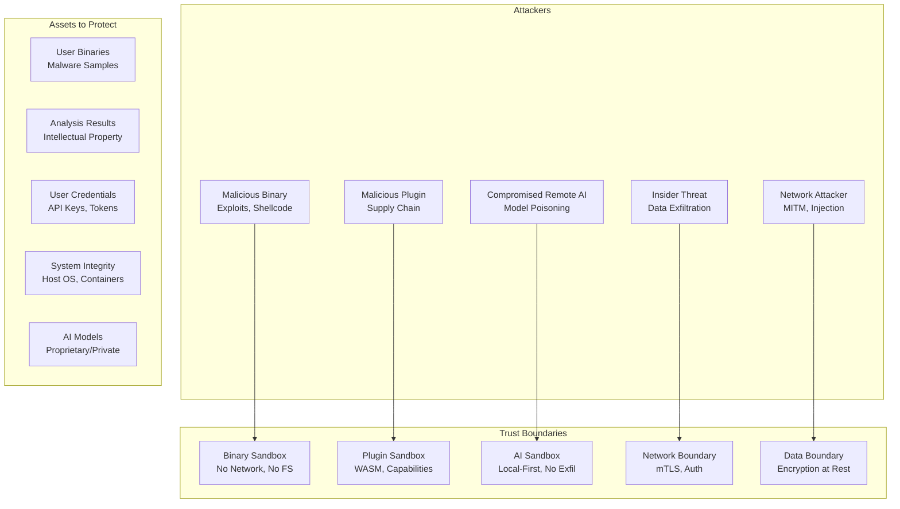
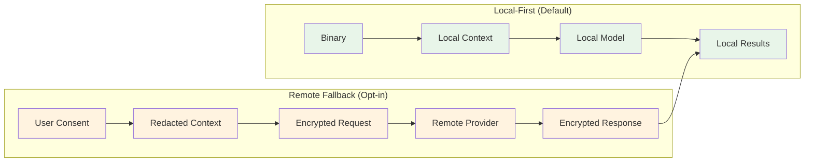

# Security Model

## Overview

The security model follows a **defense-in-depth** approach with **zero-trust** principles. Every component is sandboxed, every communication is authenticated and encrypted, and user data never leaves the machine without explicit consent. The system is designed to safely analyze malicious binaries without risk of host compromise.

---

## Threat Model



### STRIDE Analysis

| Threat | Vectors | Mitigations |
|--------|---------|-------------|
| **Spoofing** | Fake plugins, forged API requests, spoofed WebSocket | Plugin signing, mTLS, JWT with RS256, WebSocket auth |
| **Tampering** | Binary modification, plugin code injection, DB corruption | Immutable binaries, plugin signatures, DB checksums, WAL |
| **Repudiation** | Denied actions, audit log deletion | Immutable audit logs, signed audit entries |
| **Information Disclosure** | Binary leakage, analysis results, API keys | Local-first, encryption at rest/in transit, no telemetry |
| **Denial of Service** | Resource exhaustion, queue flooding, plugin crashes | Rate limiting, resource quotas, circuit breakers, isolation |
| **Elevation of Privilege** | Plugin escape, container breakout, API bypass | WASM sandbox, capability model, least privilege, seccomp |

---

## File Isolation

### Binary Handling

```rust
// crates/openre-storage/src/isolation.rs
pub struct BinaryIsolation {
    sandbox_dir: PathBuf,
    max_file_size: u64,
    allowed_paths: Vec<PathBuf>,
}

impl BinaryIsolation {
    /// Prepare binary for analysis in isolated environment
    pub async fn prepare(&self, file_id: FileId) -> Result<IsolatedBinary, IsolationError> {
        // 1. Copy to sandbox directory with random name
        let sandbox_path = self.sandbox_dir.join(Uuid::new_v4().to_string());
        tokio::fs::create_dir_all(&sandbox_path).await?;
        
        // 2. Stream binary to sandbox (never fully in memory)
        let src = self.object_store.get_object(file_id).await?;
        let dst_path = sandbox_path.join("binary");
        let mut dst = tokio::fs::File::create(&dst_path).await?;
        tokio::io::copy(&mut src, &mut dst).await?;
        
        // 3. Verify integrity
        let hash = self.compute_hash(&dst_path).await?;
        if hash != self.get_expected_hash(file_id).await? {
            return Err(IsolationError::IntegrityCheckFailed);
        }
        
        // 4. Set restrictive permissions (read-only)
        self.set_readonly(&dst_path).await?;
        
        // 5. Apply seccomp profile (Linux)
        #[cfg(target_os = "linux")]
        self.apply_seccomp_profile().await?;
        
        Ok(IsolatedBinary {
            path: dst_path,
            sandbox_dir,
            file_id,
            hash,
        })
    }
    
    /// Cleanup after analysis
    pub async fn cleanup(&self, isolated: IsolatedBinary) -> Result<(), IsolationError> {
        // Secure delete (overwrite + remove)
        self.secure_delete(&isolated.path).await?;
        tokio::fs::remove_dir_all(&isolated.sandbox_dir).await?;
        Ok(())
    }
}
```

### Seccomp Profile (Linux)

```c
// seccomp/profile.bpf
// Allowlist syscalls for binary analysis worker

// File operations (read-only)
allow: openat, read, pread64, mmap, munmap, close, fstat, lseek, ioctl

// Memory
allow: brk, mprotect, madvise, mincore

// Process
allow: exit_group, exit, rt_sigaction, rt_sigprocmask, sigaltstack

// Time
allow: clock_gettime, nanosleep

// Network (NONE - completely disabled)
// deny: socket, connect, bind, listen, accept, sendto, recvfrom

// Filesystem (NONE - no write, no directory ops)
// deny: write, pwrite64, openat (with O_CREAT|O_WRONLY), mkdir, unlink, rename

// Dangerous
deny: execve, execveat, fork, clone, vfork, ptrace, process_vm_readv, process_vm_writev
```

---

## Plugin Sandboxing

### WASM Sandbox (Default)

```rust
// crates/openre-plugins/src/wasm_sandbox.rs
pub struct WasmSandbox {
    engine: wasmtime::Engine,
    fuel_limit: u64,
    memory_limit: usize,
    allowed_host_functions: HashSet<String>,
    epoch_deadline: Arc<AtomicU64>,
}

impl WasmSandbox {
    pub fn new(config: SandboxConfig) -> Result<Self, SandboxError> {
        let mut engine_config = wasmtime::Config::new();
        
        // Security: Disable dangerous WASM features
        engine_config.wasm_simd(false);
        engine_config.wasm_threads(false);
        engine_config.wasm_memory64(false);
        engine_config.wasm_bulk_memory(false);
        engine_config.wasm_reference_types(false);
        engine_config.wasm_tail_call(false);
        engine_config.wasm_extended_const(false);
        engine_config.wasm_multi_value(false);
        
        // Resource limits
        engine_config.consume_fuel(true);
        engine_config.max_wasm_stack(config.max_stack_kb * 1024);
        
        // Epoch-based interruption (for timeout)
        engine_config.epoch_interruption(true);
        
        let engine = wasmtime::Engine::new(&engine_config)?;
        
        Ok(Self {
            engine,
            fuel_limit: config.max_fuel,
            memory_limit: config.max_memory_mb * 1024 * 1024,
            allowed_host_functions: config.allowed_host_functions.into_iter().collect(),
            epoch_deadline: Arc::new(AtomicU64::new(0)),
        })
    }
    
    pub fn create_store(&self, plugin_id: &PluginId) -> wasmtime::Store<PluginState> {
        let mut store = wasmtime::Store::new(&self.engine, PluginState::new(plugin_id));
        store.add_fuel(self.fuel_limit).unwrap();
        store.limiter(|store| store.data().fuel_consumed());
        store.epoch_deadline_callback(move |store| {
            if store.data().should_yield() {
                store.yield_now();
            }
        });
        store
    }
    
    /// Validate WASM module before instantiation
    pub fn validate_module(&self, module: &wasmtime::Module) -> Result<(), SandboxError> {
        // Check imports match allowed host functions
        for import in module.imports() {
            if !self.allowed_host_functions.contains(import.name()) {
                return Err(SandboxError::DisallowedImport(import.name().to_string()));
            }
        }
        
        // Check exports don't include dangerous functions
        for export in module.exports() {
            if self.is_dangerous_export(export.name()) {
                return Err(SandboxError::DangerousExport(export.name().to_string()));
            }
        }
        
        // Check memory limits
        if let Some(memory) = module.memory() {
            if memory.maximum().unwrap_or(u64::MAX) > self.memory_limit as u64 {
                return Err(SandboxError::MemoryLimitExceeded);
            }
        }
        
        Ok(())
    }
}
```

### Capability-Based Permissions

```rust
// crates/openre-plugins/src/capabilities.rs
#[derive(Debug, Clone, Serialize, Deserialize)]
pub struct PluginPermissions {
    pub filesystem: FilesystemPermission,
    pub network: NetworkPermission,
    pub host_api: Vec<String>,
    pub native_access: bool,
}

#[derive(Debug, Clone, Serialize, Deserialize)]
pub enum FilesystemPermission {
    None,
    Read { paths: Vec<PathBuf> },
    Write { paths: Vec<PathBuf> },
    Sandbox { mount_points: Vec<MountPoint> },
}

#[derive(Debug, Clone, Serialize, Deserialize)]
pub struct MountPoint {
    pub host_path: PathBuf,
    pub guest_path: PathBuf,
    pub readonly: bool,
}

#[derive(Debug, Clone, Serialize, Deserialize)]
pub enum NetworkPermission {
    None,
    Localhost { ports: Vec<u16> },
    Egress { domains: Vec<String> },
}

// Capability enforcement at runtime
pub struct CapabilityEnforcer {
    permissions: PluginPermissions,
}

impl CapabilityEnforcer {
    pub fn check_filesystem_read(&self, path: &Path) -> Result<(), CapabilityError> {
        match &self.permissions.filesystem {
            FilesystemPermission::None => Err(CapabilityError::FilesystemDenied),
            FilesystemPermission::Read { paths } => {
                if paths.iter().any(|p| path.starts_with(p)) {
                    Ok(())
                } else {
                    Err(CapabilityError::PathNotAllowed(path.to_path_buf()))
                }
            }
            FilesystemPermission::Sandbox { mount_points } => {
                if mount_points.iter().any(|m| path.starts_with(&m.guest_path)) {
                    Ok(())
                } else {
                    Err(CapabilityError::PathNotAllowed(path.to_path_buf()))
                }
            }
            _ => Err(CapabilityError::FilesystemDenied),
        }
    }
    
    pub fn check_network(&self, host: &str, port: u16) -> Result<(), CapabilityError> {
        match &self.permissions.network {
            NetworkPermission::None => Err(CapabilityError::NetworkDenied),
            NetworkPermission::Localhost { ports } => {
                if host == "localhost" || host == "127.0.0.1" {
                    if ports.contains(&port) {
                        Ok(())
                    } else {
                        Err(CapabilityError::PortNotAllowed(port))
                    }
                } else {
                    Err(CapabilityError::HostNotAllowed(host.to_string()))
                }
            }
            NetworkPermission::Egress { domains } => {
                if domains.iter().any(|d| host.ends_with(d)) {
                    Ok(())
                } else {
                    Err(CapabilityError::DomainNotAllowed(host.to_string()))
                }
            }
        }
    }
}
```

---

## AI Security

### Local-First Architecture



### Data Sanitization

```rust
// crates/openre-ai/src/privacy.rs
pub struct PrivacyConfig {
    pub allow_remote: bool,
    pub allowed_providers: Vec<ProviderId>,
    pub redact_sensitive: bool,
    pub sensitive_patterns: Vec<Regex>,
    pub max_context_tokens: usize,
    pub audit_log: bool,
}

impl AiService {
    fn sanitize_context(&self, context: &mut PromptContext, config: &PrivacyConfig) {
        if !config.redact_sensitive {
            return;
        }
        
        for pattern in &config.sensitive_patterns {
            // Redact binary name
            context.binary.name = pattern.replace_all(&context.binary.name, "[REDACTED]").to_string();
            
            // Redact function assembly
            if let Some(func) = &mut context.function {
                func.assembly = pattern.replace_all(&func.assembly, "[REDACTED]").to_string();
                if let Some(pseudo) = &mut func.pseudocode {
                    *pseudo = pattern.replace_all(pseudo, "[REDACTED]").to_string();
                }
                
                // Redact strings
                func.strings = func.strings.iter()
                    .map(|s| pattern.replace_all(s, "[REDACTED]").to_string())
                    .collect();
            }
        }
        
        // Truncate to token budget
        self.truncate_to_budget(context, config.max_context_tokens);
    }
    
    async fn audit_request(&self, request: &AiRequest, config: &PrivacyConfig) {
        if config.audit_log {
            let entry = AuditEntry {
                timestamp: Utc::now(),
                task: request.task_type,
                model: request.model_id.clone(),
                remote: request.remote_fallback,
                tokens_estimated: request.estimated_tokens,
                user_id: request.user_id,
                sanitized: config.redact_sensitive,
            };
            self.audit_log.write(entry).await;
        }
    }
}
```

### Model Supply Chain Security

```rust
// crates/openre-ai/src/model_security.rs
pub struct ModelSecurity {
    trusted_keys: Vec<PublicKey>,
    allowlist: HashSet<ModelId>,
    blocklist: HashSet<ModelId>,
}

impl ModelSecurity {
    /// Verify model signature before loading
    pub async fn verify_model(&self, model_path: &Path) -> Result<ModelMetadata, SecurityError> {
        // 1. Check allowlist/blocklist
        let model_id = self.extract_model_id(model_path)?;
        if self.blocklist.contains(&model_id) {
            return Err(SecurityError::ModelBlocklisted(model_id));
        }
        if !self.allowlist.is_empty() && !self.allowlist.contains(&model_id) {
            return Err(SecurityError::ModelNotAllowlisted(model_id));
        }
        
        // 2. Verify signature
        let signature_path = model_path.with_extension("sig");
        let signature = tokio::fs::read(&signature_path).await?;
        let manifest_path = model_path.with_extension("manifest.json");
        let manifest = tokio::fs::read(&manifest_path).await?;
        
        let verified = self.verify_signature(&manifest, &signature).await?;
        if !verified {
            return Err(SecurityError::InvalidSignature);
        }
        
        // 3. Parse and validate manifest
        let metadata: ModelMetadata = serde_json::from_slice(&manifest)?;
        self.validate_metadata(&metadata)?;
        
        Ok(metadata)
    }
    
    fn validate_metadata(&self, metadata: &ModelMetadata) -> Result<(), SecurityError> {
        // Check license compatibility
        if !self.is_license_compatible(&metadata.license) {
            return Err(SecurityError::IncompatibleLicense(metadata.license.clone()));
        }
        
        // Check for known vulnerable versions
        if self.is_vulnerable(&metadata.name, &metadata.version) {
            return Err(SecurityError::KnownVulnerability);
        }
        
        // Verify provenance
        if metadata.provenance.is_none() {
            return Err(SecurityError::MissingProvenance);
        }
        
        Ok(())
    }
}
```

---

## Network Security

### mTLS Configuration

```rust
// crates/openre-api/src/tls.rs
pub struct TlsConfig {
    pub cert_path: PathBuf,
    pub key_path: PathBuf,
    pub ca_path: PathBuf,
    pub client_ca_path: PathBuf,
    pub verify_client: bool,
    pub min_version: TlsVersion,
    pub cipher_suites: Vec<CipherSuite>,
}

impl TlsConfig {
    pub fn build_server_config(&self) -> Result<rustls::ServerConfig, TlsError> {
        let cert = self.load_cert_chain()?;
        let key = self.load_private_key()?;
        
        let mut config = rustls::ServerConfig::builder()
            .with_safe_defaults()
            .with_client_cert_verifier(self.build_client_verifier()?)
            .with_single_cert(cert, key)?;
        
        config.alpn_protocols = vec![b"h2".to_vec(), b"http/1.1".to_vec()];
        config.max_fragment_size = Some(16384);
        
        Ok(config)
    }
    
    fn build_client_verifier(&self) -> Result<Arc<dyn rustls::server::ClientCertVerifier>, TlsError> {
        let ca_cert = self.load_ca_cert()?;
        let mut roots = rustls::RootCertStore::empty();
        roots.add(&ca_cert)?;
        
        Ok(Arc::new(rustls::server::AllowAnyAuthenticatedClient::new(roots)))
    }
}
```

### API Security Headers

```rust
// crates/openre-api/src/security_headers.rs
pub fn security_headers() -> impl axum::response::IntoResponse {
    (
        Header("X-Content-Type-Options", "nosniff"),
        Header("X-Frame-Options", "DENY"),
        Header("X-XSS-Protection", "1; mode=block"),
        Header("Referrer-Policy", "strict-origin-when-cross-origin"),
        Header("Permissions-Policy", "geolocation=(), microphone=(), camera=()"),
        Header("Content-Security-Policy", 
            "default-src 'self'; \
             script-src 'self' 'unsafe-inline' 'unsafe-eval'; \
             style-src 'self' 'unsafe-inline'; \
             img-src 'self' data: https:; \
             font-src 'self' data:; \
             connect-src 'self' wss:; \
             frame-ancestors 'none'; \
             base-uri 'self'; \
             form-action 'self'"),
        Header("Strict-Transport-Security", "max-age=31536000; includeSubDomains; preload"),
    )
}
```

### Rate Limiting

```rust
// crates/openre-api/src/rate_limit.rs
pub struct RateLimiter {
    redis: Arc<RedisClient>,
    limits: HashMap<RateLimitKey, RateLimitConfig>,
}

#[derive(Debug, Clone, Hash, Eq, PartialEq)]
pub enum RateLimitKey {
    Global,
    PerIp,
    PerUser,
    PerApiKey,
    Endpoint(String),
}

#[derive(Debug, Clone)]
pub struct RateLimitConfig {
    pub requests: u64,
    pub window_secs: u64,
    pub burst: Option<u64>,
}

impl RateLimiter {
    pub async fn check(&self, key: RateLimitKey, identifier: &str) -> Result<RateLimitResult, RateLimitError> {
        let config = self.limits.get(&key).unwrap_or(&DEFAULT_LIMIT);
        let redis_key = format!("ratelimit:{}:{}", key.as_str(), identifier);
        
        let current = self.redis.incr(&redis_key).await?;
        if current == 1 {
            self.redis.expire(&redis_key, config.window_secs).await?;
        }
        
        let remaining = config.requests.saturating_sub(current);
        let reset_at = Utc::now() + Duration::from_secs(config.window_secs);
        
        if current > config.requests {
            return Ok(RateLimitResult {
                allowed: false,
                remaining: 0,
                reset_at,
                retry_after: Some(Duration::from_secs(config.window_secs)),
            });
        }
        
        Ok(RateLimitResult {
            allowed: true,
            remaining,
            reset_at,
            retry_after: None,
        })
    }
}
```

---

## Authentication & Authorization

### JWT with RS256

```rust
// crates/openre-api/src/auth.rs
pub struct AuthService {
    encoding_key: EncodingKey,
    decoding_key: DecodingKey,
    validation: Validation,
    token_blacklist: Arc<TokenBlacklist>,
}

#[derive(Debug, Serialize, Deserialize)]
pub struct Claims {
    pub sub: UserId,
    pub email: String,
    pub roles: Vec<String>,
    pub scopes: Vec<String>,
    pub exp: i64,
    pub iat: i64,
    pub jti: String, // JWT ID for revocation
}

impl AuthService {
    pub fn create_token(&self, user: &User, scopes: Vec<String>) -> Result<String, AuthError> {
        let now = Utc::now();
        let exp = now + Duration::hours(24);
        let jti = Uuid::new_v4().to_string();
        
        let claims = Claims {
            sub: user.id.clone(),
            email: user.email.clone(),
            roles: user.roles.clone(),
            scopes,
            exp: exp.timestamp(),
            iat: now.timestamp(),
            jti,
        };
        
        encode(&Header::new(Algorithm::RS256), &claims, &self.encoding_key)
            .map_err(AuthError::Encoding)
    }
    
    pub fn validate_token(&self, token: &str) -> Result<Claims, AuthError> {
        // Check blacklist
        if self.token_blacklist.is_blacklisted(&claims.jti).await? {
            return Err(AuthError::TokenRevoked);
        }
        
        let mut validation = self.validation.clone();
        validation.validate_exp = true;
        validation.validate_nbf = true;
        validation.leeway = 60;
        
        decode::<Claims>(token, &self.decoding_key, &validation)
            .map(|data| data.claims)
            .map_err(AuthError::Decoding)
    }
    
    pub async fn revoke_token(&self, jti: &str) -> Result<(), AuthError> {
        self.token_blacklist.add(jti).await
    }
}
```

### Permission Model

```rust
// crates/openre-api/src/permissions.rs
#[derive(Debug, Clone, Copy, PartialEq, Eq, Hash, Serialize, Deserialize)]
pub enum Permission {
    // Project permissions
    ProjectCreate,
    ProjectRead,
    ProjectUpdate,
    ProjectDelete,
    ProjectArchive,
    
    // File permissions
    FileUpload,
    FileRead,
    FileDelete,
    FileExport,
    
    // Analysis permissions
    AnalysisCreate,
    AnalysisRead,
    AnalysisCancel,
    AnalysisRetry,
    
    // Collaboration
    CollaboratorInvite,
    CollaboratorRemove,
    CollaboratorUpdateRole,
    
    // Plugin permissions
    PluginInstall,
    PluginUpdate,
    PluginRemove,
    PluginPublish,
    
    // Admin
    UserManage,
    SystemConfig,
    AuditLogRead,
}

#[derive(Debug, Clone)]
pub struct Role {
    pub name: String,
    pub permissions: HashSet<Permission>,
}

impl Role {
    pub fn has_permission(&self, permission: Permission) -> bool {
        self.permissions.contains(&permission)
    }
}

pub const ROLE_ADMIN: Role = Role {
    name: "admin",
    permissions: Permission::all().collect(),
};

pub const ROLE_ANALYST: Role = Role {
    name: "analyst",
    permissions: [
        Permission::ProjectRead,
        Permission::ProjectUpdate,
        Permission::FileUpload,
        Permission::FileRead,
        Permission::FileExport,
        Permission::AnalysisCreate,
        Permission::AnalysisRead,
        Permission::AnalysisCancel,
        Permission::AnalysisRetry,
        Permission::CollaboratorInvite,
        Permission::PluginInstall,
    ].into(),
};

pub const ROLE_VIEWER: Role = Role {
    name: "viewer",
    permissions: [
        Permission::ProjectRead,
        Permission::FileRead,
        Permission::AnalysisRead,
    ].into(),
};
```

---

## Secrets Management

```rust
// crates/openre-config/src/secrets.rs
pub struct SecretsManager {
    backend: SecretsBackend,
    cache: Arc<DashMap<String, SecretValue>>,
}

#[derive(Debug, Clone)]
pub enum SecretsBackend {
    Environment,
    File { path: PathBuf },
    Vault { addr: Url, token: String },
    AwsSecretsManager { region: String },
    AzureKeyVault { vault_url: String },
}

#[derive(Debug, Clone)]
pub struct SecretValue {
    pub value: String,
    pub expires_at: Option<DateTime<Utc>>,
    pub version: u64,
}

impl SecretsManager {
    pub async fn get(&self, key: &str) -> Result<String, SecretsError> {
        // Check cache
        if let Some(cached) = self.cache.get(key) {
            if cached.expires_at.map_or(true, |e| e > Utc::now()) {
                return Ok(cached.value.clone());
            }
        }
        
        // Fetch from backend
        let value = self.backend.get(key).await?;
        
        // Cache with TTL
        self.cache.insert(key.to_string(), SecretValue {
            value: value.clone(),
            expires_at: Some(Utc::now() + Duration::from_secs(300)),
            version: 1,
        });
        
        Ok(value)
    }
    
    pub async fn rotate(&self, key: &str) -> Result<(), SecretsError> {
        // Generate new secret
        let new_value = self.generate_secret()?;
        
        // Update backend
        self.backend.set(key, &new_value).await?;
        
        // Invalidate cache
        self.cache.remove(key);
        
        // Notify dependent services
        self.notify_rotation(key).await?;
        
        Ok(())
    }
}
```

---

## Audit Logging

```rust
// crates/openre-telemetry/src/audit.rs
#[derive(Debug, Clone, Serialize, Deserialize)]
pub struct AuditEntry {
    pub id: Uuid,
    pub timestamp: DateTime<Utc>,
    pub event_type: AuditEventType,
    pub user_id: Option<UserId>,
    pub ip_address: Option<IpAddr>,
    pub user_agent: Option<String>,
    pub resource_type: String,
    pub resource_id: Option<String>,
    pub action: String,
    pub outcome: AuditOutcome,
    pub details: serde_json::Value,
    pub risk_level: RiskLevel,
}

#[derive(Debug, Clone, Serialize, Deserialize)]
pub enum AuditEventType {
    Authentication,
    Authorization,
    DataAccess,
    DataModification,
    ConfigurationChange,
    PluginManagement,
    AnalysisExecution,
    Export,
    Sharing,
    SecurityEvent,
}

#[derive(Debug, Clone, Serialize, Deserialize)]
pub enum AuditOutcome {
    Success,
    Failure,
    Partial,
}

#[derive(Debug, Clone, Serialize, Deserialize)]
pub enum RiskLevel {
    Low,
    Medium,
    High,
    Critical,
}

pub struct AuditLogger {
    writer: Arc<dyn AuditWriter>,
    buffer: Arc<Mutex<Vec<AuditEntry>>>,
    flush_interval: Duration,
}

impl AuditLogger {
    pub async fn log(&self, entry: AuditEntry) -> Result<(), AuditError> {
        // Add to buffer
        self.buffer.lock().await.push(entry);
        
        // Flush if buffer full
        if self.buffer.lock().await.len() >= 100 {
            self.flush().await?;
        }
        
        Ok(())
    }
    
    pub async fn flush(&self) -> Result<(), AuditError> {
        let entries = std::mem::take(&mut *self.buffer.lock().await);
        if entries.is_empty() {
            return Ok(());
        }
        
        // Write to backend (file, syslog, SIEM)
        self.writer.write_batch(entries).await
    }
}

// Immutable audit log (append-only)
pub struct ImmutableAuditWriter {
    file: Arc<Mutex<tokio::fs::File>>,
    hash_chain: Arc<Mutex<Vec<u8>>>, // Hash chain for tamper evidence
}

impl ImmutableAuditWriter {
    pub async fn write_batch(&self, entries: Vec<AuditEntry>) -> Result<(), AuditError> {
        let mut file = self.file.lock().await;
        let mut hash_chain = self.hash_chain.lock().await;
        
        for entry in entries {
            let json = serde_json::to_vec(&entry)?;
            
            // Compute hash: H(previous_hash || entry)
            let mut hasher = sha2::Sha256::new();
            hasher.update(&hash_chain);
            hasher.update(&json);
            let hash = hasher.finalize();
            
            // Write: length (4 bytes) + entry + hash (32 bytes)
            file.write_all(&(json.len() as u32).to_le_bytes()).await?;
            file.write_all(&json).await?;
            file.write_all(&hash).await?;
            
            *hash_chain = hash.to_vec();
        }
        
        file.flush().await?;
        Ok(())
    }
}
```

---

## Compliance

### Data Protection

| Requirement | Implementation |
|-------------|----------------|
| **GDPR Art. 25** (Privacy by Design) | Local-first, no telemetry, data minimization |
| **GDPR Art. 32** (Security of Processing) | Encryption at rest/in transit, access controls, audit logs |
| **GDPR Art. 17** (Right to Erasure) | `DELETE /api/v1/users/me` cascades to all data |
| **GDPR Art. 20** (Data Portability) | `GET /api/v1/projects/{id}/export` in standard formats |
| **SOC 2 Type II** | Audit logging, access controls, encryption, monitoring |
| **ISO 27001** | Risk assessment, asset management, incident response |

### Data Classification

| Classification | Examples | Handling |
|----------------|----------|----------|
| **Public** | Documentation, public binaries | No encryption required |
| **Internal** | Project metadata, user preferences | Encryption at rest |
| **Confidential** | Analysis results, private binaries | Encryption at rest + in transit, access logging |
| **Restricted** | Malware samples, exploit code | Air-gapped option, hardware encryption, dual-control |

---

*This security model provides comprehensive protection for the open-re platform, ensuring that malicious binaries can be analyzed safely, user data remains private, and the system maintains integrity against supply chain and runtime attacks.*