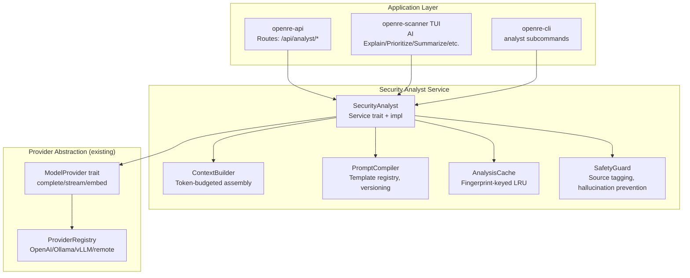

# ADR: AI Security Analyst (Phase 7)

**Status:** Proposed
**Date:** 2026-08-02
**Authors:** open-re contributors
**Related docs:** [06-ai-architecture.md](06-ai-architecture.md), [03-backend-architecture.md](03-backend-architecture.md)

---

## Context & Problem Statement

Phase 7 introduces an AI-powered analysis layer that interprets, correlates, explains, prioritizes, and assists with security scan findings. The deterministic scanning engine (Phases 1–6) remains the **authoritative source** of vulnerabilities — the AI never discovers them; it augments scanner results.

The existing `openre-ai` crate provides a provider-agnostic abstraction layer (`ModelProvider` trait with ONNX/llama.cpp/remote providers, prompt compiler, response cache), but it is entirely focused on **binary analysis** (function classification, decompilation improvement). Security scan findings live in `openre-core::result::{Finding, ScanSession}` and need an AI service that understands security semantics: evidence chains, risk scores, CWE/OWASP mappings, exploitability assessments.

### Requirements Summary
- Provider-agnostic abstraction supporting Ollama, OpenAI-compatible APIs, future providers — the app must never depend on a specific model.
- Capabilities: finding explanation, remediation generation, finding correlation, prioritization, executive summaries (4 audiences), natural language search, scan comparison.
- Structured context builder that intelligently selects relevant information within token budget.
- Reusable prompt templates with versioning; no hardcoded prompts scattered throughout the codebase.
- Caching of analysis results with invalidation when findings change.
- Streaming responses in both API and TUI.
- Safety: never invent findings, distinguish scanner evidence from AI interpretation, state uncertainty.

---

## Decision Drivers

| Driver | Weight | Notes |
|--------|--------|-------|
| Separation of concerns | High | Binary-analysis AI ≠ security-scan analysis AI — different domains, different data models |
| Reuse existing provider abstraction | High | The `ModelProvider` trait already supports OpenAI-compatible APIs (covers Ollama) |
| Architectural boundary enforcement | High | Scanner should not depend on AI; core has zero deps on other crates |
| Independent testability | Medium | Security analyst tests use mock findings, no storage/project setup needed |
| Implementation velocity | Low-Medium | Feature-first development — "build features first, polish later" per CLAUDE.md |

---

## Considered Alternatives

### Alternative A: New crate `openre-security-ai` (SELECTED)
A dedicated crate containing the `SecurityAnalyst` service, context builder, security prompt templates, and analysis result caching. Depends on `openre-core` for finding types and reuses `ModelProvider` from `openre-ai`.

**Pros:** Clean separation; follows one-crate-per-domain pattern; independently testable with mock findings; doesn't bloat openre-ai which has binary-specific deps (`GlobalStore`, `ProjectStore`).
**Cons:** Adds a workspace crate; needs wiring in `AppState`.

### Alternative B: Module within existing `openre-ai`
Add a `security_analyst.rs` module inside the existing crate, reusing `PromptCompiler`/`AiCache`/providers directly.

**Pros:** No new crate; everything available in-place.
**Cons:** Mixes binary-analysis and security-scan analysis AI concerns — violates single-responsibility principle. The existing `AiService::new()` requires storage deps (`GlobalStore`, `ProjectStore`, `ObjectStore`) that the security analyst does not need, forcing an awkward parallel constructor or unnecessary coupling.

### Alternative C: Inline enrichment within scanner pipeline
Run AI analysis during scan execution inside `openre-scanner`.

**Pros:** Direct access to `ScanSession` findings without passing them around.
**Cons:** Violates architectural boundaries — the scanner cannot depend on `openre-ai` (which depends on `storage`, creating a potential cycle). Couples scan performance to LLM latency; harder to test independently.

---

## Decision: Alternative A — New crate `openre-security-ai`

### Rationale
The existing dependency graph enforces clean boundaries: `core → {scanner, ai} → api`. The security analyst needs `Finding`/`ScanSession` types from core and the provider abstraction from `openre-ai`, but does not need binary-analysis-specific dependencies. A separate crate honors this structure while enabling independent development and testing of each Phase 7 capability.

The existing `ModelProvider` trait (`complete()`/`stream()`) is already generic enough — Ollama's OpenAI-compatible API endpoint is handled by the existing `RemoteProvider::openai()` path with a different base URL, requiring no new provider type. The security analyst crate depends on this trait but never knows which concrete provider is active.

---

## Architecture



### Crate: `crates/openre-security-ai`

**Dependencies:**
- `openre-core` — for `Finding`, `ScanSession`, severity/confidence enums, risk score calculation
- `openre-ai` (non-dev) — to reuse the `ModelProvider` trait. The service accepts an `&dyn ModelProvider` via dependency injection rather than constructing one itself; concrete providers are configured and injected at server startup in the API layer.
- `serde_json`, `sha2`, `tokio-stream`, `async-trait`, `dashmap`

**Does NOT depend on:** `openre-scanner`, `openre-storage`, or any binary-analysis-specific modules. Findings are passed as parameters (dependency inversion).

---

## Components

### 1. SecurityAnalyst Service (`service.rs`)

The main entry point — a trait + concrete implementation:

```rust
#[async_trait]
pub trait SecurityAnalyst: Send + Sync {
    /// Explain why a finding exists, how it was detected, security impact, attack scenarios, confidence, false-positive considerations.
    async fn explain_finding(&self, scan_id: ScanId, finding_id: FindingId) -> AiResult<FindingExplanation>;

    /// Generate secure implementation guidance with code examples and verification steps.
    async fn generate_remediation(&self, scan_id: ScanId, finding_id: FindingId) -> AiResult<RemediationPlan>;

    /// Identify relationships between findings (compound risk).
    async fn correlate_findings(&self, scan_id: ScanId, filter: Option<&FindingFilter>) -> AiResult<CorrelationReport>;

    /// Generate prioritized remediation plan considering exploitability, exposure, severity, confidence.
    async fn prioritize(&self, scan_id: ScanId) -> AiResult<PrioritizedFindings>;

    /// Executive summary for a specific audience (developer / manager / security engineer / executive).
    async fn executive_summary(&self, scan_id: ScanId, audience: Audience) -> AiResult<ExecutiveSummary>;

    /// Natural language query against scan data — grounded only in findings.
    async fn query(&self, scan_id: ScanId, question: &str) -> AiResult<QueryResponse>;

    /// Compare two scans for new/fixed/increased-risk/reduced attack surface.
    async fn compare_scans(&self, base_scan: ScanId, target_scan: ScanId) -> AiResult<ScanComparison>;
}
```

**Key design decisions:**
- Methods accept `scan_id` + `finding_id`, not `&Finding`. The service resolves findings through a callback/trait (`FindingProvider`) injected at construction — this keeps the analyst decoupled from storage while allowing it to fetch full finding data including evidence.
- Every method returns structured results (not raw strings) so consumers can render them appropriately in TUI/CLI/API.
- Streaming variants return `Pin<Box<dyn Stream<Item = Result<StreamChunk, AiError>> + Send>>` for API SSE and TUI interactive display.

### 2. FindingProvider Trait (`provider.rs`)

A minimal trait that the analyst depends on to resolve scan data:

```rust
#[async_trait]
pub trait FindingProvider: Send + Sync {
    async fn get_finding(&self, scan_id: ScanId, finding_id: FindingId) -> AiResult<Option<Finding>>;
    async fn list_findings(&self, scan_id: ScanId, filter: Option<&FindingFilter>) -> AiResult<Vec<Finding>>;
    async fn get_scan_metadata(&self, scan_id: ScanId) -> AiResult<ScanMetadata>;
}
```

The scanner's `ScanStorage` trait (already in `openre-scanner/src/scan.rs`) is the natural implementor. This keeps the analyst testable with a mock provider that returns canned findings.

### 3. Context Builder (`context.rs`)

Assembles token-budgeted structured context for prompts:

```rust
pub struct ContextBuilder {
    max_tokens: usize,        // From model capabilities / config
    priority_scorer: PriorityScorer,
}

impl ContextBuilder {
    /// Assemble a FindingExplanationContext within the token budget.
    pub fn build_finding_context(&self, finding: &Finding) -> Result<FindingExplanationContext, AiError>;

    /// Assemble context for correlation/prioritization across multiple findings.
    pub fn build_correlation_context(&self, findings: &[&Finding]) -> CorrelationContext;

    /// Assemble scan comparison context from two sets of findings.
    pub fn build_comparison_context(&self, base: &[Finding], target: &[Finding]) -> ComparisonContext;
}
```

**Token budget strategy:** Context is assembled in priority order — finding title/description/severity (highest priority), then evidence with HTTP request/response bodies (truncated to `max_tokens`), then related findings. Evidence payloads larger than the remaining budget are replaced with a summary placeholder: `[evidence truncated: N bytes]`. The builder exposes a `.token_count()` method so callers can verify they're within limits before sending to the provider.

### 4. Prompt Compiler (`prompts.rs`)

Template registry loaded at compile time from `templates/*.txt` files (matching the existing openre-ai pattern):

```
crates/openre-security-ai/src/templates/
├── explain_finding_system.txt      # System prompt: safety rules, output schema
├── explain_finding_user.txt        # User template: finding context variables
├── generate_remediation_system.txt
├── generate_remediation_user.txt
├── correlate_findings_system.txt
├── prioritize_system.txt
├── executive_summary_developer.txt
├── executive_summary_manager.txt
├── executive_summary_security_engineer.txt
├── executive_summary_executive.txt
├── natural_language_query_system.txt
└── compare_scans_system.txt
```

Each template is a `PromptTemplate` struct with: name, version (semver), system prompt text, user template text, required variables list. Templates are registered in a compile-time array — no runtime file loading needed for built-in templates. Future versions can be added alongside old ones and selected via config.

### 5. Analysis Cache (`cache.rs`)

Caches analysis results keyed by finding fingerprint + task type:

```rust
pub struct AnalysisCache {
    entries: Arc<DashMap<AnalysisKey, CachedEntry>>,
    max_entries: usize,
}

#[derive(Hash, PartialEq, Eq)]
struct AnalysisKey {
    scan_id: ScanId,
    finding_id: FindingId,   // or None for cross-finding tasks like prioritize/correlation
    task_type: TaskType,
    template_version: String,  // Invalidation when templates change
}

impl AnalysisCache {
    /// Invalidate cache entries for a specific finding (when findings change).
    pub fn invalidate_finding(&self, scan_id: ScanId, finding_id: FindingId);

    /// Get cached result if still valid.
    pub async fn get(&self, key: &AnalysisKey) -> Option<&CachedEntry>;

    /// Store a new result with TTL.
    pub async fn put(&self, key: AnalysisKey, entry: CachedEntry);
}
```

**Invalidation strategy:** When findings change (new scan completed, finding modified), the scanner calls `invalidate_finding` which removes all cache entries for that `(scan_id, finding_id)` pair across all task types. Template version is part of the key — updating a template invalidates only affected caches automatically.

### 6. Safety Guard (`safety.rs`)

Enforces safety rules on every AI response:
- **Source tagging:** Every structured result field is tagged as `Evidence` (from scanner) or `Interpretation` (AI-generated). The TUI/API always shows which claims are grounded in scan data vs. AI reasoning.
- **Hallucination prevention:** System prompts explicitly instruct the model to only reference provided context and to state uncertainty. Post-processing validates that referenced finding IDs exist in the current scan — if not, a warning is attached: `"[AI claimed X but no evidence was found for this claim]"`.
- **No findings invention:** The natural language query endpoint rejects questions whose answers would require creating new findings. If the model's response references a vulnerability not present in the provided context, it's flagged rather than surfaced as fact.

---

## Data Flow

### Finding Explanation (streaming example)
1. API receives `POST /api/analyst/explain?scan_id=X&finding_id=Y` with optional `?stream=true`.
2. Handler calls `SecurityAnalyst::explain_finding_stream(scan_id, finding_id)`.
3. Analyst resolves the finding via injected `FindingProvider`, checks cache (hit → stream cached result).
4. Context builder assembles a token-budgeted context from the finding's title/description/evidence/risk_score/exploitability.
5. Prompt compiler renders `explain_finding_system.txt` + `explain_finding_user.txt` with variables.
6. Analyst sends `CompletionRequest` (with `stream: true`) to the configured `ModelProvider`.
7. Response stream is wrapped by SafetyGuard, tagged chunks flow back through API SSE / TUI.

### Scan Comparison
1. Handler calls `compare_scans(base_scan_id, target_scan_id)`.
2. Analyst fetches findings from both scans via `FindingProvider`, computes diff (new, fixed, increased-risk, reduced).
3. Context builder creates a structured diff summary within token budget.
4. Prompt compiler renders comparison template; model generates explanation of differences.

---

## Integration Points

### API Routes (`openre-api/src/routes/security_ai.rs`)
Mounted at `/api/analyst/*`:
- `POST /explain` — non-streaming JSON, returns `FindingExplanation`
- `GET  /explain/stream?scan_id=&finding_id=` — SSE streaming
- `POST /remediate` — returns `RemediationPlan`
- `GET  /prioritize?scan_id=` — returns `PrioritizedFindings`
- `POST /summarize` — accepts audience, returns `ExecutiveSummary`
- `POST /query` — natural language query against scan data
- `POST /compare` — compare two scans

All endpoints require auth (`Claims`), validate input via `validator`, and return structured errors. Streaming uses Axum's `Sse`.

### TUI Commands (`openre-scanner/src/tui.rs`)
Extend the existing TUI (built on `ratatui`) with AI analyst commands — no generic chatbot:
- **`AI Explain`** — explain selected finding, stream response in a side panel
- **`AI Prioritize`** — show prioritized remediation plan for current scan
- **`AI Summarize`** — select audience, generate executive summary
- **`AI Remediate`** — show secure code examples and verification steps for selected finding
- **`AI Compare`** — compare two scans (select from history)

### CLI (`openre-cli/src/commands/analyst.rs`)
Subcommands: `explain`, `remediate`, `prioritize`, `summarize`, `query`, `compare` — each with `--scan-id`, `--finding-id`, `--stream` flags. Streaming output uses the same SSE parsing as existing `ai chat`.

### AppState Wiring (`openre-api/src/state.rs`)
```rust
pub struct AppState {
    pub analysis: Arc<dyn AnalysisService>,   // existing
    pub ai: Arc<AiService>,                    // existing (binary-analysis AI)
    pub analyst: Option<Arc<dyn SecurityAnalyst>>,  // NEW — may be None if no provider configured
    ...
}
```

The `SecurityAnalyst` is constructed in the server startup code (`openre-cli/src/commands/server.rs`) and wired into state. If no AI provider is configured (no API keys, no Ollama), it's set to `None` and analyst endpoints return a clear error: "AI analyst not configured — provide an OpenAI-compatible endpoint or run Ollama."

---

## Error Handling

Uses the existing `openre-core::error::OpenReError` hierarchy with new variants:
- `AiProviderNotConfigured` — no model provider available
- `ContextTooLarge` — findings exceed token budget even after truncation (shouldn't happen but handled gracefully)
- `AnalysisCacheError` — cache read/write failure (non-fatal; proceed without caching)
- `SafetyViolation` — AI response contained claims not grounded in evidence (response flagged, not returned as fact)

All errors implement `Into<ApiError>` for consistent HTTP responses. Non-streaming endpoints return structured error JSON; streaming endpoints emit an SSE event with `"type": "error"` and close the stream.

---

## Testing Strategy

### Unit Tests (per module)
- **ContextBuilder:** Test token budgeting — verify large evidence payloads are truncated, priority ordering is correct, `.token_count()` matches actual usage. Use `proptest` to generate findings of varying sizes.
- **PromptCompiler:** Verify template variables are substituted correctly; missing required variables produce errors; version field is present and valid semver.
- **AnalysisCache:** Test LRU eviction, invalidation by finding ID, TTL expiry, cache hit returns identical results.
- **SafetyGuard:** Feed responses with hallucinated finding IDs → verify flagging; verify source tagging (Evidence vs Interpretation) works on structured output.

### Integration Tests (`tests/integration/`)
- Full analyst flow: construct a `MockFindingProvider` returning canned findings, run each capability end-to-end against an in-memory mock provider that returns deterministic AI responses. Verify the context builder receives correct data and results are cached properly.
- Test cache invalidation: modify a finding's evidence → verify cache entry is invalidated → next call re-runs analysis.

### Mock Provider for Testing
```rust
#[cfg(test)]
struct MockModelProvider { /* implements ModelProvider, returns canned responses */ }
```
This allows testing the analyst logic without an actual LLM — the mock provider can return scripted `CompletionResponse` objects that match expected template outputs.

---

## Consequences

### Positive
- Clean architectural separation: binary-analysis AI and security-scan analysis are independently developed, tested, and evolved.
- Reuses existing provider abstraction (no redundant trait); Ollama works via OpenAI-compatible endpoint with zero new code in the provider layer.
- Independently testable security analyst — tests use mock findings and mock providers, no storage setup needed.
- Caching reduces repeated inference; template versioning enables safe evolution of prompts.

### Negative / Mitigated Risks
- **Token budget overflow:** If a finding has very large evidence payloads (e.g., full HTTP response bodies), the context builder must truncate intelligently. This is handled by priority-based truncation with clear placeholder messages.
- **AI hallucination risk:** The SafetyGuard post-processes every response to verify grounding in scanner evidence. Claims not supported by findings are flagged, never presented as fact. The system prompt explicitly instructs against inventing findings.
- **Provider availability:** If no provider is configured, analyst endpoints return a clear error rather than crashing. This follows the existing pattern where `openre-ai` providers can be absent at startup.

---

## Implementation Order (high level)
1. Create crate skeleton: Cargo.toml, lib.rs, module structure
2. Define `SecurityAnalyst` trait + `FindingProvider` trait with mock impl for tests
3. Implement ContextBuilder with token budgeting
4. Add prompt templates (.txt files) and PromptCompiler
5. Implement AnalysisCache with invalidation
6. Implement SafetyGuard source tagging
7. Wire up SecurityAnalyst concrete implementation (explain, remediate first; then correlation/prioritize/summarize/query/compare)
8. API routes + streaming SSE endpoints
9. CLI subcommands
10. TUI commands (extend existing ratatui interface)

*Detailed per-step plan to be generated via the writing-plans skill.*